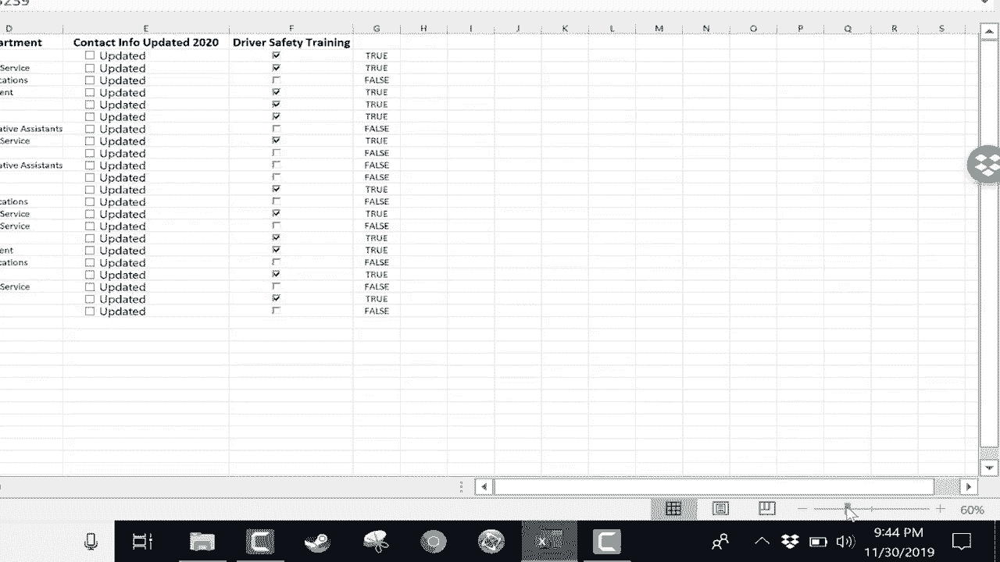

# Excel正确打开方式！提效技巧大合集！(持续更新中) - P16：16）放大和缩小 

在这个简短的Excel教程中，我将向你展示如何快速轻松地更改Excel中的缩放级别。很多时候，当你在Excel中时，需要放大或缩小以查看所有数据，或者至少更多的数据，或者你可能想要放大，更深入和更清晰地查看数据。因此，能够放大和缩小是很重要的。最笨重的缩放方式可能是去“视图”选项卡查看视图功能区。

这里有一个缩放组，你可以快速缩放到100%。你也可以缩放到选定区域。比如说我选择了这些单元格，这个范围。我可以点击“缩放到选定区域”，现在只有那个范围被放大，所以我只能看到那些内容。这是一个很不错的功能。你也可以点击这里的缩放按钮。

假设你想要200%的放大，或者可以缩小到50%或25%。你也可以输入自定义的放大倍数，比如说55%。所以这些都是在视图功能区的缩放组中的非常不错的选项。我将回到100%。这些选项的问题是，它们有点笨重。

正如我之前所说的，你需要点击“视图”，然后点击选项，再点击一个数字。幸运的是，微软在Excel中增加了一个快速缩放条，位于右下角。那里有一个滑块，我可以快速点击并拖动，比如我可以跳到218%。

现在一切看起来都大了很多。我也可以快速缩小，比如缩到50%或60%。这真是一个非常方便的滑块。不过还有另一种缩放选项，许多人喜欢这个方法。这就是简单地按住键盘上的Ctrl键，然后使用鼠标的滚轮向前滚动来放大，向后滚动来缩小。如果你仔细看。

如果你不想让观看体验变得支离破碎和有些困惑，可以点击A1单元格，现在应该能更加平滑地放大和缩小。实际上，如果你从A1单元格开始放大，数据会更加流畅。因此，这里有三种选择，三种在Excel中更改缩放级别的方法。

希望这能帮助你更轻松地查看数据，看到你想要看到的内容。感谢观看，我希望你觉得这个教程有帮助。如果你觉得有用，请点击下面的点赞按钮，并考虑在我的社交媒体账户上与我联系，如Facebook、Pinterest和Twitter，当然也请订阅我的YouTube频道，以获取更多关于教师和学生的技术视频。

当你订阅时，请点击订阅按钮旁边的铃铛。如果你这样做，每当我发布新视频时，你就会收到通知，并且至少每个星期一会有我的新视频。如果你想支持我的频道，可以通过我的Patreon账户成为我的支持者，你会在描述中看到相关链接。

下面。
