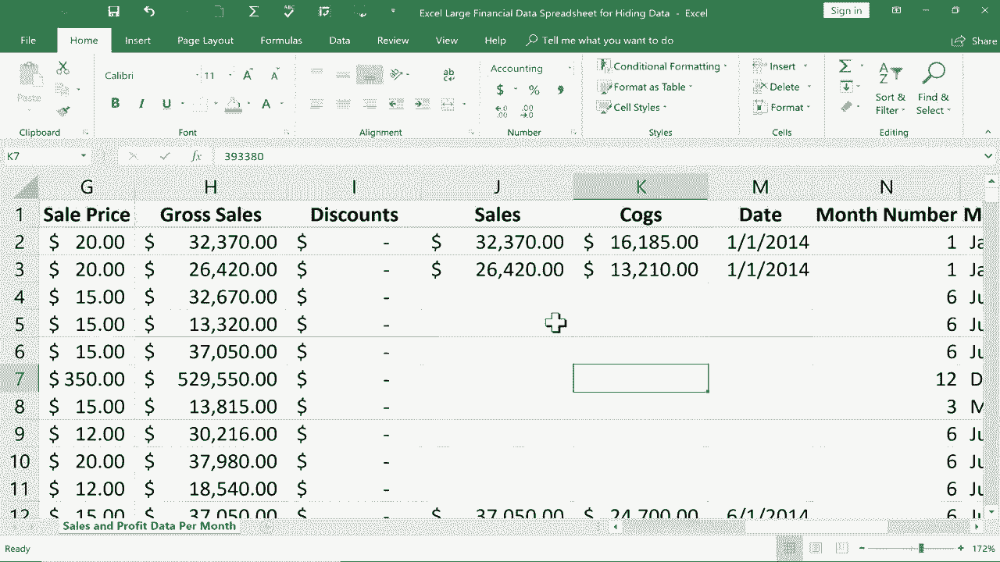

# Excel正确打开方式！提效技巧大合集！(持续更新中) - P19：19）隐藏数据 

在本教程中，我将向你展示如何在Excel中隐藏数据。我们还会讨论为什么有时这样做是好事。所以在这里你可以看到我有一个大型财务数据电子表格。这只是一个假设，但它包含制造成本、销售价格、总销售额和总利润。

所有这些数据都在这个相当大的电子表格中。它还包含与这些数字相关的月份和年份。

我在底部还有第二个工作表，称为客户列表。这里有人的姓名、电话号码、信用卡号码和信用卡类型。不过，假设我的一个合作伙伴或者我合作的关联企业需要获取这张电子表格中的一些信息。但是我可能不想让他们知道我所有客户的个人信息。而且。

我可能不想让他们知道。例如，我从所有这些销售中获得的利润。那么我该如何发送电子表格，而不展示我不希望其他人看到的信息呢？最简单的方法就是隐藏数据。你可以隐藏行，可以隐藏列，还可以隐藏工作表。所以让我们看看如何做每一项。

假设我想隐藏关于名为Montana的产品的数据。所以我想隐藏所有这些行。我所要做的就是点击并按住左侧的行号。因此，行号8。我点击并按住鼠标，然后向下拖动，直到我得到列C中所有包含Montana的记录。

然后我可以放开鼠标按钮。现在，要隐藏这些行，我只需右键点击任意行号并选择隐藏。所以看起来我删除了行号8到17，但在Excel中这根本不可能。你无法删除行号。你可以删除数据行，但行号本身永远不会消失。

这意味着它们是隐藏的。我将稍微放大一点，以便你可以更清楚地看到。在最近版本的Microsoft Excel中，看到隐藏数据变得稍微容易了一些。所以如果你仔细看看这里，第7行与第18行之间的分隔线上，有一条比正常稍微厚一点的线，表明。

对我来说，有隐藏的数据。现在，要显示这些数据，有几种方法可以做到。我可以点击并拖动隐藏行的顶部，然后右键点击选择显示，所有内容就会恢复。实际上，对于列也是一样的。这是可以预期的。所以我将去查看利润。假设我不想让我合作的公司知道我们公司赚取的利润。

我只需点击选择我想隐藏的列。现在。如果我想隐藏多于一列，我会按住并拖动。但在这种情况下，只是这一列。现在选中后，我右键点击并选择隐藏。此外，客户列表，这很重要。这是来自客户的个人信息。

我不希望人们看到这个。所以看看我能做什么。我只需右键单击工作表名称并选择隐藏。那个工作表就隐藏了。现在，我将如何取消隐藏那个工作表。对于行和列，我们知道怎么做。对于这一列，我可以点击并拖动到隐藏的列上，然后选择取消隐藏。好吧。

那关于工作表，你不需要点击并拖动，而是右键点击其中一个工作表名称，然后选择取消隐藏。然后你必须选择想要取消隐藏的工作表。在这种情况下，我只有一个隐藏的工作表。但在某些情况下，你可能有两个、五个或十个隐藏的工作表，你需要逐个取消隐藏。在这种情况下。

只有一个，我选择它，点击确定。现在它不再隐藏。我将再次隐藏它。因为假设我真的想发送这个电子表格。我希望它保持隐藏。因此，现在我可以保存这个电子表格，然后发送出去，那些重要的信息安全地隐藏着。对吧，好吧。

有些人可能会想，难道我发送这个电子表格的人不会注意到有隐藏的数据，然后点击并拖动以取消隐藏，或者右键点击以取消隐藏隐藏的工作表吗？是的，他们可以。所以这是一个问题。不过，解决方案在审阅选项卡上。

你可以点击这里进入专业工作簿，输入密码并点击O。它让我确认密码。所以现在我保护了工作簿。如果我向下右键单击工作表名称并尝试取消隐藏，看看，它不让我这样做。这是一种保护数据的方式。现在，不幸的是，这里不适用。

如果我在K列和M列之间点击并拖动，然后右键点击，我就能取消隐藏隐藏的列。所以要注意，有些人可能足够聪明，可以取消隐藏某一列。他们甚至可以在受保护的工作簿中做到这一点，但无法取消隐藏隐藏的工作表。那么在这种情况下，我不想让他们看到总利润该怎么办。

我会打印它。所以我会进入打印，甚至可以将其保存为PDF，如果我想的话。然后把这个发给想查看的公司。我想给你展示最后一个技巧。在某些情况下，你可能不想隐藏整个列或行或一系列行和列，而是只想隐藏一个特定的单元格。如果我只想隐藏这个单元格。那么。

有一种比较棘手的方法。如果你去到“主页”标签，在字体组里你可以更改字体颜色，将其改为白色。你会发现这并没有真正隐藏单元格，但确实隐藏了数字。如果有人点击单元格，那么数字会在公式栏中显示出来。

所以请对此保持警惕。但这是一种隐藏单元格或范围内信息的方法，而不会隐藏整列或整行的所有内容。现在如果我打印这个电子表格，它看起来就像那些单元格完全是空白的。感谢观看这个教程，希望你觉得有用。如果你觉得有用，请点击下面的喜欢按钮。

