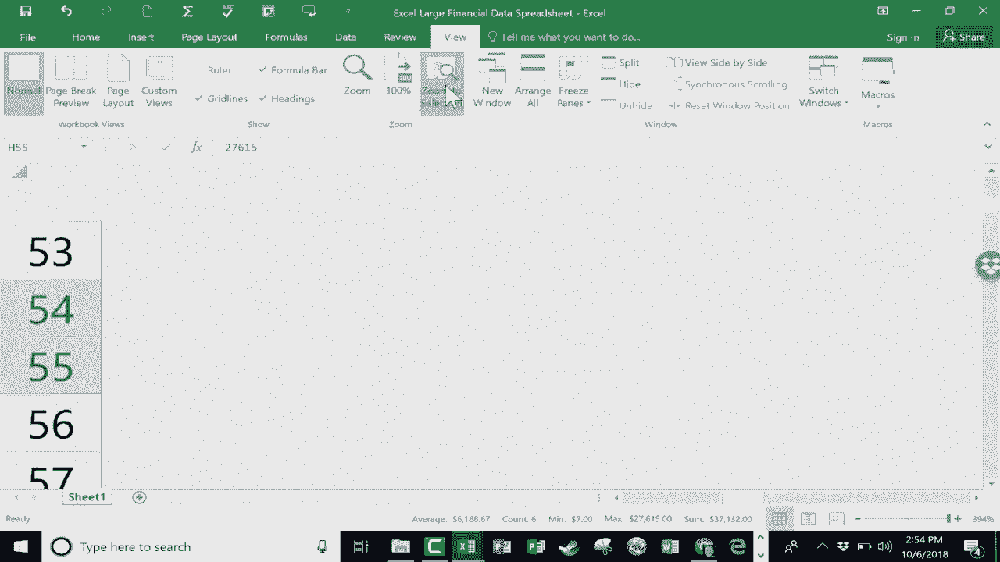

# Excel正确打开方式！提效技巧大合集！(持续更新中) - P24：24）在 Excel 电子表格中导航 

在这个视频教程中，我们将讨论Excel中有时出现的一个问题，那就是如何在一个巨大的电子表格中导航。我们都可以处理小型电子表格，假设电子表格中有10到15条记录。移动并跟踪数据是很容易的。

但当你有数百条记录甚至上千条时，容易失去数据的位置以及如何快速到达电子表格的不同部分。因此，让我们看看你有哪些选项。我想指出的第一件事是在右下角。

我们有一个视图缩放级别。对我来说，现在设置为235%。但我可以点击并拖动这个滑块，使其变得更小。因此，我可以快速了解我的电子表格中的数据。现在，你会注意到，当你这样做时，看看某些数据会发生什么。如果数据在列中不自然地适应。

你会看到这些井号，不用担心。数据仍然是好的，看看我再次放大，缩放更大。那些井号消失了，所以这是你可以做的事情之一，以了解你的数据有多大，所有东西在哪里，只需改变缩放级别。现在。

还有另一种方法可以做到这一点，那就是按住键盘上的控制键，然后使用鼠标上的滚轮。如果向上滚动，它会放大。如果向下滚动滚轮，它会缩小。你可以看到它在这里也在调整。接下来，让我们看看如何从电子表格的顶部跳到底部。所以我现在几乎在这个电子表格的顶部。我在查看信息。

查看数据。但现在我想回到底部以输入更多信息。我有几种方法可以做到这一点。一个是使用键盘快捷键。如果按住控制键，然后按结束键，它不仅将你带到底部电子表格，还会带到右边缘。

数据范围的右下角，这对我来说很好用。现在，如果我想回到顶部，还有另一个键盘快捷键。那就是按住控制键，然后按主页按钮。这将我带到左上角。现在，还有一种鲜为人知的方式可以做到类似的事情。假设我在G列。

我想到电子表格的底部，但我不想真的去右下角。因此，我不会使用控制加结束键。我只想到G列的底部。看这个。我将略微增加缩放，以便你能更好地看到这个。

但请看这个技巧。你所要做的就是去你目前所在单元格的底边。将鼠标放在底边上，然后快速双击。这样很快就带我到电子表格的底部。如果我想回到同一列的顶部，只需双击我当前所在单元格的顶边，就可以回到顶部。

这是一个美丽、简单且优雅的方法，可以快速到达电子表格的底部和顶部，方法是双击。而且正如我之前指出的，这样你会停留在你当前工作的列中。我想向你展示的最后一个技巧是，假设在你缩放、放大、跳到顶部或底部时，可能是电子表格的右下角。

假设你到达一个点，发现你想在电子表格的某一部分、某个范围内工作，也许就是这一部分。这是我现在想要工作的内容。我可以点击并拖动以突出显示它。然后我可以去查看，选择“缩放到选择”。让我们看看这会发生什么。它最大化了视图，所以我突出显示的那部分。

放大到尽可能大的程度。如果我选择了电子表格的不同部分并点击“缩放到选择”，你会发现效果更加显著。所以，这里有三到四个技巧可以帮助你在Microsoft Excel中更好地浏览你的电子表格。

尤其是大的，这可以帮助你看到。

数据并更好地、更加轻松地在数据周围导航。感谢观看。我希望你觉得这个教程有帮助。如果你觉得有用，请点击下面的喜欢按钮。
