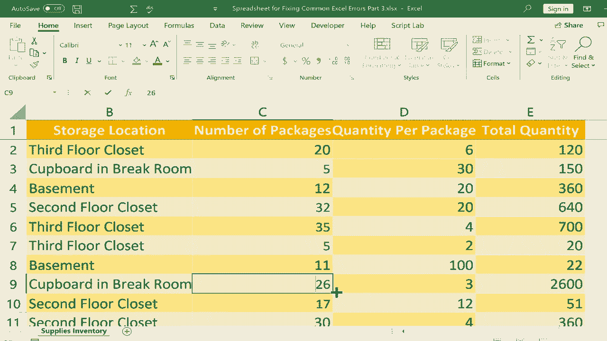

# Excel正确打开方式！提效技巧大合集！(持续更新中) - P26：26）修复常见错误：REF 和 VALUE - ShowMeAI - BV1Jg411F7cS

这是修复常见 Excel 错误的第三部分。这是三部分系列中的第三个视频，教你如何修复常见 Excel 错误。在这个特定视频中，我们将重点关注两种常见错误。一种是引用错误，另一种是值错误。你可以看到我们将使用的电子表格，这是一个库存清单，列出了供应品、存储地点及其他详细信息，如包的数量。

每包的数量。然后我们有一个公式来计算好吧。如果有 20 包电池，每包 6 颗电池，我们总共有 120 颗电池。正如我所说，这是通过这个公式自动计算的。现在，为了说明引用错误，假设我决定这里的数据其实并不必要，我不需要知道每包的数量，我只需要知道总数量。那么，如果我直接删除列呢？

我在 C 列和 D 列之间点击并拖动，选中了整个列，然后我将删除它。你可以看到发生了什么。我得到了一个引用错误，引用错误的原因是公式引用了在此公式中不再存在的单元格。那些单元格完全消失了。我删除了整个列，这些单元格也不见了。我将点击撤销，用控制键 Z 恢复它。

你可以看到这解决了问题。现在，如果我只删除一个单元格呢？我右键点击这个单元格，点击删除，Excel 会移动其他单元格以替换我正在删除的单元格。你可以看到它所做的事情。它破坏了这里的公式。它找不到它所引用的单元格。它消失了。

因此，基本上我们得到了一个引用错误。那么如何修复这个呢？好吧，你可以选择撤销。你可以意识到这是一个错误。我不能就这样删除这些数据。或者如果你真的必须删除这些数据，那也可以，但只需点击引用错误的单元格进入你的公式。

你可以双击它，在单元格中直接进行更改，或者你可以只点击一次，然后在公式栏中进行更改。不论你选择哪种方式，你都需要进入并修复公式。所以这里就是错误所在。我可以直接删除那个，然后说，好吧，C3 乘以 D3，按下回车，修复了引用。现在引用是有效的，这很好。

现在让我们继续讨论值错误，当你使用错误的函数参数时会出现值错误，通常是因为你试图组合不同类型的数据，而这些数据实际上并不匹配。比如，一个数字加上文本，或者你可能是将一个单词乘以一个数字，这在大多数情况下是没有意义的。

所以我们来看第一个可能导致值错误的错误示例。假设在右侧，我试图将包裹的数量与每包的数量相乘，就像我在这里成功做到的那样。但假设我不放C2，而是放B。那么我现在是将三楼的储物间乘以6，看看结果。我按下回车键。

于是我得到了值错误。为什么呢？因为我在组合两种不匹配的数据类型，文本乘以数字。另一个比较常见的例子是，假设我在输入数字11时，如果我急于输入而意外放入一个空格。看起来还不错，对我来说看起来是11。但我在键盘上按下回车，得到了值错误。

多出的空格无法被计算为数字。另一个例子在这里。假设再次，我很着急。当我输入数字30时，也许我不小心输入了30而不是30。假设大写锁定开启了，那看起来像30，但我按下回车。再次，我在组合不匹配的内容，30乘以4，这没有任何意义。

结果我得到了值错误。另一个比较常见的导致值错误的错误是，有时当你在包含数字的单元格中放入符号时，Excel并不喜欢这样，结果你会得到值错误。现在看看我如果放一个美元符号会发生什么。通常你不会这样做。你不会仅仅放一个美元符号。相反，你应该选择该单元格，然后在主页功能区的数字组中点击美元符号。

这是正确显示这些是美元的方式。但有时，人们会直接输入美元符号。实际上这样是有效的，不会导致错误，但其他符号通常会导致错误。例如，假设我在这里放一个井号。那么井号28，也许我是在表示数字28。

但我在键盘上按下回车键，得到了值错误。因此，每当你在同一个单元格中放入这样的符号并且也放入数字时，要小心，这通常会导致值错误。因此，当你遇到这些值错误时，注意单元格中的内容。如果有错误，你需要修正它们。显然，我可以将其从B2改为C2，这样就可以修复这个问题。

我可以修复O并将其改为0。在这种情况下，我可以去掉符号。现在你们中的一些人可能会注意到我的公式有点混乱，那是因为我之前提到的引用错误以及我删除了一个单元格，注意到这使得所有内容上移，因此我的公式有点不对。

但问题依然存在，如果你尝试将不同类型的数据结合在公式中，而它们并不匹配，你可能会遇到值错误。感谢观看！
