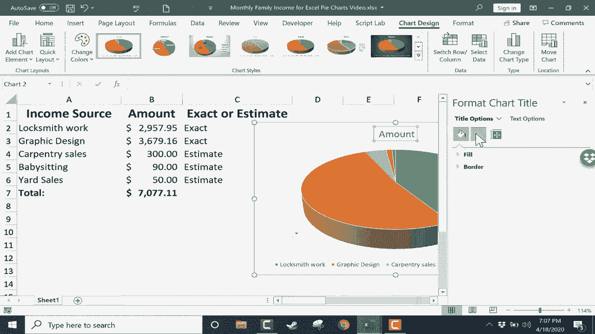
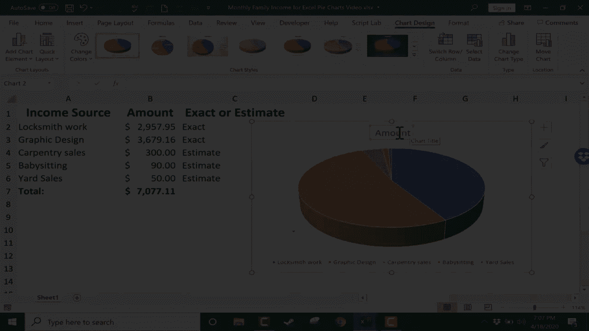
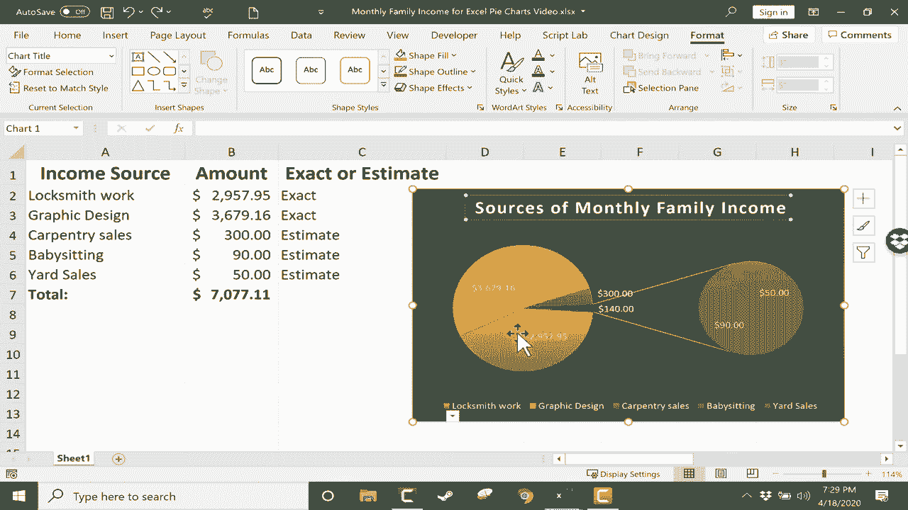
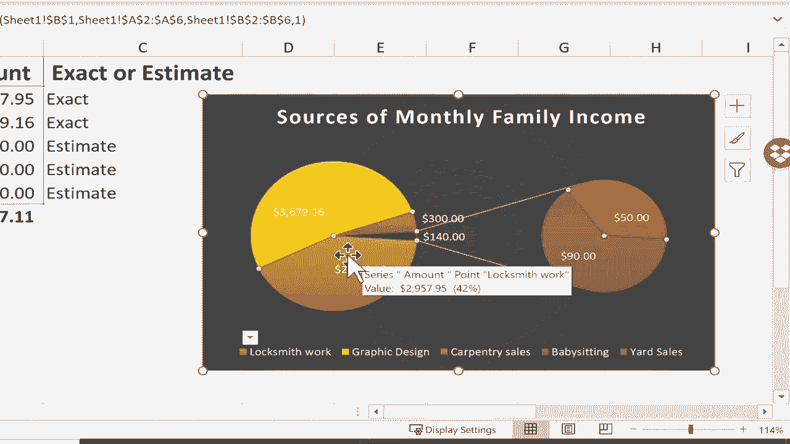
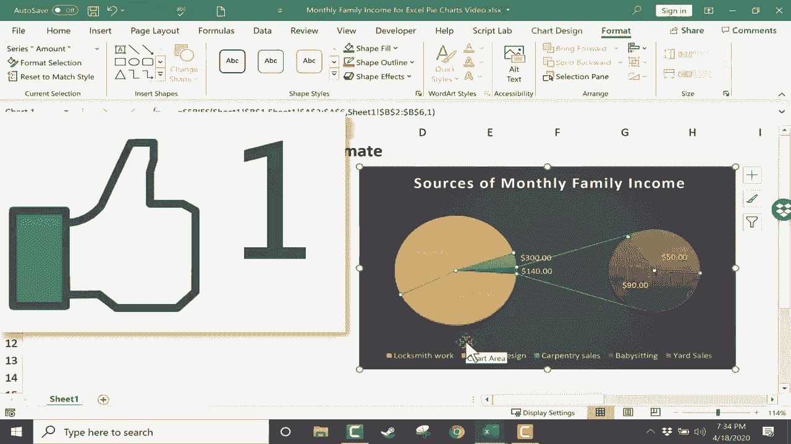

# Excel正确打开方式！提效技巧大合集！(持续更新中) - P29：29）创建饼图 - ShowMeAI - BV1Jg411F7cS

在这个视频中，我们将看看如何以及何时在 Excel 中使用饼图。首先，让我们讨论饼图何时有用。饼图的目的是展示个别部分与整体之间的关系。因此，例如，在这个电子表格中。我们有一个家庭的收入来源列表。假设一位配偶是一名锁匠，每个月赚这个数额。这是一个确切的每月金额。

另一位配偶是一名平面设计师，赚取不同的金额，同样是确切的。然后他们俩也有副业，这些是估算值，而不是确切的数字。所以我会把这些改为估算值。这种方式是每一项收入成为总金额的一部分。因此，这些都是构成下面整体的一部分。

所以这是一个饼图会有用的情况，并能够传达有趣、实用的信息。在我们继续之前，我想给你展示一个单独的例子，一个饼图不太有意义的例子。这个电子表格非常复杂，有重复的部分，统计产品。

由于其复杂性，这不是一个适合饼图的好候选项。我稍后会告诉你我是什么意思。但现在，让我们回到我们的家庭月收入电子表格。如果我想创建一个饼图来配合这些数据。

第一步是选择图表的数据。所以我会点击并按住鼠标，拖动以选择 A 列和 B 列。但我在选择中不包括总数。我们包括列标题，以便 Excel 知道这些数字代表什么。

但我们不包括总数，因为总数会扭曲饼图，使其基本上毫无用处。因此，选中这些数据后，我可以直接去插入选项卡。这里列出了各种图表，有插入饼图的选项。所以我点击它，会出现多种选项。注意当我将鼠标放在这些选项上时。

我可以预览它们的样子。这是 Excel 中的一个很棒的功能，帮助我决定选择哪一个。我们有一些 2D 饼图，一个 3D 饼图和一个甜甜圈图。看着这些饼和甜甜圈，我有点饿了，但我会尽力集中注意力。现在，我决定选择 3D 饼图。所以我只需点击它，我的图表就出现在电子表格上。

我可以点击并拖动，把饼图放在我想要的位置。我觉得这里看起来很好。现在我有了饼图。如果我选中它，我在顶部会看到两个额外的标签：图表设计和格式。如果我点击图表外部，我就会失去这两个标签。

但我可以再次点击图表，它们就会重新出现。 让我们看看这两个标签为我们提供的一些选项。 如果你点击图表设计标签， 你会看到有一个选项可以添加图表元素。 如果你点击这个按钮，它会给你一些图表标题选项。 我可以通过选择无来去掉这个金额的图表标题，或者我可以将其移动到饼图的正上方。

还有更多标题选项。 如果你点击那里，你会得到额外的填充和边框选项，以及阴影和各种不同的对齐选项，等等。我希望我的标题在顶部，但我不喜欢它为标题选择的文本。 我想把它从金额更改为其他内容。

我会把它改成家庭月收入来源。 我觉得这更好地描述了我在这里展示的数据。 比单单使用“金额”这个词好多了。 我在添加图表元素按钮中可以做的其他事情包括我的数据标签，现在我没有。 如果我选择居中，看看会发生什么。

这个饼图切片或饼图部分现在所放置的数字。

那个部分作为标签。 但你可以看到这个问题。有时它不起作用。 它们被挤在一起。 所以我可以回去选择一个不同的数据标签选项。 外部结束是另一个可能性，最佳适配数据标注。 在许多情况下，这是一个很好的选项。 你也可以加载更多选项，类似于我的标题选项。

我觉得我最喜欢的选项是最佳适配。 看起来很好。 每个饼图切片或部分代表的内容很清晰。 我也有一些图例选项。 我可以没有图例。 我可以在右侧、顶部、左侧或底部放置图例。 再一次，如果我想要，我可以获得更多图例选项。 我决定将图例移动到右侧。

我觉得这看起来真的很好。 我可以在图表设计标签上做一些其他更改。 包括快速布局。 你只需将鼠标放在其中一个选项上快速调整布局，然后点击。😊。我实际上喜欢现在的样子。 我也可以点击更改颜色以选择不同的配色方案。

这工作的方式是这是一个颜色调色板。 所以如果我点击这些颜色中的任何一个，那么这就成为该图表的颜色调色板或配色方案。 如果我更喜欢蓝灰色调色板，我只需点击这里，所有内容就会变成蓝色或灰色。 我们还有其他所有选项，如果我继续浏览还有更多。

我打算选择多彩调色板 3，我觉得这看起来真的很好。 接下来，我可以选择不同的图表样式。 这将更改我已经选择或调整的一些设置。 但你可以看到每一个选项都可以改变饼图对观众的影响。 这取决于你展示图表的目的，以及哪个样式对你和你的观众最具吸引力。

其中一些可能比其他的效果更好。我觉得那个看起来有趣，尽管😊有点奇怪。还有另一种风格，我认为看起来很好。还有另一种。但我想我会点击撤销按钮几次，回到我最初的样子。在图表样式旁边，我有选项可以更换数据。

交换行和列或选择不同的数据。如果我想，我还可以更改图表类型。如果我点击那里，它再次给我一个从3D切换回2D图表的选项，或者选择一个甜甜圈图表。我甚至可以切换到完全不同类型的图表。但这是我向你展示这些选项的好机会。

饼的饼或饼的条。饼的饼是一个特别有趣的选项，尤其是当你有一些大块的饼，而其他的则是非常非常小的饼块，比如我们这里的数据。所以如果你看这个例子，饼的饼图设置显示了这个小切片代表的是什么，它是来自保姆工作的90美元和50。

来自车库销售。所以这个较小的饼图有助于突出较小的切片。我现在真的很喜欢这个样子，虽然我可能会将其更改为另一个样式，对我来说看起来很好。我们在图表设计选项卡上的最终选项是移动图表。如果我点击它，可以注意到我可以将这个图表放在一个新工作表上。

或者我可以将其保留为工作表1中的对象。让我们尝试将其移动到新工作表。我可以根据需要命名它，但我只需点击O。现在我有了一个新工作表，但它特别是一个图表工作表，chart1。现在工作表1上根本没有饼图。我将撤销这一操作，只需再次选择图表，进入图表设计。

然后我会将其移动到工作表1中的一个对象，点击O。现在我们快速查看格式选项卡。在这里，我们有一堆可以添加的形状，比如箭头、三角形、正方形等。此外，还有一些样式可供选择。如果我把鼠标放在这些上面，它会给我一个预览，你可以看到选择其他主题样式如何改变饼图的外观。

在某些情况下非常明显。因此，你会得到一些非常美观的选项。如果你尝试这些，注意我没有点击，只是将鼠标放在不同样式的顶部，我会得到即时预览。我也可以在这里选择特定的形状填充。如果我喜欢这个饼图的外观。

除了背景色有点黑或深灰色。我可以为形状填充选择特定颜色。实际上，我在这种情况下并不想这样做，但你可能想要。我会下去选择形状轮廓，我可以选择一种颜色，比如红色。现在这个饼图框的轮廓是红色的，我可以去形状轮廓下拉菜单更改轮廓的粗细。

如果我想的话，可以把它做得非常厚。我并不一定认为那看起来好，但这些都是你可以改变的东西。通过去格式选项卡为你的饼图，你还可以查看一些其他快速样式，如果你对此感兴趣的话。

饼图和Excel中的其他图表最美妙的地方之一是，随着时间的推移，如果这些数字发生变化。假设木工销售上升。我按下回车，饼图会调整以显示这些变化。假设庭院销售也大幅上升。同样，饼图会根据这些变化进行调整。

在结束之前，我想向你展示一些饼图功能，许多人完全不知道，但非常有用，可以让你的饼图看起来很棒。其中一个是你可以“爆炸”饼图的任何部分。例如，只要饼图被选中，我就可以双击饼图的任何一片。

然后点击并拖动以“爆炸”那一片饼，这就是它的意思。“爆炸”。我可以双击这块饼，然后点击并拖动到。😊。

“爆炸”那一片饼图以及其他的每一片。这样做可以帮助将标签稍微分开，并将焦点放在饼图的特定部分。另一个常被忽视的功能是，你可以右键点击任何饼图元素来调整其填充、轮廓，格式化数据标签，可能通过改变其颜色。如果你对这些更改感到后悔，可以右键点击那片饼并选择“重置以匹配样式”。

我也会对文本这样做。所以我希望你在Excel中制作饼图时玩得开心。只需记住，饼图并不适用于每种数据或电子表格。例如，如果我选择这个电子表格中的一部分，仅用一列数值数据。如果我去插入饼图，看看我得到的结果。

这完全没用且无关紧要。

信息，所以考虑清楚你制作饼图的目的以及你想通过图表展示的数据是非常重要的。感谢观看。我希望你觉得这个教程有帮助。
