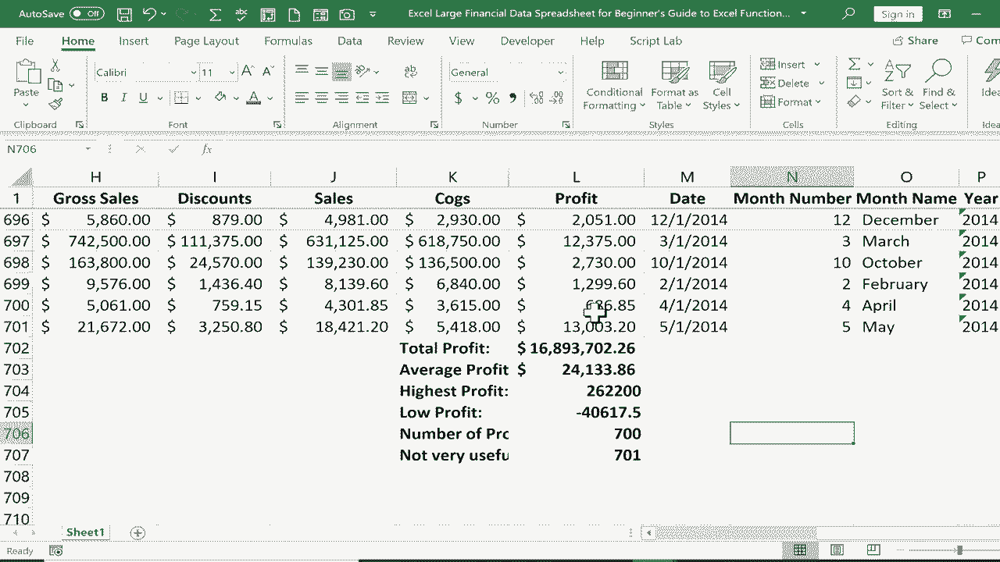

# Excel正确打开方式！提效技巧大合集！(持续更新中) - P30：30）函数和公式初学者指南 

这是Excel函数和公式的初学者指南。在这个视频中，我将向你展示六个最常用和基本的Excel函数以及它们的工作原理。这里我有一个相当大的财务数据电子表格。我们假设我是一个大型企业的会计，这些信息展示了企业的运营情况。左侧是不同的市场细分和不同国家。

不同的产品都排放在这里。假设我想了解关于每个客户群体所产生的利润的一些信息。因此在这个视频中，我主要关注的是利润。所以我想做的是下滑到这个电子表格的最底部。但这个电子表格太大了，我该如何快速做到这一点呢？好吧。

如果我按住键盘上的控制键并点击下箭头，它会将我直接带到这组数据的底部。但你会注意到，我仍然可以看到第一行，它包含我的列。如果你想学习如何做到这一点，请观看我关于冻结窗格的视频。不过，接下来。

我想计算一些关于所产生利润的重要信息。首先，我想知道整个公司的总利润。为此，我只需点击我想要显示总额的位置，然后在键盘上输入等号。当我第一次学习Excel时。

我有点困惑为什么我会从等号开始，但现在我明白了。这基本上是说这个单元格等于，然后我输入一个公式。所以我希望这个单元格等于，我将使用我的第一个函数，函数是sum。当我开始输入sum这个词时，注意到我得到了一个弹出指南，里面有一些建议的其他函数。

这是我想要的，只是求和。但Excel还建议查看一些if和一些if等函数。注意，我确实得到了每个额外函数的描述。这才是我想要的，sum。它会将一系列单元格中的所有数字相加。所以现在我已经输入了sum，我可以直接输入左括号。接下来。

我只需要确定我想要加总的数字范围。我可以用几种不同的方法做到这一点。一种方法是点击并拖动以突出显示你想要加总的内容。然而，正如你所见，对于700条记录和如此多的数据，我要回到顶部需要花费一些时间。不过，如果我想这样做的话。

我可以，假装我已经到达顶部。我可以按下回车键，它会将我选择的所有内容加总在一起。另一个在这种情况下更好的选择是，不是点击并拖动，而是简单地在L2中输入，L代表列，而数字2代表我想要添加的行。

L2到L701，在Excel中输入范围的方式是用冒号。因此，L2到L701。注意整列现在都被高亮显示，我可以按键盘上的回车。现在Excel会将整个范围内的所有数字相加。因为总和是如此流行和常见的函数，Excel实际上内置了自动求和。

所以在很多情况下，使用总和的最好和最简单的方法是点击你想加总的数据下面，然后去主页标签，主页功能区，在编辑组中，点击这个符号进行自动求和，然后按键盘上的回车。现在为了帮助我记住这些数据是不同的，它实际上不是一个常规记录。

这些记录有一些数据。我刚选择了它，并点击粗体让它突出。我也可能想在左边输入总利润，再次将其设为粗体。现在很清楚这意味着我接下来要展示的函数是平均值。

如果我想要每个客户群体细分的平均利润，我只需去新的单元格，输入等于平均值的公式。然后，我会得到一些不错的建议，再加上左括号。接着，我将输入L2到L701。现在，你可能看到刚刚发生了什么。我本想在这里输入我的公式。

但我不小心碰到了触控板，结果我在另一个单元格里输入了内容。这很好地说明了为什么在使用公式和函数时，有时在特定单元格中输入是不够的。通常在屏幕顶部的公式栏中输入会更好。所以我可以点击公式栏并修正刚才的错误。

而我在公式栏中输入的内容会在单元格中反映出来。现在我应该在这个公式末尾加上另一个括号。实际上这样做并不是必要的，你可以直接按回车，它在没有右括号的情况下也能工作，但加上是规范的。所以养成这个习惯可能是个好主意。好吧，现在我有了平均利润。

接下来你需要了解的常见基本函数是最大值。最大值函数的作用是返回范围内的最高数字。所以这个单元格等于这一列的最大值。我确实想在这里使用公式栏，写上括号，按回车，这就是该范围内的最高数字。接下来，我们来看看最小值。

这个单元格等于最小值左括号，我会输入我的范围，然后按下键盘上的回车。哇，我们得到了负利润。所以就像你所期待的，最小值函数会在范围内生成最小的数字。在这一列的所有数据中，这是最小的数字。我们的下一个函数是计数。计数函数会查看一个范围，并统计其中有多少个单元格包含数字。

它会跳过每个空白单元格，以及每个包含字母而不是数字或包含单词而不是数字的单元格。所以我们来试试看。这个单元格等于计数左括号并上移到公式栏。我将输入 L 1，这次不输入 L 2 到 L 701。所以它将尝试计算 L 1 中“profit”这个词的位置。但让我们看看总数是否为 701。

在键盘上按回车。结果不是 701，而是 700。为什么？因为它没有计算“profit”这个词。那不是一个数字。所以它跳过了这个单元格。因此，当你只对数字感兴趣时，这个功能非常有用。我将称其为利润类别的数量。然后我们的最后一个例子与计数类似，但它是计数 a。

计数和计数 a 的区别在于，计数 a 包含任何包含键盘字符的单元格。同时也会计算包含空格的单元格。因此，如果一个单元格仅由某人按下空格键而产生的空白空间组成，那也会计入总数。

所以在这里，计数 a 上移到公式栏左括号 L 1 到 L 701，按回车，因为这次我使用了计数 a。计数是不同的，它在总计中包含了“profit”这个词。我不确定该怎么称呼这个。怎样称其为不太有用呢？至少在这种情况下是这样的。但是在某些情况下，你可能想知道构成列表的项目数量，同时包括文本和数字项。

所以现在我可以将所有这些加粗。我生成了一份重要数据的列表。从我的电子表格中提取的利润详情的重要信息。谢谢观看这本 Excel 函数和公式的初学者指南。如果你喜欢这个教程，并希望我创建一个 Excel 函数和公式的中级指南。

我会这样做。并且我会向你展示一些在 Excel 中你会发现有用的函数。谢谢观看，希望你觉得这个教程对你有帮助。
