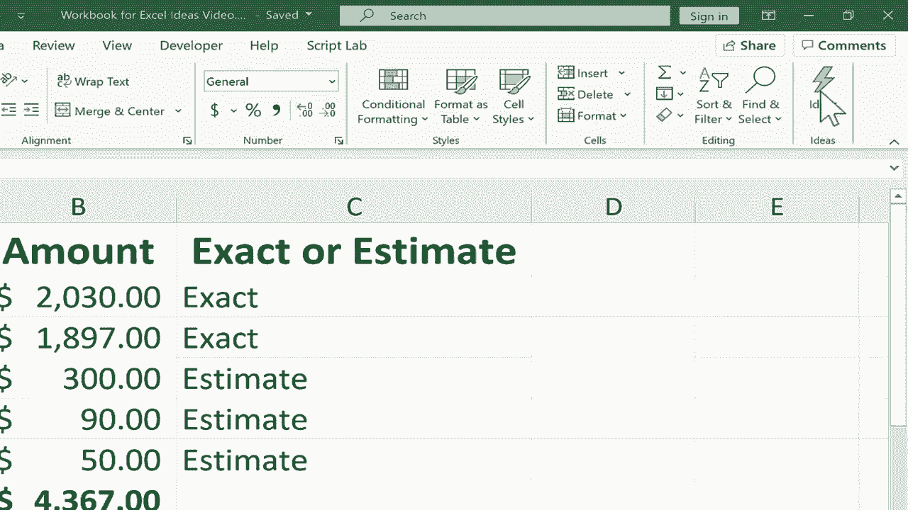
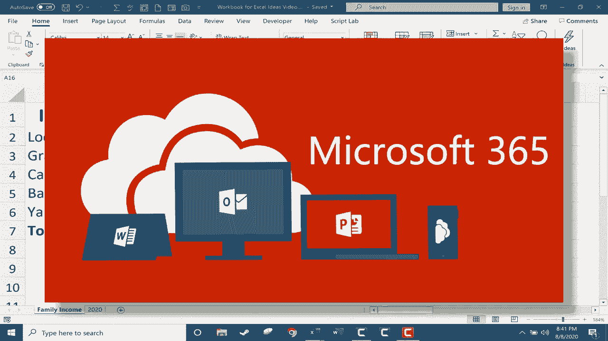
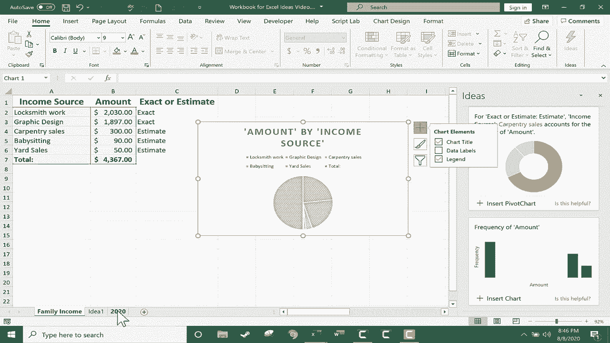

# Excel正确打开方式！提效技巧大合集！(持续更新中) - P33：33）创意按钮 

在这个简短的Excel视频中，我将向你展示可以用来快速轻松生成美丽视觉效果的Excel想法按钮，而Excel想法现在已经可以使用。我相信这仅在Office 365版本的Excel中可用，包括Windows、Mac和在线版本。

现在，我有一个Excel工作簿，里面有一个假设家庭的家庭收入电子表格，以及一个包含大量财务数据的2020电子表格，当然，我可以通过选择数据本身来生成一些视觉效果，比如一些图表等，插入各种类型的图表，我也可以使用这个工具。

快速分析按钮可以用来查看一些我可以添加的视觉效果。如果你想了解更多关于这两种方法的信息，请查看我的其他视频，但在这个视频中我想专注于Excel想法。如果你想使用Excel想法。

你甚至不需要选择数据。你只需打开一个电子表格，然后点击主页选项卡，在右侧你应该再次看到想法按钮，如果你有Office 365，点击按钮，可能需要耐心等待一会儿，它会显示一系列你可以添加到电子表格中的视觉效果的想法。它建议一个关于收入来源的饼图，也建议一个我可能喜欢的收入来源透视表。

一个有趣的透视图表，注意到总共有六个结果，所以有一些结果是隐藏的。我可以点击显示所有结果，就像我刚才做的那样，然后浏览以查看剩余选项。所以我喜欢这个第一个饼图，我会点击插入图表，它将其添加到电子表格中，位置就在数据的右侧和下方。在我的情况下，如果我缩小一点，你可以更好地看到它把饼图放在哪里。

我还想要透视表，所以我在这种情况下会点击插入透视表。因为这是一个透视表，它没有直接添加到电子表格中，而是创建了一个新的电子表格，里面是关于我家庭收入电子表格的数据透视表。当然，我可以通过点击和拖动来重新排序电子表格，把想法1放在产生这个想法的电子表格旁边。

当然，一旦你添加了这些想法，无论是图表、透视表，还是透视图表等，它们都是可编辑的，所以我可以点击调整这个饼图。例如，我可以使用这里的工具来改变图表样式，进行一些图表过滤，点击添加图表元素等等。比如选择图表，顶部有一些图表设计选项和格式选项。所以这些想法是预制的，使用人工智能生成的，但我很喜欢。

你可以自定义它们，使其更符合你想要的样子。现在让我们再次尝试Excel创意，但使用一个更复杂的电子表格。我将关闭创意面板，你可以看到，我现在在标题为2020的电子表格上。这是一个包含大量数据的大电子表格。所以幸运的是。

我不需要选择数据来使用Excel创意，只需在电子表格的主页选项卡，主页功能区中点击创意。它会生成一份创意列表。你可以看到，这个案例生成的创意是相当不同的。原因是这些数据与之前的电子表格非常不同。

在这种情况下，我总共获得了36个创意结果。数量如此之多，还有更多可供选择。一些非常有趣且看起来强大的图表。这个图表讨论了离群值。这个图表发现了两条不同信息之间的相关性。这个数据透视图突出了数据中的一个模式。所以这可以。

使用人工智能识别趋势是一种很好的方法。识别电子表格中的关键信息，并添加一些美观的视觉效果，然后你可以自定义这些效果。一旦你将它们添加到电子表格或在同一工作簿中新建的电子表格中。在这种情况下，我将点击插入图表。这是对这个电子表格的美丽补充。

感谢观看，希望你觉得这个教程有帮助。😊
