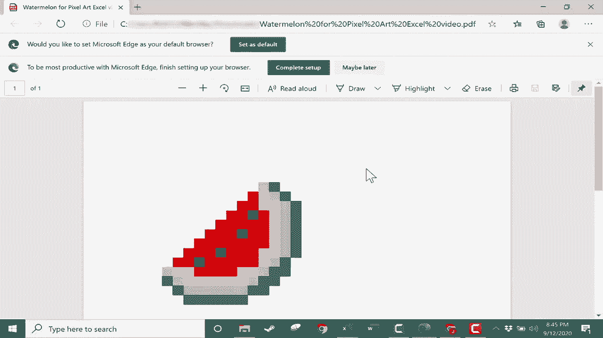

# Excel正确打开方式！提效技巧大合集！(持续更新中) - P36：36）如何创建 Excel 像素艺术 

在这个视频中，我将向你展示如何在 Microsoft Excel 中开始进行自己的像素艺术，这不仅有趣，而且对刚学习 Excel 的学生来说是一个很好的第一课。所以，如果你还不知道像素艺术，建议你去 Bing.com 或 Google.com 搜索一下，在完成搜索后，我会切换到图片模式，这样就只会显示图片而不是网站，你可以看到各种像素艺术的例子。

这些因《Minecraft》而流行，并且也常用作头像等。现在由于你在许多这些图像中看到的背景网格，Microsoft Excel 实际上非常适合人们创作自己的像素艺术。所以让我们开始准备 Excel 来进行一些像素艺术创作。这里是我想使用的 Excel 工作簿，第一步是改变 Excel 工作簿中单元格的宽度和高度。

为了做到这一点，我只需在 Excel 的这个确切位置点击。这将突出显示整个工作表中的所有内容。现在我只需把鼠标放在任何两个列字母之间。所以我会在 B 和 C 之间。然后点击并拖动。我将更改宽度。如果你看看这里。

它会告诉你宽度是以像素为单位的。而你选择的宽度并不太重要。我会选择 50，50 像素。好了。现在我可以在任何两个行号之间点击并拖动，做同样的事情。我会确保它也是 50。好的。现在我有了一个完美的像素艺术网格在 Excel 中。此时。

我真正需要做的就是使用 Excel 的填充颜色工具或油漆桶来开始创作美丽的艺术作品。如果你无法想出任何创意来创作你自己的原创艺术作品，你可以先去 Bing.com 搜索一下图片。😊

你想在 Excel 中绘制。因此，例如，我想在 Excel 中画一个西瓜。这看起来不错。所以我会点击它，也许再点击一次，然后我可以右键点击复制图片，然后在 Microsoft Excel 中粘贴就可以了。我只需把它稍微拉到一边。

恰巧这个西瓜图像与我设置的单元格宽度和高度几乎完美契合。如果对你来说情况并非如此，你可以尝试几种方法。一个尝试的方法是缩小图像或放大它，使其与我调整过的单元格的正方形大致匹配。我会撤销这个操作，因为它已经几乎完美了。好的。

所以现在我所要做的就是复制我在这里看到的内容，并在Excel中绘制出来。为此，你可能想使用缩放滑块，这样可以更好地查看你正在处理的内容以及你想要复制的内容。所以我就点击这里。我会试试。

大约点击在这个西瓜红色部分的同一位置。我可能不会做到完美，但没关系。所以在这里选定之后，我将上移到首页标签，在字体组中。我会使用这个油漆桶或填充颜色工具。我会点击旁边以选择合适的颜色。

我只是会使用这个红色。大致上与我们这里的颜色相同。所以我会点击那里，然后放入红色。好吧，现在我需要添加更多的红色。所以这会有点乏味，一次点击下一个单元格，然后点击这个红色按钮，再点击下一个单元格，再点击红色。这里有一个快捷方式可以让这个过程变得更轻松和有趣。

我会稍微放大一点。所以更容易看到。我所要做的就是选择我已经涂成红色的一个方块。然后点击这里的格式刷。现在，很多人可能知道，如果你点击格式刷，选中的内容会被复制，而我接下来点击的地方也会应用这个格式。

假设这里的格式是一样的。这是一个格式刷。但是请看这个小技巧。如果我做同样的事情，选择我想复制格式的单元格。然后，不点击格式刷。那如果我双击呢？如果我双击，它让我多次粘贴或应用相同的格式。所以到现在为止我有五个红色的方块。

在这里我有3，4，5，6，7，8。所以我需要再添加三个，我可以继续添加这些。为什么？因为我双击了格式刷按钮。好了，现在我可以添加一些更多的红色，直接复制我在右边的图像。看起来不错，然后我可以继续在适当的位置添加更多的红色。

给我一点时间来完成红色的添加，然后我会继续视频。太好了。我现在准备在我的图形中添加更多颜色。为了让我更好地看到这个，我会点击并拖动，使我正在复制的图像更靠近一些。现在我可以选择我想要变成黑色的像素。我将从这个开始。

我将上移并点击将其变为黑色。现在，你可能想使用的另一个快捷键。除了格式刷和双击格式刷之外。看看你还可以做什么。我可以点击我想让黑色种子出现的地方。然后我可以按住键盘上的控制键，点击下一个应该有种子的方块。

然后下一个，再下一个。所以我选择了四个方块。然后我可以上去点击油漆桶填充颜色，选择黑色，它们都变成黑色。我会再次使用同样的技巧来填入粉色。所以我会点击第一个应该是粉色的地方，按住控制键。

然后我只需点击选择其他所有单元格或方块，这些应该是相同颜色的。好，现在在这一点上，我可以回到油漆桶工具，随机猜测那种粉色。结果会很好。我可以试试这里这个。看起来不错，特别是当我点击其他地方时，或者我可以点击进入更多颜色。

我可以在这里选择这些粉色，或者去自定义，然后尝试获得我想使用的准确粉色，然后点击O。无论你怎么做，对我来说都差不多。接下来，对于绿色，我可以使用任一策略。我可以点击，然后将那个方块涂成浅绿色。

假设我选择了它，我可以双击格式刷。然后无论我点击还是点击并拖动，都会变成绿色。正如你所记得的，这是在Excel中快速放入颜色的一种方法。而另一种方法是按住控制键。

选择所有单元格，然后选择一个颜色。现在，我仍然激活了格式刷。所以我不能点击而不添加另一个绿色方块。为了解决这个问题，我只需点击格式刷，它就会取消选择。😊，好的。那么回顾一下另一种快速添加颜色的方法。

我这次只需点击单元格06，然后按住控制键，然后继续点击或点击并拖动一系列单元格。看看我是否正确操作了，片刻之后就会看到。选择了所有这些后，我可以去油漆桶工具，选择一种更深的绿色。好的。

所以这是我完成的像素艺术杰作，一片西瓜。在这一点上，我不需要我复制的图纸，所以我可以直接点击并删除它。我剩下的就是一幅美丽的西瓜像素艺术。我可以缩小查看它小的时候的样子，也可以放大来看它的细节。

无论我想做什么，现在我已经完成了我的像素艺术。如果我想的话，可以上到文件，选择导出，然后可以创建一个PDF文档。我会将其保存到我的下载文件夹里，那里。😊，我创建的PDF文档，当然可以打印或以多种其他方式使用。现在，回到主题。

我想让你看看使用这种像素方法在Excel中可以创建的一些惊人的艺术作品示例。我可以创造一个像素艺术龙、一辆车、一匹马，以及其他无数惊人的像素艺术项目。感谢观看。我希望你觉得这个教程有帮助。

