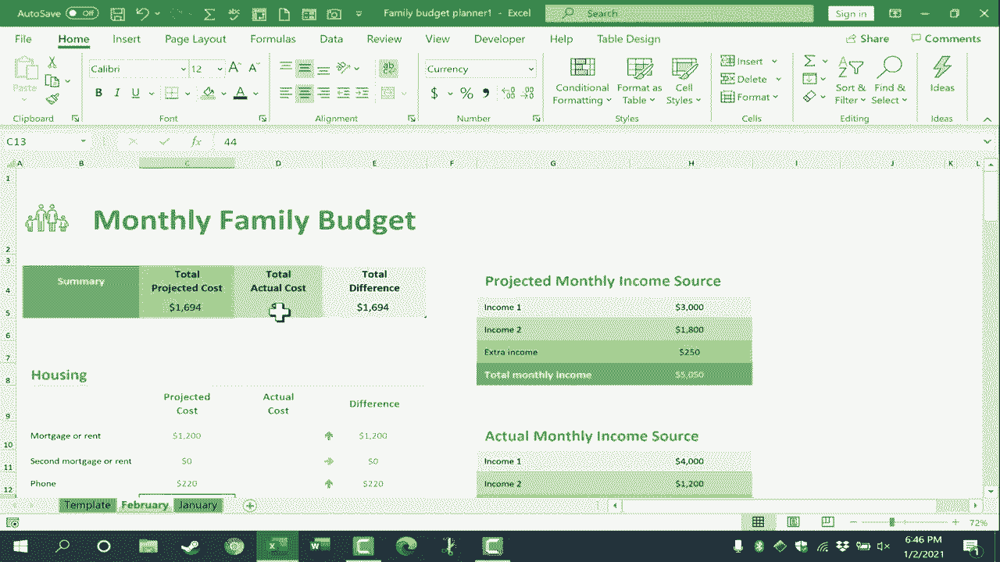

# Excel正确打开方式！提效技巧大合集！(持续更新中) - P38：38）使用 Excel 创建家庭预算 

在这个视频中，我将向你展示如何使用Excel创建和维护每月家庭预算。目前有很多人设定财务目标，可能是为了还清债务，存钱买房，不管是什么，我认为这个话题很合适。而且你知道吗，我已经使用Excel很多年了。

我制作了很多关于Excel的YouTube视频。但这个主题和Excel家庭预算仍然是我使用Excel的最有效方法。让我们看看如何做到这一点。所以我现在在Microsoft Excel中。我只需点击左上角的文件，然后选择新建。

这会弹出一个屏幕，我可以在这里开始一个新的空白工作簿。还有一些我最近访问的模板列表。所以这对你来说可能看起来不同。在那下面，有一个搜索框，我可以用它搜索一些在线模板。所以我输入家庭预算，然后按回车。

出现了几个结果。😊，除了家庭预算，我可以尝试家庭月预算，或者这个预算可能不是为家庭准备的，可能是为一个组织、公司。在这种情况下，也许只需搜索月预算或大学预算或部门预算。

无论你想搜索什么，然而在我的案例中，我将搜索家庭预算，我将选择这个，但我在这个视频中展示的所有原则都适用于其他样式和模板，无论是家庭预算还是商业预算，都是适用的。

我双击了它，然后弹出一个窗口，显示有关模板的更多细节。我可以浏览这些信息，然后点击创建以下载该模板的副本，这样就可以立即开始使用。为了让你更好地看到这个，我将使用右下角的滑块缩小视图，看看你如何使用它来真正帮助你跟踪家庭预算，并可能改变你的家庭。

在这个过程中管理财务。当你第一次下载这个模板时，它会带有一些默认数字。当然，我们可以更改这些数字。假设这是一个双收入家庭，收入来源一，可能$4000并不准确，也许更像是每月$3000。所以我只需点击单元格，输入3000。

我将在键盘上按回车，这会删除之前的数字。第二个收入呢？也许第二个收入是$1800。同样，我只需点击单元格，输入数字，然后按回车即可更改。注意现在有一个地方可以输入第三个收入。这是额外收入。

也许在某个月，我们会做一些保姆工作，或者我们会有一个车库出售之类的事情，这将带来一些额外收入。我会估算大约$250，然后按下回车。这引出了一个重要的观点，当涉及到使用家庭月度预算时。

在Excel中，这个想法是我和我的配偶在每个月初一起讨论，估算两人的月收入金额以及任何可能的额外收入。因此，这是在预测即将到来的这个月的财务状况。接下来。

我和我的配偶坐下来，查看每一个预算类别，再次为这个月的费用做出预测，比如说抵押贷款或租金，也许是$1200。现在，也许我并不知道任何这些费用的实际成本。如果是这样，我可能想要单击并拖动以选择所有这些单元格。

然后我可以右键单击并选择清除内容。接着我们可以继续处理预算中的下一个项目。没有第二次抵押贷款。那泡沫账单呢？也许更像是$200的煤气和电费。因此，因为这是一个来自微软的默认模板，尤其是在你第一次做这个的时候。

会有一些初步的工作，你需要进去把数字改成你自己的实际情况。现在我已经完成了这一点，请注意Excel在这种情况下为住房类别计算了一个预计成本。现在，这些数字总和就是这里列出的总预计成本。你会注意到，如果我把电话的金额改为220，然后按下回车，上面的数字会更新并改变。

好的，所以接下来我当然会继续处理交通费用，输入预计的保险、食品、儿童、法律等费用，还有各种其他类别。现在，在我实际输入所有这些数字之前，让我给你展示一个我和家人一起使用的小技巧，你可以看到这些数字。

住房费用、水费、电费等。这些数字通常基本保持不变。它们可能会略微上调或下调，但一般来说，每个月都相对一致。所以在我输入这些通常会变化的其他数字之前，比如这个月的交通费用或娱乐费用。

这些数字可能会更频繁地上下波动。在我添加任何这些之前，我将前往左下角，那里有这个电子表格的名称，家庭月度预算。我会右键单击它并选择重命名。我就叫它模板。按下回车，我这么做的原因是为了让我能够很容易地反复使用这个电子表格。

这样我就不需要清理上个月的信息。让我演示一下我的意思，现在我有这个模板，假设一月份来了，我只需右键点击模板，选择移动或复制，我确实想创建一个副本。

所以我会点击这里的复选框。点击确认，现在我有一个名为模板二的新标签。我会右键点击，重命名为一月。按回车键。可能把一月放在模板的右边更好，或者左边，根据你的喜好。但现在当我填写这个一月预算的数据时，我仍然有一个几乎空白的模板，可以为二月再复制一个，然后三月等等。回到一月预算，这是我和我的妻子要查看并预测例如汽油费用的地方。

对于本月的两辆车，任何可能需要的维护。然后我们可以继续处理其他类别。那么预计的食品、外出就餐等费用是多少？我们现在可以看看余额。预计月初的余额是1921。

所以我和我的妻子此时会这样做，如果这些是我们得到的数字，我们会说好吧，预计这个月底我们会有这么多剩余的钱，让我们计划一下如何使用它。在许多情况下，这将是为大学存钱、为退休存钱或对房屋进行修理。

但这就是预计的余额。随着月份的推进和实际收入的到账，我需要返回电子表格，输入那些实际数字，不仅仅是预计的月收入，还要将实际收入数字输入到电子表格中。

假设支票里有一些小额奖金。假设收入第二项按预期进账。也许院子拍卖的收入超过预期。这就是实际的月收入。当然，整个过程中，尤其是到月底时。

我和我的妻子需要进入电子表格，输入每个项目的实际费用，只需点击、输入，然后按回车键。更新这些很简单。我可以轻松看到哪些类别的开销超支，也许我们对所需金额的估算不足，但这有助于引起对一些超支或错误估算的关注。

当我们完成输入实际成本后。我们可以查看总预计成本、总实际成本和总差额。这是未花费的钱，即剩余的钱。所以当二月到来时，回顾上个月的情况是个好主意，看看一切如何结束。然后我可以简单地右键点击模板，选择移动或复制。我想创建一个副本。

那么我想把它放在哪里呢？在我的情况下，我希望它在一月份之前。点击O，然后有template2。我可以右键点击，重命名，称之为二月。按下Enter，预算大部分清空了，所以我可以进去更改一些固定的月度开支，比如水电费、房贷等。然后我们可以继续填写其他预计的费用。

使用Excel制作的这种月度家庭预算的一个伟大之处在于，我可以回顾一年前、两年前、五年前，看看我们在二月份的支出，特别是因为生日、不同的传统和其他事情。

多年来的假期，我们通常在一月的支出情况。这可以帮助我们为今年的二月制定计划。其他月份，比如十二月，也有一些假期，有时还会有假期旅行之类的。记录具体开支真是太好了。😊

家庭预算中所有项目的总体实际费用。非常感谢您观看这个视频。我希望您觉得这个视频有帮助。我知道这些信息在过去14年中对我和我的配偶做这件事帮助巨大。预测未来一个月的情况，并根据这些制定计划，然后跟踪进展和实际费用。

