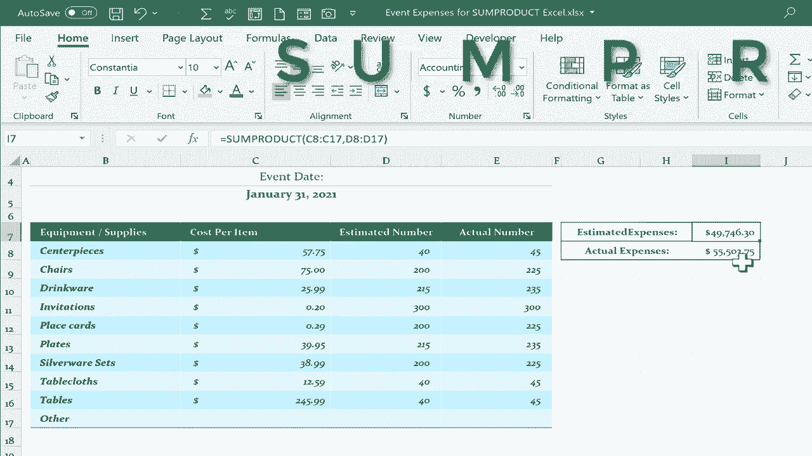

# Excel正确打开方式！提效技巧大合集！(持续更新中) - P39：39）Excel SUMPRODUCT 函数 - ShowMeAI - BV1Jg411F7cS

在这个视频中，我将演示使用 SUMPRODUCT 函数的基础知识。看完这个视频后，我希望你能明白 SUMPRODUCT 如何为你在许多 Excel 表格中节省几步。我们有一个活动费用的电子表格。假设有一个即将到来的活动，我们需要规划这个活动的各个方面及其费用。这里有一份设备和供应品的清单，每个项目的成本，以及需要的预计数量。

然后最终的数字就是它的结果。通常，人们会做的是你会有另一个列，通常会采用相同的格式。然后你会创建一个公式，生成正确的结果。这是中心装饰品的估计总成本。让我们来算一下。

通常，你会在 C8 中输入数字。所以你只需点击 C8 乘以预计数量。现在 D8，当然，我可以在完成后输入单元格引用。按回车键，它就会计算中心装饰品的总估计成本，然后我可以使用自动填充手柄，点击并按住那个绿色方块，然后向下拖动，它会自动计算并生成这些项目的总估计成本。如果我想在下面某个地方得到总估计成本，我可以点击输入等于号，然后对这个公式以上的所有内容进行求和，按回车键。

这就是总计。因此，你可以看到有多个步骤，我必须计算每个项目的成本乘以估计数量。无论乘法的结果是什么，它都会出现在这里。然后我会将那个公式复制到其余这些项目中，然后进行求和，实际成本也是如此，我可以输入等于号，这是每个项目的成本。假设这次活动的预期人数是 200，但实际是 225。那会改变桌子、中心装饰品，所有的都要变化。

所以 C8 乘以（asterisk），然后实际数字放在这里。所以 E8，按回车键。我可以向下自动填充，然后进行求和，我实际上可以通过拖动来自动填充这个求和。所以这是比较慢、耗时的方式来计算总估计费用和总实际费用。现在看看我如何用一个公式和一个函数来产生相同的结果。

使用 SUMPRODUCT 函数。我可以一次性完成所有这些。我可以让 Excel 将 C 列与 D 或 E 列相乘，然后将这些乘积求和。当然，数学中的乘积意味着乘法的结果。就是这个乘积。那么回到 K7，我输入等于 SUMPRODUCT，你可以看到 Excel 识别了这个函数。

现在Excel在寻找一个数组，逗号，另一个数组，逗号，另一个数组。数组只是Excel中范围的另一种说法。那么，在这次相乘的加法中，第一个涉及的数组是什么？所有产品的总和。那么，第一个需要相乘的数组是每个项目的成本。

所以我会点击并拖动以突出显示C列中的所有数字。这是第一个数组。那么第二个数组。它们将会乘以什么以产生一个乘积呢？好吧，这些数字将依次与预计费用相乘。它们将乘以D列中的数字。所以这是我的第二个数组。

我点击并拖动以突出显示数字，而不是这里的列标题。仅突出显示D列中的数字。这就是我所需的预计费用。因此，我应该输入右括号，然后点击回车。在点击回车之前，我想引起注意的是公式栏。

这里通常是查看你正在创建或过去创建的公式最清晰和安全的地方。所以让我们回顾一下这里会发生什么。Excel将把C8与D8相乘，所以C8将被D8相乘以再次产生一个乘积。

乘积就是乘法的结果。然后这个过程将继续沿着范围进行。所以这里的冒号表示到这里。所以C8到C17。接下来，它将把C9与D9相乘，然后继续到C17，恰好是空的0乘以D17也为0。当完成所有乘法运算时，它会产生一大堆乘积。

你不会看到那些产品。然后Excel会对它们求和。它会将所有值加在一起。所以我们点击回车，你可以在公式栏或实际公式输入处进行操作。我将在公式栏中完成这个操作。我会在键盘上点击回车，而那个公式与这两个范围或数组的乘积产生完全相同的结果。

这个数字与我们在G18中看到的相同。但这需要多个步骤来创建。现在，当然，我可以点击并拖动将这些结果格式化为货币或会计格式，以便清楚地表示我们讨论的是钱。我们再做一次，但这次是针对实际费用。因此，这个单元格等于求乘积。我将在公式栏中完成这一步，左括号，数组一。

现在再次，我们谈论的是实际费用。但每个项目的成本仍然是相同的。所以我点击并拖动以突出显示成本列中的所有数字，输入我的逗号，Excel此时期待另一个数组，并注意如果你想的话，可以使用多个数组，而不仅仅是两个。

但在这个例子中，我们需要做的就是。所以这次，我需要的是实际购买的椅子、桌子和盘子的数量，而不是估计数量。因此，我会单击并拖动以突出显示实际购买项目的数组，我应该在右括号中放入，即使通常不需要这样做。

然后我会按下键盘上的回车键，它会产生相同的结果。所以，当然，我们根本不需要这些列。我可以突出显示这些列。我可以删除以产生这些结果，您只需要一个单元格和一个使用一些乘积的公式，正如我在这个视频中演示的那样。现在，这只是开始，某些乘积函数的能力远不止于此。

这可以成为一个非常强大的函数，供您以多种不同方式使用。感谢观看这个视频，我希望您觉得它有帮助。
