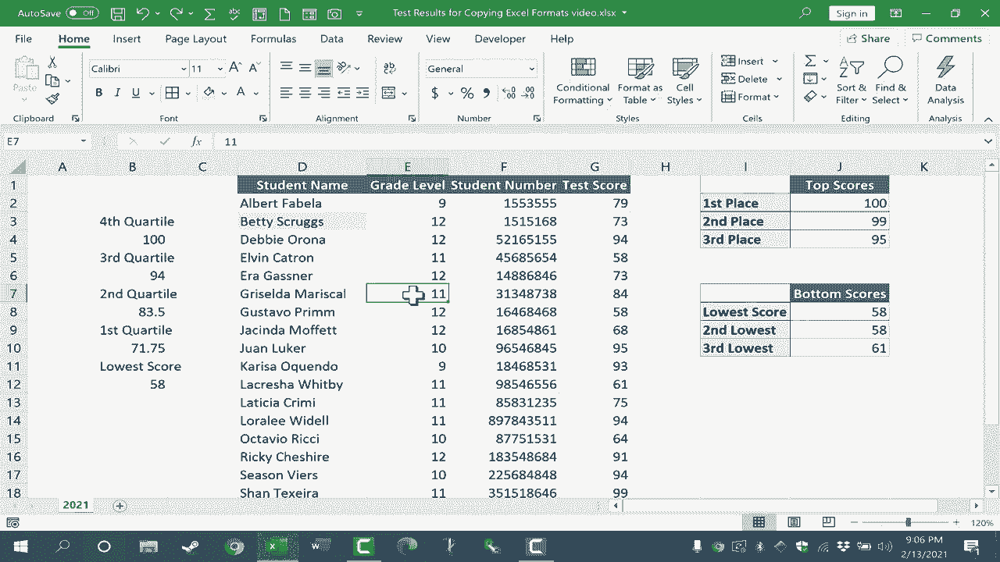

# Excel正确打开方式！提效技巧大合集！(持续更新中) - P40：40）复制 Excel 格式：格式刷及更多 - ShowMeAI - BV1Jg411F7cS

在这个视频中，我们将重点介绍如何在 Excel 中使用格式刷以及其他方法复制 Excel 格式。所以让我们来看一下这个电子表格，这是一个学生考试成绩的电子表格。假设我决定稍微美化一下，让它看起来更好一些，应用一些格式。

也许我想把单元格的背景颜色设为深蓝色。也许我想把文本设为白色，我觉得这看起来不错。那么如果我现在想把这个格式复制到我的 Excel 电子表格中的其他单元格呢？一种方法是点击我想要模仿的单元格，然后按住控制键并按 C 来复制该单元格。

然后我可以移动到我想粘贴相同 Excel 格式的位置，比如在 J1，然后我会去“开始”选项卡的剪贴板功能区，这里有一个粘贴的选项。如果我去到那个粘贴按钮的底部，会有一个箭头。

选择粘贴特殊，现在我可以选择格式。我只想粘贴格式。我不想粘贴值或公式或其他任何东西，只想粘贴格式。我点击确定，它仍然显示“最高分”，并没有显示“学生姓名”，但 D1 的相同格式已应用到 J1。现在，不使用选项卡和功能区，我可以简单地按住控制键和 alt 键，再按 V。控制+alt+V 会弹出相同的粘贴对话框，因此我可以以这种方式选择格式，并得到相同的结果。

复制 Excel 格式的另一个选项是使用格式刷。它看起来像一个画笔，你可以在“开始”选项卡的剪贴板组中找到它，这个功能起初对人们来说有点困惑，但基本上你先点击具有你想要的格式的单元格或范围，然后点击格式刷，似乎什么都没有发生。

但是看看我的鼠标指针。它现在旁边有一个加号和一个画笔，这告诉我我处于格式刷模式，我可以点击 Excel 中的任何东西以应用相同的格式。我现在要撤销这个，让我再做一次，但这次通过双击格式刷。

现在我可以做同样的事情，但不止一次，而是多次。现在我点击的任何内容都将具有与 D1 完全相同的格式。这是一种快速将格式应用于多个单元格的好方法。我甚至可以点击并拖动整个范围，以将相同的格式应用于整个范围。

我会撤销这个。现在，格式刷也很好地适用于复制整个范围的格式。因此，例如，对于这里的这个范围，假设我想让所有的边框都可见并加粗，我想让第一、第二和第三名也加粗，也许我想添加不同的颜色。

在这里的 I 列。所以这是我为这个数据范围设置的格式。但如果我想将所有这些格式应用到下面这个范围呢？这似乎会需要多个步骤，即使我使用格式刷。我必须按照我想要的格式为每个单元格进行格式刷，对吗？不。

其实不，如果我点击并拖动选择整个范围。我可以然后去格式刷，点击，然后点击并拖动我想要应用同样格式的范围，释放鼠标按钮，那个格式就会精确地复制到第二个范围。

我可以在 J 列和 K 列之间双击，这样你就可以更清楚地看到。同样在 I 列和 J 列之间也是如此。所以这个格式刷是复制 Excel 格式的非常强大的方法，无论你是简单地复制一个单元格还是整个格式范围，它都很有效。让我们来看另一种复制 Excel 格式的方法。假设我想在这个范围内设置我自己的条纹行。

现在有更快速、更简单的方法来做到这一点，但仅作为示例。假设我希望这一行为淡蓝色，这一行为白色，这一行再为淡蓝色。好吧，我已经设置了单元格 D3 为淡蓝色。如果我想将这个单元格的格式复制到右边。

我可以做的是右键点击自动填充手柄，很多人都知道这个自动填充手柄，就是我选择的单元格右下角的这个小绿方块，它可以让你点击并拖动，以复制或扩展单元格的内容。

在这种情况下，是将 Betty Scrubs 复制到我拖动自动填充手柄的每个单元格。我会撤销这个操作。那么，如果我右键点击自动填充手柄呢？你可以点击并拖动，然后释放，会给你选择如何处理这个自动填充的选项。

我只想填充格式，所以数据本身并没有改变，而是像我之前说的那样，只是复制了格式。但是现在你知道可以通过点击自动填充手柄来扩展格式。我知道你会看到机会，那将是复制 Excel 格式的好方法。所以这些是从一个单元格或列或范围复制 Excel 格式到另一个单元格、列或范围的几种不同方法。感谢观看，我希望你觉得这个教程有帮助。

