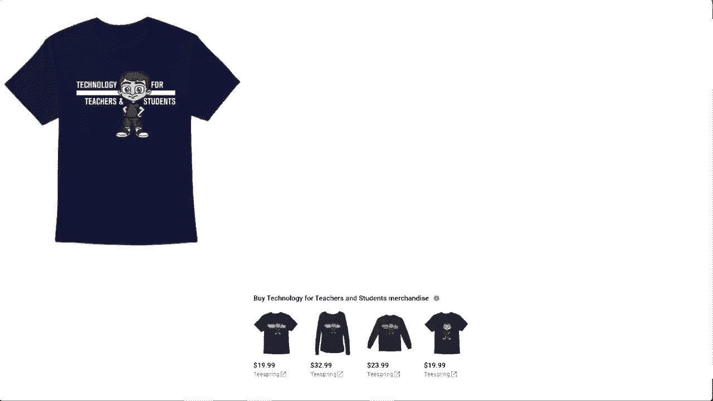

# Excel正确打开方式！提效技巧大合集！(持续更新中) - P41：41）Excel双击鼠标技巧 - ShowMeAI - BV1Jg411F7cS

在这个视频中，我们将学习一些Excel的双击鼠标技巧。试着快速说三遍。如果你想跟着视频操作，可以在视频下方的描述中获取我使用的这个电子表格的副本。Excel中充满了一些小技巧，你可以通过双击来执行，第一个技巧是，你可以双击Excel的标题栏来最大化窗口。正如你所看到的。

我的Excel窗口没有填满整个屏幕。如果我双击这个标题栏，它会自动最大化窗口。那么，如果我需要回到这个窗口较小的之前的大小呢？我只需再次双击，它就会回到之前的确切大小。第二个技巧，Excel有这样一个不错的选项卡和功能区布局，使我们能够轻松识别可能想要使用的最重要的选项、功能和工具。

但有时这个大功能区会妨碍使用，尤其是当你的屏幕较小时，比如我。如果你想隐藏功能区，只需双击。除了“文件”以外的任何选项卡都可以双击，不要双击“文件”。例如，如果我在“数据”上双击，它会隐藏功能区，这样我就可以在电子表格中输入数据时有更多的空间。如果我想恢复功能区，只需在“文件”以外的任何选项卡上再次双击。第三个技巧是，当我在Excel中处理数据时，如果我需要更改单元格内的数据，而不是只点击一次然后通过输入覆盖数据，我可以双击特定单元格以进入该单元格。

你可以看到我的鼠标光标在闪烁，现在我可以简单地编辑单元格的内容，所以我不必删除“DVD”这个词。在这种情况下，我可以直接添加一个斜杠并输入“blueray”。第四个技巧是，你可以双击单元格内的文本以选择该词。假设我双击以进入这个单元格，此时如果我双击“comedy”这个词，它会选择整个词，这在我想要剪切那个词时会很有帮助。

复制或删除那个词。那么，如果一个Excel单元格中有多个单词呢？我双击以进入这个单元格，如果我双击“science”这个词，它会只高亮“science”。如果我三次双击呢？如果我三次双击，它会高亮该单元格中的所有单词。

第五个技巧是，我可以在列之间双击以自动调整它们。例如，假设我的“位置”列比必要的要大。我可以在F列和G列之间双击。必须在上方，而不是在数据本身下方，而是在列字母上方。

但是在F和G之间双击，它会自动调整该列的大小以完美适应所有数据。它在其他方向也适用，所以假设我的列太窄。我可以在F和G之间双击以扩展该列，变得更大。你也可以同时对多个列执行此操作。

所以我将更改A、B和D，使它们的大小不同。如果在列字母上点击并拖动到最右侧，然后在任何两个之间双击，它应该会自动将所有列调整到完美宽度。技巧6。你可以双击自动填充手柄将公式复制到电子表格中。

这里是我所说的在这一数据范围的右侧的一个示例。我设置了一个新公式来计算我为每个DVD支付的价值变化和DVD的当前价值。如果你看过我其他的Excel视频，可能就知道了。

我可以使用自动填充手柄点击并拖动，将这个公式应用到页面下方。这很好，通常这是使用自动填充手柄的一个非常好的方法。但是，如果这个电子表格中不是30或40部电影，而是有1万部呢？我不想在电子表格中无限点击和拖动。因此，为了节省时间，我可以只需双击那个小绿色方块的自动填充手柄。只需双击，它就会扩展那个公式。

一直到数据的底部。技巧7。你可以双击格式刷以多次使用它。假设我想用一些颜色和一些粗体选项来格式化我的电子表格。也许我希望下面的数据为*斜体*。

也许我想在列A中让我的数据有可见的边框。因此，我进行了某些格式更改。现在，如果我想把它复制到列J，我该怎么做呢？嗯，一个方法是使用格式刷。我可以点击一个我喜欢格式的特定单元格，然后去到“开始”选项卡中的剪贴板组。我可以点击格式刷，然后可以在这里点击格式化另一个单元格。

但此时格式刷被取消选择。我需要重新开始这个过程才能以那种方式格式化更多单元格。这一次，我将双击格式刷，而不是单击一次。这样可以保持它启用。因此现在我可以点击多个单元格。当然，我可以点击并拖动，将该格式应用到所有这些单元格上。

但是如果你想突出显示的单元格散布在整个电子表格中呢？因为我已经双击了那个格式刷。我可以继续点击，它将以与该单元格相同的方式格式化那些特定的单元格。我想我会撤销所有这些，让我们继续第8个技巧。

你可以双击单元格的边缘，以跳转到该范围内最后一个有数据的单元格。例如，假设我在 Gremlin 的单元格上。如果我双击该单元格的底边，它会让我跳到这个范围内最底部的记录或电影。所以十个。

现在如果我需要到最右边，我可以在 A35 的右边缘双击。在这种情况下，这会把我带到 B35。那么，为什么会这样呢？😊。原因是我在数据中插入了一个空白列。我将右击并删除那一列，然后再试一次。我选择 A35。

我在那个单元格的右边缘双击，它让我跳到我的数据范围的最右边。它同样适用于特定单元格的左边缘和上边缘。小技巧编号9，你可以双击一个形状为其添加文本。我可以在这里找到这些形状。假设我在我的数据上方插入一个形状，我可以双击那个形状来添加文本。

小技巧编号10。在对话框中双击选择选项。在 Excel 中，当对话框打开时，你通常可以选择一个选项，然后点击 O 来应用该选项。那为什么不直接双击选项呢？在大多数情况下，这就是你需要做的来应用该选项。你不必点击 OK。小技巧编号11，你可以双击重命名你的工作表。

这里是工作表编号一。我只需在这里双击，就可以将其重命名为电影收藏。小技巧编号12，你可以在标题栏的左上角双击以关闭你的 Excel 工作簿。由于我还没有保存，当我双击时，它会问我是否要保存更改。我选择保存。然后它会关闭工作簿，但在你想快速退出 Excel 时，这可以节省不少时间。

这些就是我的 Excel 双击鼠标的小技巧。感谢你观看这个视频。我希望你觉得它有帮助。如果你觉得有用，请点赞、关注并订阅。当你订阅时，点击铃铛，以便在我发布另一个视频时收到通知。如果你想支持我的频道，可以通过我的 Patreon 账户或购买频道周边来实现。

你将在这个视频下方了解更多选项。说到 Patreon，我想向我的$5 Patreon支持者致以感谢。非常感谢你们对频道的支持！

