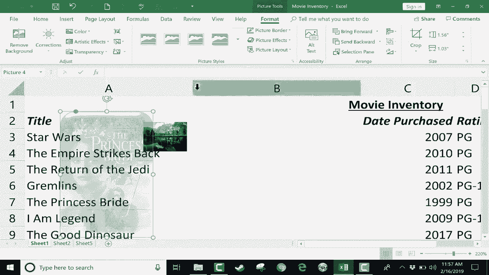

# Excel正确打开方式！提效技巧大合集！(持续更新中) - P8：8）将图片和背景添加到Excel 

在这个简短的Excel教程中，我想展示如何将一些图片添加到Excel电子表格中。这主要是为了展示目的。假设你想向观众展示一个电子表格，你想让它看起来更生动、更吸引人。这是一些你可以使用的小技巧。所以第一个选项是添加背景。

你可以在页面布局选项卡的页面布局功能区进行设置。在页面设置组中，就在那里，有一个背景选项。所以我可以添加一个背景。我点击背景。在这一点上，我可以浏览我的电脑寻找图片。我只需双击其中一张，选择这张酷炫的自然图片，点击插入。

现在我的数据后面有了这幅美丽的背景。当我向下滚动页面或向右移动时，你可以看到图片在背景中不断重复。因此，做这件事有一些好处，也有一些缺点。好处是。

显然，这为我的电子表格增加了很多色彩和美感。缺点是背景图片遮挡了一些文本。这一单元格里的内容很难阅读。这个单元格里的内容也很难阅读。这些也是如此。因此，在添加背景时要非常小心。

另一个缺点是这个。注意当我缩小时会发生什么。我正在缩小。我的数据变得更小。但大部分情况下，图片的大小保持不变。如果我大幅放大，它确实看起来图片有一点变化。但在大多数情况下，图片在背景中保持静态，而文本变得更小或更大。

所以背景图片不会跟随数据。它与数据本身不成比例。所以请注意这一点。现在，在页面布局中我有另一个选项。现在我有了一个背景。我可以删除背景，并可以添加一个新的，并注意到有一个进行图片搜索的选项。

在很多情况下，这样做比从你的电脑上传更好，因为很多时候你可能并没有那张完美的图片在电脑上。 如果你使用OneDrive，还可以从OneDrive中提取图片。如果你不熟悉OneDrive。

请观看我的视频教程。但是在这里进行图片搜索时，我只需点击并搜索DVD。这张我用作示例的电子表格是DVD库存。因此，我将默认搜索DVD的图片。它只会查找创意共享的图片。这些图片是为了共享而上传到互联网的。

如果你想要更多，你可以取消选中该选项，它会给你更多结果。这里还有一个过滤按钮，你可以点击，表示我只想要大图像，我只想要剪贴画或线条图。线条图的好处是因为它们是黑白的，如果你添加它们，有时不会遮挡文本太多。我将撤销该操作。

不过，回到背景，再次搜索 DVD。在这种情况下，我将坚持使用创意共享的内容。这些是被上传以供分享的图像。我将点击这个特定的图像并插入。同样，这确实会影响可读性。因此，我可能需要调整文本格式，使其颜色不同，以便我能实际阅读它。

即使如此，阅读起来也很困难。我将回到页面布局并删除背景。因此，背景可以非常好，但你确实需要小心，确保它们不会遮挡文本，使其无法阅读。关于背景的另一件事是，当你在电子表格中添加背景时，如果你去打印或甚至是打印预览，要注意背景图像不会被打印。

它们不会在打印预览中显示。因此，Excel 中背景图像的唯一真正用途是当你在做演示时，当你向其他人展示数据时，并想吸引他们的注意。现在，让我们看看你还有第二个选项。

在很多情况下，添加背景不如直接点击插入更好。在插入功能区中，进入插图并选择图片。现在，你的 Excel 版本可能看起来稍微不同。我正在使用一个非常小的屏幕来制作这个教程。

所以它无法在提供的空间内放置这些图标。对你来说，可能看起来稍微不同。但通常，它在插入选项卡的插图组中找到。寻找图片。因此，我可以上传相同的图像，或者为了多样性，我将选择一个不同的图像。

但这次它不是背景图像。这实际上是漂浮在电子表格顶部的数据上的图片。如果我增加缩放，图片会变大；如果我减少缩放，图片会变小。因此，这与背景图像的工作原理根本不同。

我可以将其缩小到任何我想要的大小，然后将其放在我想要的数据旁边或上面。因此，我知道这与 DVD 的标题并不匹配，但它可以工作。我还可以尝试点击插入插图在线图片。

这与我在查看背景时展示的类似，但在这种情况下，我有可以提取和使用的图像类别，我可以浏览这些图像，也可以进行搜索。所以我将搜索“公主新娘”，它只找到创意共享的内容，这在这种情况下非常完美。

我可以选择一张图片，点击插入，然后它的大小太大了。但同样，我可以把它缩小。然后我可以把它放在相关的数据旁边。我甚至可能会考虑在我的电子表格中插入一个新的空列。在这一列中，我可以放置与不同DVD相关的这些图片。

如果我想的话，我可以真的把它缩小，并放入单元格中。现在它并不真正位于单元格内，实际上是在单元格上方悬浮，但它看起来像是在单元格中。现在，插入图片而不是使用背景图像的一个优点是，一旦插入图片，你可以点击它，会出现一个格式选项卡，你可以点击格式选项卡，查看所有可用的格式选项。

我可以给这张图片加一个边框。我可以让边缘变得圆滑，变成椭圆形。我可以给它一个3D效果或斜面效果。所有这些图片样式都可以选择。我还可以改变透明度。这在电子表格中尤其有用。因此，在这一点上，尽管这不是背景图像。

它几乎表现得像是背景图像。而这些格式选项的好处在于，我能够使用这个透明度工具让这张图片变得透明，这样它就可以放在数据后面，同时我仍然可以读取数据。因此，这可能是将背景图像添加到电子表格中的更好方法。尽管它并不真正是背景图像。所以这两种方式都可以将图片添加到你的Excel电子表格中。

感谢观看，希望你觉得这个教程对你有帮助。如果你觉得有用，请点击下面的点赞按钮。
