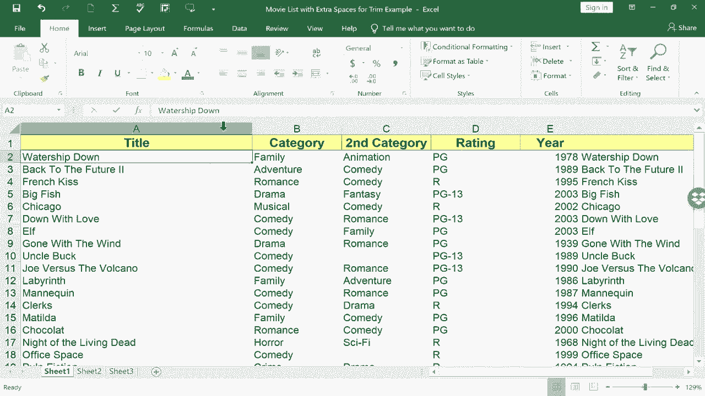

# Excel正确打开方式！提效技巧大合集！(持续更新中) - P9：9）移动和复制列 

在这个简短的Excel教程中，我想展示一个更快、更简单的方法来移动Excel中的列。许多人会按照这些步骤来移动Excel中的列。他们会右键单击列字母并选择剪切。然后他们会去想要粘贴该列的地方，右键单击列字母并选择粘贴。

这个方法有效且不错，但看一个更快的方法。我只需用左键单击选择A列，然后将鼠标指针放在该列的右边缘。我会稍微向下移动A列，你可以看到我的鼠标指针变成了四个箭头的符号，而不是加号。此时，我可以左键点击并按住，拖动整列到我想要的位置。如果我拖到一个空白列，那很简单，它就会放在那里。如果我拖到一个已有数据的列，看看它怎么说，那里已经有数据了。你想替换吗？不。

我不想这样。所以我会取消。如果我想把这一列放在D列，我需要在D列右键，插入一个空白列，现在我可以左键点击H列，移动到边缘。我之前去过右边的边缘，但左边的边缘也同样有效。我会把它放在我想要的位置。

我会使用Ctrl Z撤销所有这些，因为我想再给你展示一个通过选择整列可以使用的技巧。除了移动到边缘，点击和拖动外，你还可以按住Ctrl，然后点击并拖动边缘。现在，这样做有什么作用？这实际上是复制列。所以列保持在原来的位置，并在我拖动的地方被复制。

所以每当你需要移动一列时，想想这个视频和选择的技巧。

整个列，利用该列的边缘拖动到你想要的位置。感谢观看。我希望你觉得这个教程有帮助。如果你觉得有帮助，请点击喜欢。
