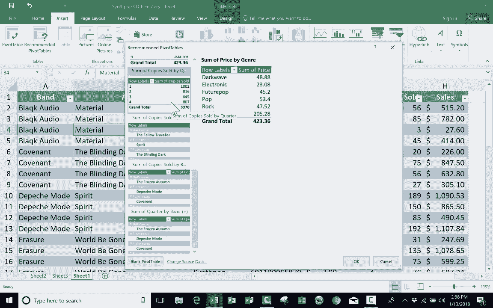

# Excel高级教程（持续更新中） - P10：10）使用“推荐的数据透视表” 

在这个简短的教程中，我将向你展示最简单、最容易的方法，将数据透视表添加到你的Excel电子表格中。这个功能被称为**推荐的数据透视表**，并且仅在较新版本的Excel中可用。因此，你需要检查一下你的Excel版本是否具备此功能。要检查的地方在左上角，只需点击插入，你应该能看到数据透视表旁边有推荐的数据透视表。如果你还没有这样做。

你真的应该观看我之前的视频，专注于常规数据透视表，以及如何设置它们、如何安排以获得你希望显示的数据。所以请在观看这个视频之前，先观看那个视频，或者至少在观看这个视频的同时观看那个视频。在之前的视频中，我使用了这个包含乐队列表的相同电子表格，而这个电子表格应该是一个假设的合成流行音乐商店的库存。

我们这里有一个令人惊叹的流行乐队及其最新C类发行的列表，😊，它的排列方式非常典型，适合库存管理。你有项目编号、价格、季度、售出总数和总销售额，换句话说，就是带来的总金额。

但如果我想从这个电子表格中提取特定数据并以新的方式查看，我可以使用数据透视表工具来实现。不过在数据透视表工具旁边，还有一个叫做推荐的数据透视表的功能。如果你只需点击推荐的数据透视表，你会得到一个弹出窗口，我将看看是否可以稍微扩展一下。

推荐的数据透视表正如其名。Excel根据我在电子表格中拥有的数据，向我推荐可能的数据透视表。因此，我可以获得按类型汇总的价格数据透视表。这将帮助我了解在我的商店中，每种类型的价格是多少。

但这真的是我想知道的吗？我的意思是，这是可能被出售的商品价格的总和，但它们并不一定已经售出。因此，我不知道这是否真的是我想要的。我觉得不是，所以我会在一些按类型的销售数据中点击。现在这可能对我更有用。我可以查看并识别我假设的商店中哪种音乐类型最受客户欢迎，而我的假设客户对音乐的品味非常独特，因此你可以看到流行音乐是为我带来最多销售的类型。因此，这个推荐的数据透视表对我来说可能确实有用。接下来是按类型汇总的项目编号、售出的副本数量和季度数据，对我来说这不是很有帮助，我并不需要知道项目编号，或许副本销售总数是有用的，但我不喜欢这一项，所以我会向下选择下一个。因此，关键是你可以向下选择这些推荐的数据透视表。

这已经为你做了工作。基本上，你只需查看这些数据，判断对你是否有用。这是按乐队销售的副本数量。我认为这非常有用，它还列出了与该乐队相关的音乐类型，因此这也可能很有用，接下来是按乐队汇总的季度数据。注意，除了布兰登·弗劳尔斯外，它们的总数都是相同的。

因为我只为一个季度放入他的专辑。所以这是另一个数据透视表报告的例子，尽管是推荐的，但它并不太有用。它并没有告诉我我想要或需要的信息。因此，在这个例子中，我将选择按乐队汇总的副本数量。我点击它，点击确定，注意它所做的。它为我添加了一个工作表，我可以在其中查看这个数据透视表报告，并从中提取我想要的信息。如果我想调整这个报告。

如果我想在右边添加或更改某些内容，我可以使用数据透视表字段面板进行调整，可以将季度作为列添加或进行其他多种更改。如果你想了解更多关于如何实现这一点的信息。

请观看我之前的视频，标题为“高级Excel：数据透视表介绍”。我真的很喜欢数据透视表，通常我都是自己制作。我通常使用插入数据透视表，因为我通常确切知道我想要在数据透视表报告中包含什么，但有时我并不确定，因此我会插入推荐的数据透视表，然后看看哦，这是否对我有帮助，我想知道那部分信息是否对我有帮助。因此，这是一种获取有关数据透视表如何为你带来益处和提取数据的信息的绝佳方式。

