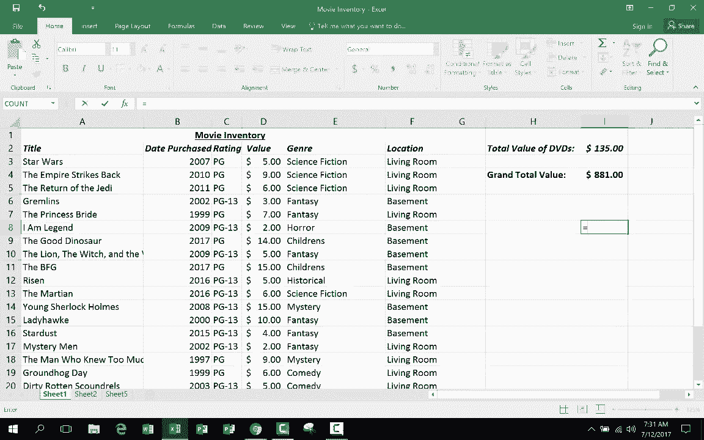

# Excel高级教程（持续更新中） - P13：13）3D公式 - ShowMeAI - BV1sQ4y1B71N

在这个简短的视频教程中，我们将探讨一个高级Excel技巧。那就是如何生成3D公式。如果你还没有观看我的Excel初学者指南或中级技巧视频，请先回去观看那些，这样你看这个视频时会更有意义。但现在让我们开始在Excel中使用3D公式。在这一系列的前两段视频中。

我创建了我拥有的电影的库存。说实话，这是假设的。我输入了标题、购买日期和价值。有些人对我在这里放入的价值提出了异议。这些都是随机放入的。但基本上，我输入了类型、房子的地点、评级等信息。现在。

在之前的教程中，我还放入了所有DVD的总价值。它已被计算并放置在这里。在这个教程中，我进行了更改。😊。

这个电子表格的排列方式，我已将总值移到右上角。你可能猜到了原因。在这一点上，我可能有这么多DVD，但将来我可能会买更多，我需要有空间将那些记录放在这里，列出这些DVD及其相关数据。然后我希望在这里生成总值。所以我需要再次输入那个公式。

所以我只需输入等号，然后选择我想添加的内容。现在，当然，最终我会有比这更多的DVD。所以我将其改为D，假设2000，按回车键。那么现在它会将所有DVD的价值加到2000。

如果我想的话，我可以做到10000。但这里是我在电子表格中列出的DVD的总价值。我在这个工作簿中做的另一个更改是创建了一个第二个工作表。你可以在左下角看到。你只需点击添加即可添加一个新工作表。好吧，我已经这么做了，在第二个工作表上我创建了一个非常相似的电子表格。

你可以看到它的排列非常相似，但这是我的音乐库存。我在这里列出了一些我确实拥有的实际CD。在这种情况下，我收集了我喜欢的一个流派的精彩音乐，叫做合成流行音乐。这包括像杜尔佩什·模式、阿尔法维尔和类似的现代合成流行音乐。

包括一些地下合成流行音乐，如Bom code 64 B机。这些是非常少有人听过的惊人音乐，但如果你喜欢经典合成流行或新浪潮音乐，这些都是非常好的音乐。我还收集新浪潮CD。所以这是我拥有的真实音乐的部分列表，购买日期，我给它的评分，基于收藏家愿意为其支付的当前价值，以及它们的存储位置。现在因为我遵循了与我的相同的模式。

在第一张表格中，我能够创建一个三维公式，并强调这两张表格是多么相似。我将进入视图并将缩放到125%。这样你可以真正看到它们的相似之处。是的，我更改了一些列。这一个说的是星级评分，而不是内容评分，等等。但在大多数情况下。

这是同一张表格。在这种情况下，CD的总价值和DVD的总价值都在同一个单元格I2中。因此，我们有I2，也有I2。正因为如此，我可以返回到表格1并做一个三维公式。这就是你可能想做三维公式的原因。假设除了我的电影库存，我还想要音乐库存。

然后可能有一本书的库存，当然还有其他类型的媒体。所以我可以创建几张不同的表格。我希望能够得到所有媒体或我的所有收藏的总价值。做到这一点的方法是，我可以点击这个空单元格，输入等于sum左括号，然后简单地点击我想要添加的单元格。所以我想要添加DVD的总价值，但不仅如此，我还想添加CD的总价值。

假设还有书籍等等。所以我选择正确的单元格的方式是，我下到表格列表，按住键盘上的Shift键，然后点击以包含我希望汇总的所有表格的单元格I2。

假设我只想要表格1和表格2。在按住Shift键的同时，我会点击表格2，现在它们都被选中。如果我想要这三张表格，我会在这种情况下点击表格5。它叫做表格5，但实际上是第三张表格。现在这三张都被选中，看看我的公式。

合并这三张表格。如果我改变主意，我点击返回，你会看到公式在变化。所以这就是他们所称的三维公式。因为它不仅涉及列和行，而是列、行和表格，这是第三个维度。不仅是x维度，y维度，还有z维度。

它进入其他表格。所以我将选择这三张表格。我再次按住Shift键。现在我释放Shift键，然后简单地在键盘上按回车。看，它生成了我所有媒体的总价值。当然，我可以到这里的主页，选择这就是钱。

如果我想的话，可以将其加粗。但这基本上就是如何在Excel中创建3D公式。您点击希望显示3D公式的单元格，输入等号，然后输入您想使用的函数，无论是求和、平均值、最大值还是最小值，随您所需。在我看来，是求和。

输入左括号。点击相关单元格。现在必须是工作表2、工作表3等中的同一个单元格。对了，您想要的数据必须在同一位置。但无论如何，您点击该特定单元格，按住shift，然后用鼠标点击选择您想要在该3D公式中包含的不同工作表。

然后只需按回车键。
