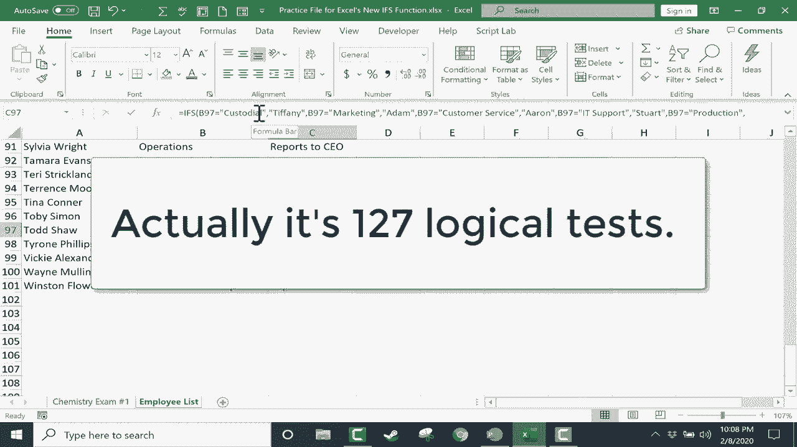

# Excel高级教程（持续更新中） - P16：16）新的 IFS 函数 

在本教程中，我们将看看 Excel 中令人兴奋的新 IFS 函数。这是一个新特性，一个在 Excel 2019 中全新推出的函数。它也包括 Office 365。所以在我们深入探讨这个新的 IFS 函数之前，先来看一下已经存在很多年的常规 if 函数。

这里我们有一个电子表格，列出了学生编号、学生姓名和他们的考试成绩。假设这是一个大学班级。他们参加了考试，这就是他们的成绩。那么，我可以使用 if 函数来进行一些基本的自动评分。让我们看看如何使用我们已经有一段时间的传统 if 函数。

第一步是点击一个单元格，输入等于 if 左括号。然后我们会弹出一些帮助信息。它说如果逻辑测试，值如果为真，逗号，值如果为假。所以我需要一个逻辑测试。假设如果 D2 大于 59，则我会放一个逗号来表示接下来要做的。如果你查看我们得到的帮助文本，它说现在是值如果为真，所以我应该在这里输入如果 D2 确实大于 59 时显示的内容。好吧，我想在屏幕上输出单词 pass，双引号表示在屏幕上输出。现在我放一个逗号，这就像说如果不是。

所以让我们回顾一下，如果 D2 大于 59，则输出 pass，如果不是，则输出 fail，然后我会加上括号，按下键盘上的 Enter 键，注意 Excel 是如何测试 D2 是否大于 59 的，如果是的话，输出 pass，这正是发生的事情，pass。因此现在我可以通过点击 E2 这个公式所在的单元格，使用自动填充手柄，然后点击并按住，向下拖动到整个学生列表。

我们可以计算他们是否通过或未通过。现在，还有一种更快速的方法。我可以双击自动填充手柄，这样会自动将其应用到整列。这很好，对吧？嗯，是的。但如果我想做的不仅仅是通过或未通过呢？如果我想说如果大于 92，那么就是 A。好吧。

我可以输入等于 if 左括号。D2 大于 92，则输出 A。我不需要再加上 if not 或 if false，我可以在这里停止，或者我可以继续说如果它不大于 92，那么我该说什么呢，是通过、未通过、B 还是 C，我需要更多的内容。

我需要能够创建一个公式，计算的不仅仅是一个陈述是否为真。你可以看到我在这里得到的结果，它们都是 false 或 A。仅此而已，它的能力就到此为止。因此，传统上，解决这个问题的方法是创建一个所谓的嵌套 if 的公式。

但嵌套的 if 开始时可能会相当令人困惑和困难。所以在 Excel 2019 中，若你有 Office 365。现在我们有了一个新解决方案。我们有一个新函数叫做 ifs。它确实解决了我刚才给你解释的问题。我将点击并向下拖动，擦掉我创建的公式生成的结果。

所以回到顶部，我们做类似的事情，但使用 ifs。我点击 E2 单元格等于 ifs 左括号。你可以看到我再次得到了帮助文本。它需要一个逻辑测试，然后是逗号，值如果为真，逗号，等等。所以让我们看看这如何运作。首先，我将开始点击 D2。

就像我之前做的那样。如果 D2 大于 92，就打印 a。然后我再放一个逗号。如果不大于 92 呢？如果不是，那么下一个逻辑测试可能是真的。也许 D2 大于 89。然后逗号，如果是这种情况，我想打印 a 减去。让我稍微挪动一下，这样你能更好地看到。如果这不成立呢？好吧。

那么也许 D2 大于 84，如果是的话，就打印 B 加。我把括号关掉。那么如果这不成立呢？如果这些都不成立，那么，看看 D2 是否大于 79。如果是，就打印 B。所以希望你能看到这里的模式，我正在创建一系列测试。如果第一个测试成立，逻辑就停止，Excel 会在 E2 单元格中放一个 a。

但如果那个测试结果为假，那么它会寻找下一个测试，看看这个测试的结果是否为真。如果是的话，给一个减号。所以它会不断寻找真的东西。给我一点时间完成这个模式，然后我将继续视频。好的，我已经完成了我的公式。让我快速给你展示一下。正如你所见。

我为每个字母成绩建立了不同的分数范围。注意在 D- 之后，我说如果 D2 小于 58。那么就是 F。好的。现在我有了包含许多 if 的公式。这就是为什么这个函数叫做 ifs。我要做的就是按下键盘上的 Enter，它就会计算出我列表中第一个人的成绩，吉娜。

现在我可以双击自动填充手柄。它应该会计算所有学生的成绩。你可以看到分数范围和字母成绩。这个例子。我认为说明了为什么 ifs 是如此重要。它是对 Excel 的一个很好的补充。

这比嵌套 if 简单多了。现在，看看会发生什么，如果说，新学生进了班级。老好的约翰·怀特，我们将公式向下扩展。注意，它给约翰打了个 F。那么，约翰并没有真正参加测试。假设我在这里有“不适用”或类似的内容。

公式有些混乱。让我们看看可以做些什么来修复这个。并不总是需要发生这种情况，但有时当你使用ifs创建公式时，你可能需要在公式的最后放入一个最终的逻辑测试。如果这些逻辑测试没有任何结果为真。那么。

你可以强制使其为真，只需再加一个逗号。输入单词true，再加一个逗号，然后在引号中输入你希望出现的内容。如果这些其他逻辑测试都不为真。所以我强迫这个作为最后的手段。我要输入的是“测试未进行”。我会把它放在引号中，按下键盘上的回车键，然后让我们。

自动填充下来。但注意它仍然没有完全成功。原因是，公式将其解释为大于92。在Excel中，字母有时会被解释为具有数值。因此，这可能是它显示为A的原因。

所以即使在这种情况下它并没有真正帮助我们。了解公式最后这个真实的逻辑测试是很重要的。让我们看看在我的第二个电子表格中，当ifs函数可能有用的第二个示例。这是一个员工列表。所以我这里有我的员工。

我已经有他们所属的部门了。我希望Excel能够自动计算并显示他们的主管是谁。是的，我可以手动完成这个，但将来会添加新员工。我会输入他们的部门，主管将自动计算并打印在屏幕上。

那么怎么做呢？就像之前一样，我会先点击，输入等于号。左括号B2是否等于保洁。现在，因为我在处理一个单词。我在处理文本，而不是数字。我必须把它放在引号中，这很容易被忽视。但你必须这样做。所以如果B2等于保洁，则打印蒂凡尼作为主管。

现在如果那个逻辑测试不为真，那么测试B是否等于市场营销。如果是，那么打印出来。如果那个逻辑测试失败，那么测试B2是否等于客户服务。给我一点时间来完成这个公式，然后我会继续视频。

所以我至少暂时完成了我的公式，你可以看到它的样子。这是一个相当复杂的ifs公式，它将从左到右进行工作。它会检查这是否为真，如果是，它会打印蒂凡尼。如果不是真的，它将转到下一个。它在寻找一个为真的东西。

现在你可以看到我没有输入每一个。所以让我们看看当我按下键盘上的回车键使公式生效时会发生什么。它找到了阿兰在保洁部门的主管是蒂凡尼。那么。让我们通过双击自动填充句柄将其自动填充。看看它是怎么工作的。你可以看到它看起来运作得相当不错。但看看。

我在公式中没有输入任何关于人力资源的内容。所以 Excel 将其视为错误，并显示 N 错误信息，不适用。在这里还有其他类似的例子。这看起来有点丑，不太好。因此，这是一个很好的例子，说明在公式末尾强制一个真实值是多么重要。

所以我们来这样做。为了更好地查看这个，我得稍微缩小一点。但我会双击公式。你可以看到在末尾，我会输入一个逗号，然后强制一个真实的语句。所以是真逗号。然后我会输入不适用。现在你会注意到“真”没有加引号。

因为这实际上不是文本，而是一个函数。基本上。好吧，我要在键盘上按下回车键。让我们向下自动填充，你可以看到会发生什么。现在没有错误信息了。它只显示不适用。当然，稍后我可能会决定更改它，并说诸如“向 CEO 汇报”之类的内容。

所以没有主管，直接向最高层汇报。露西的人。所以我可以向下自动填充，它会一直改变。假设一个人调换部门，托德调到法律部，他们的主管就会改变。因此，我希望你能看到 IF 函数的巨大潜力，并将其应用到你的公式中。你可以在一个公式中使用 IF 函数进行大约一百五十个逻辑测试。

