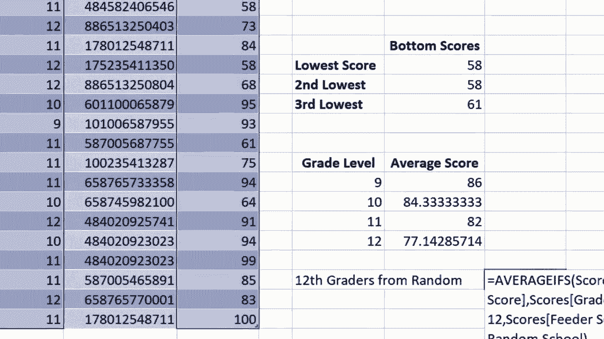

# Excel高级教程（持续更新中） - P19：19）AVERAGEIFS 函数 

在这个视频中，我将向你展示如何使用Excel的average ifs函数。我为此准备的样本电子表格，你可以在下面的描述中找到，包含虚构学生姓名、年级、测试分数的列表。我已经计算了四分位数分数、最高分、最低分等。但此刻我最想知道的是，9年级学生在这次测试中的平均分是多少。

10年级、11年级和12年级的平均分是多少？我可以用多种方法来做到这一点。我可以过滤掉不需要的数据，然后创建一个平均公式。但那有很多步骤。相反，我将使用Excel的average ifs函数来完成这项工作。

我会在单元格J14中点击，输入“=average ifs(”。average ifs的想法是我们只想在满足某些条件时进行平均。你可以看到，Excel在给我提示，关于它在寻找什么。在这个点上，它想要平均范围。那么要平均的是什么呢？是分数。

这就是我所寻找的。平均分。所以这里我有一个分数范围，我可以点击并拖动来高亮这个范围，这在这种情况下工作得非常完美。但如果你的电子表格有一万条记录呢？

点击和拖动并不实用。所以你可以点击最上面的单元格，按住Control和Shift，然后在键盘上按下箭头键。这样会选择你所在单元格到最底部的范围。好的，现在我们放一个逗号，Excel现在在寻找条件范围一。

那么是什么条件会告诉Excel它应该平均测试分数呢？条件是年级水平。所以我需要选择年级水平。我会点击第一个学生的年级水平，按住Control Shift，点击向下选择所有年级水平，然后输入逗号。

很多时候，当做这样的复杂公式时，上到公式栏使用它来输入信息会更好。所以我会输入我的逗号。现在Excel在寻找条件1。我们已经告诉它条件范围是什么。

它会在这个范围内查找，但实际的条件是什么呢？是数字9。现在我可以在这里输入数字9作为我的第一个条件，但有时输入数字不如直接点击单元格I14更有意义，因为这就是我所寻找的。我在找数字9，而数字9就在这里。所以我会点击选择它。

此时，右括号是我们所需的，按下回车，9年级的平均测试分数是86。我们可以目测一下看看是否正确，9年级79，9年级93。它的平均数大约是86。看起来是有效的，计算正确了。那么我现在需要对10年级做同样的事情，对吗？

我需要再次输入平均值IFS，重新做一遍，只不过是对于10年级。其实，不，我不需要这样做。相反，我会点击86。但请记住，它实际上并不是86。如果你在公式栏上看，它并没有数字86，而是我用来产生数字86的公式。

然后我会去单元格的右下角。那里有一个绿色的方块。这是自动填充手柄，有时称为填充手柄。我会点击并按住鼠标，向下拖动，它会自动复制相同的公式，但调整标准1。

我可以通过点击这里并查看公式栏来测试一下。标准1在I15。这里呢，是I16。还有这里，是I17。这样快速搜索范围并提取我想要的确切信息真是个好办法，基于一个标准。现在，它之所以叫平均值IFS是因为末尾有一个S。

这是因为你实际上可以在公式中使用多个标准。例如，如果我通过右键单击E列并选择插入来添加另一列。假设E列是我列出学生来自的学校或中学。

我会快速指定每个学生来自哪所学校。那么现在我们来看看是否能得到随机学校12年级学生的平均分数。对于随机的12年级学生，我会在这里点击，并输入等于平均值IFS左括号。这个公式会变得相当复杂。

所以我会上移到公式栏来完成这个公式。我会点击，Excel正在寻找平均范围。那么我想要平均什么呢？好吧，就是这个。所以我在这里点击，按住控制+shift+下箭头。它选择了公式栏中的所有数据，我输入逗号。标准范围是什么？好吧，有两个标准，对吧。

我们要找的是随机学校的12年级学生。我们先从12年级开始。所以标准范围一。我会在第一个学生的年级上点击，按住控制+shift+下箭头选择所有数据。然后输入逗号。现在Excel在寻找标准一，即数字12。要么我可以在这里点击12，要么我可以直接在公式中输入。

我现在输入逗号。那么我的第二个标准是什么？不仅是12年级的年级水平，他们还必须来自随机学校。所以标准范围二就是学校。我点击第一个学校，按住控制+shift+下箭头。回到我的公式栏，我输入逗号。现在Excel也想要它将要寻找的实际标准。

它会在这个范围内查找标准2，即“随机学校”这几个字。它在寻找这些字。在这种情况下，我可以点击单元格E2，而E2中的内容就是Excel用来决定要平均哪些分数的标准。所以这会有效。让我证明给你看。我要加上右括号。

按下回车，随机学校的12年级平均分是81。你会看到这与所有12年级学生的平均分不同。现在，让我们看看另一种方法。除了点击E2，我本可以输入“随机学校”。但是，注意当我按下回车时会发生什么。

这没有成功。我收到了一条错误信息。为什么呢？原因在于E列的数据不是数字，而是文本。因此，我需要将“随机学校”放在引号中。现在如果我在键盘上按回车，看看，它给了我相同的结果，81。这只是几个在Microsoft Excel中使用average if函数的例子。

你可以做更多的事情。

这样。
