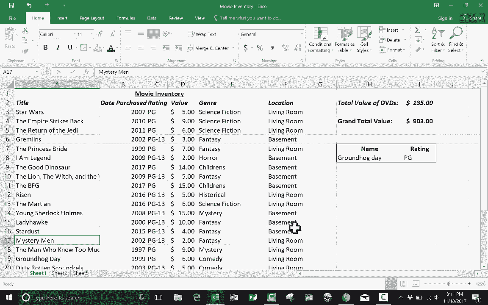

# Excel高级教程（持续更新中） - P3：3）VLOOKUP 基础 

在本高级 Excel 教程中，我将向你展示使用 Vlookup 函数的基础知识，Vlookup 实际上可以成为你在 Excel 中非常强大的工具。它可以做几件有用的事情，但在本教程中，正如我所说的，我们将仅关注如何使用它的基础知识。在本教程中，我使用的是我在过去教程中制作的一个电子表格。

如果你还没有看过我的 Excel 基础教程、中级 Excel 教程，以及一系列高级 Excel 教程，你真的应该回去看看。在那些教程中，我创建了一个电影库存的电子表格，里面有我拥有的电影，名单相当短。但为了本教程的方便。

我们假设这个电子表格里有 1000 或 2000 或 5000 条记录，而不仅仅是 20 或 30 部电影，假设有 2000 部电影。而且我也希望你假装，不仅仅有 6 或 7 列数据，想象有 20 列不同的数据。你知道，其中一列列出了时长。

电影的名称。另一个列出电影的明星。想象一下，那里有一个很大的电子表格，有很多列和很多记录，很多行。当你得到这样一个巨大的电子表格时，我们面临的一个挑战是，如何从电子表格中提取出我想要查看和思考的数据。我将向你展示如何使用 Vlookup 来做到这一点。

思考 Vlookup 的最佳方式之一是将其视为类似于在书籍索引中查找内容，或者在目录中查找你可能想买的东西，你可以找到零件编号和成本等信息。

另一个比较是，它类似于在电话簿中查找某人，你查找他们的名字，找到他们的地址或电话号码。所以在这个电子表格中，再次想象它比实际情况要大得多，假设它确实很大。

我发现很难知道特定电影的评分，我希望能够输入电影的名称并确切找到该电影的评分。为此，我需要两个单元格，所以我将使用这两个单元格，在这个单元格中输入等于 V lookup，注意我一这么做就弹出一个提示，希望能帮助我正确填写这个公式。现在我输入左括号，它给了我更多细节，说明我需要输入一个查找值。

一个表格数组，一个列索引号和一个范围查找，每个都用逗号与其余部分分隔，所以查找值，逗号，表格数组，逗号，列索引号，逗号，范围查找。 现在这个公式中这四个不同部分的官方名称是参数，每个都是一个参数，所以这是参数 1。

23 和 4，所以我们先看参数 1。 对于查找值，基本上。 我知道的是什么？ 我将查找关于什么的信息。 但这是我已经知道的东西。 所以再次，想想去图书馆。 你知道你想要的书的名字。 假设是书《时间的皱折》，这是一本为年轻人写的很棒的书。

但我觉得这对任何人来说都很棒。 我听说迪士尼很快会把它拍成电影。 不管怎样。 假设在图书馆你想查找那本书的位置。 你知道的是书的名字，在这种情况下是《时间的皱折》。 所以这是查找值。 现在在这个情况下，我希望查找值是可以改变的。

我希望能够输入，比如说《公主新娘》，并让它告诉我 Pg，或者《火星人》，并让它告诉我 Pg13。 所以因为我希望它是可变的。 我就点击 H8 单元格，点击那里。 基本上我在 H8 单元格中输入的内容将成为查找值。

我将把它放进去。 接下来，它想要表格数组。如果你看过我的 Excel 基础教程。 你知道这个术语范围，基本上这就是表格数组。 这是你想让 Excel 查看的一组电子表格，且要小心。 我真的想包括我在这里的所有列。 现在你可能不想在自己做这件事时这样做。

但我想进入并选择 A3 到 F22，所以这将是我电子表格中的所有实际数据，它不会包含我后来输入的一些其他东西。 所以要将范围放入公式中。 我所要做的就是点击并拖动选择我想让它查看的范围。 现在在这样的小电子表格中真的很简单，但想象一下一个巨大的电子表格，就像我让你假装这是的那样。

点击和拖动是不切实际的，所以没关系，你可以直接输入 A3，通过的范围是 F22，好的，很棒。 所以我完成了第一个参数和第二个参数。 现在是第三个参数。 第三个参数是它想知道一个列索引号。 所以这在问什么。 它是在要求你选择其中一列。 现在它不在寻找列 A，列 B。

列 C。 不，在这种情况下，不是。 它要寻找的。 是你选择的表格数组中的第一列。 这是第一，接下来是第二，第三，第四，第五，第六。 现在。如果我没有在我选择的表格数组中包含列 A 呢。

如果我从 B3 开始，而不是 A3，会怎样？那么这就是第一列。这就是第二列。所以它不需要与 A、B、C、D、E、F 对应。它可以是你为表格数组选择的任何内容，或者你点击并拖动以突出显示的最左边的列是第一列，然后是第二列，然后是第三列，依此类推。那么现在我将这样做。

我会在第二个参数和第三个参数之间放一个逗号以分隔它们。那么我怎么知道选择哪个列呢？我选择的列是包含我想提取的信息的列。所以如果你记得我的例子，我想能够输入电影名称并找出它的评分。这意味着我想要 C 列，但记住我必须把它作为一个数字。所以我去到我突出显示的数组，表格数组，告诉自己这是第一列。

这是第二个。所以我想要第三列。因此我输入三，接下来它想要一个范围查找。这对我以及许多人来说都有点棘手和困惑。基本上，这个问题是 H8 是否需要与电子表格中的内容完全匹配，我认为这在数字上最有用。例如，假设我们不是输入电影名称，而是输入电影购买的日期，如果我输入。

这会生成一个 PG。但如果我输入 2006 呢？如果这里没有 2006 的条目，那怎么办？好吧，如果我在范围查找的第四个参数中将其设置为真，那么它将寻找一个近似匹配。它基本上会找到最接近的那个。如果我输入“fault”这个词，它就需要一个精确匹配。

如果你不输入精确匹配，它不会生成你所期望的结果。在这种情况下，我将其保持为假。因此我将要求精确匹配。然后你应该输入右括号，但其实你并不需要。因此我只需按回车。看看，它给我一个消息，显示值不可用。

这就是一个错误。现在显示错误代码的原因是这个单元格里什么都没输入。所以我们来测试一下。我将输入“我是传奇”。看看会发生什么。看，它显示 PG13。所以这似乎效果很好。我们再试一次。我输入“土拨鼠日”。我输入“土拨鼠日”，按回车，它显示 PG。现在，一旦你像这样设置了 V 查找。

如果你像我一样对屏幕上布局感到后悔，我们来看看怎么做，输入一个词后右边就能告诉你是否是Pg，我觉得这样看起来会好一些。为了做到这一点，我双击这里，可以在公式栏上看到公式，我会复制它，然后粘贴到这里，注意再次出现错误，所以我需要双击它，检查我的公式，看哪里出错了，因为我从一列复制到另一列，所有内容都稍微向右移动了一些，并且向下也移动了一格，因此我可以通过点击第一个参数并拖动来高亮显示它来修复这个公式，你也可以在公式栏上做到这一点，然后我会点击H8，接下来是第二个参数，即表数组，表数组已经发生了很大变化，我会点击并拖动，但记得在较大的电子表格中，你需要直接输入。

这样会快得多。而列索引号仍然有效为3，范围查找故障。所以现在我可以在键盘上按回车或输入，我实际上可以删除上面的那个。现在我有一个空间可以输入电影名称，它会在右边告诉我评分。让我们再做一个例子来测试一下。我会输入《赋予者》，它会变成Pg 13。

所以我希望你觉得这个教程对你有帮助。这仅仅是查找功能能为你提供的开始。但是老实说，我最常用的方式就是创建一个表单，然后填写。我输入某个东西的名称或部件号，然后它会告诉我其他数据。

就像我在开头说的，这有点像在图书馆查找一本书并找到有关这本书的信息，或者在电话簿中查找某个人的名字并获取他们的地址或电话号码，或者他们居住的城市。

现在如果我想，我可以高亮这些，并将它们改为粗体并居中等等，创造一个漂亮的小空间，基本上这是一个工具，我可以点击并输入以获取我所寻找的信息。

现在，如果你要使用Vlookup，有几个规则需要知道。第一个规则是你需要将数据放在垂直列中。所以我这里有列标题，项目列表垂直排列，关于这些项目的信息则水平排列，但不同的记录必须垂直放置在列中，必须这样。

之所以这样，是因为V查找中的V代表垂直。因此，如果你的电子表格设置成其他方式，它就无法正常工作。确实存在H查找用于水平查找，但无论如何，这是你需要遵循的第一条规则，即你的数据必须在电子表格中垂直排列在列中。第二条规则是，你知道将要输入到框中的信息必须位于你想要查找的数据的左侧。

在这个案例中，我知道的数据是电影的名称，这就是我能够记住并在这个框中输入的内容。因此，在我的电子表格中，这些名称需要位于左侧。

我要查找和获取的信息是评分。如果你的电子表格没有这样设置，你需要将可以输入框中的信息所在的列移动到左侧。这是一个要求。因此，如果你记住这两条规则，你应该能够成功使用V查找。

希望你觉得这个视频对你有帮助。如果你觉得有帮助，我会很感激你点击下面这个视频的喜欢按钮。
