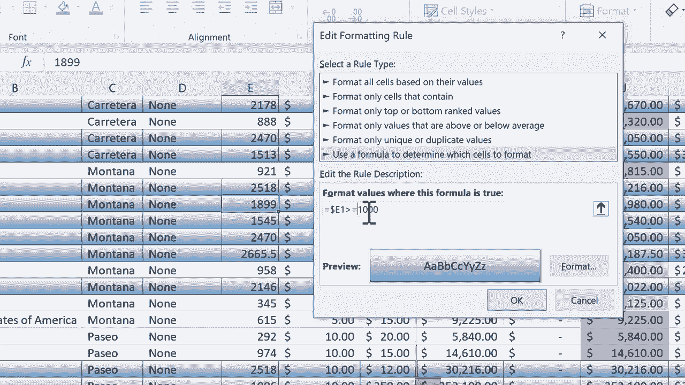

# Excel高级教程（持续更新中） - P4：4）条件格式高级技巧 

在这个简短的Excel教程中，我想展示一种如何进行条件格式化的高级技巧。如果你还没有看过我的Excel条件格式化深入教程，建议你在观看这个教程之前先看那个深入教程。在深入教程中，我展示了使用条件格式化时的许多选项。

我浏览了所有这些。但我想在这个简短的教程中分享一个高级技巧。那就是，而不是像我在这些情况下那样仅将条件格式应用于一列，这一列的格式是根据数字越高，单元格越绿色。这一列中的单元格以不同的方式格式化，数字越高。

这个条形越大。而且在L列中我有这些红绿灯符号。但如果你想要整行根据某个数字被突出显示，而不仅仅是处理一列呢？例如，在这个电子表格中，我会。

想要突出显示销售最多单位的产品的行等。因此这涉及到E列。但因为我想突出显示整行，我将不得不选择这个电子表格中的所有数据。所以我将在左上角点击A列。

我按住点击，然后拖动以突出显示所有数据。好了，从A到Q。现在我将再次浏览到左边。我的数据仍然被选中，但我只是使用这个条形移动回我的电子表格的左侧。现在我要进入条件格式化，我在寻找一个突出显示整行而不是单元格的选项。

要去的地方其实就在这里。并且是在新规则下。所以我点击了新规则。这里有很多高级选项可以选择。但我只是想创建一个公式来确定哪些单元格。现在，问题是。

我的公式是什么，格式化这些值，当这个公式为真时。所以我将点击这个框以输入一个公式。这将是一个绝对公式。这有点混乱，但你只需知道这是一个绝对公式。因此，你必须使用一个美元符号。所以我在这个框中输入了等号。

所以等于。然后这里来了一个美元符号，使其成为绝对公式。然后我需要选择一列。这有点棘手。我该选择哪一列？嗯，这是我将要根据其格式化的列。那就是E列。记住。我想根据销售最多的产品来进行格式化。所以我输入E。那行呢？

所以 E 列是这一列，行。这有点棘手。我不知道我应该选择什么。会不会是 E2？这当然可以。但是这样做有个缺点。相反，我将选择左上角的内容。现在活动单元格是 A1。所以我将在我的公式中放入这个单元格。

所以 E1 如果 E1 大于。我输入大于符号 1000，然后我想要一些格式设置。作为一个例子，我会点击这里的格式，然后选择一个边框样式，怎么样，轮廓边框，我还可以点击填充颜色，也许是深绿色。这里还有更多颜色可以选择，还有一些填充效果。

你可以看到这些不同选项的一些内容。我就保持原样，点击 O。然后如果我在这里点击 O，看看会发生什么。我点击了 O，Excel 分析了整个 E 列，并找到了大于 1000 的值。如果它们大于 1000，它会高亮显示整个列。所以这一点很好。

它只是让我们更容易集中在满足特定条件的所有数据上。不过，有时很容易忘记它是基于哪一列的。如果你忘记了，可以去条件格式管理规则查看，那里有规则。我可以点击它。如果我不再需要这个规则，可以删除它。我也可以编辑规则。

我有些内容想要编辑。注意现在设置的是大于 1000 的值。那么数字 1000 本身呢？当然，它不会被包括在内。所以我应该写大于或等于 1000，或者说大于 999 可能更好，因为更简洁。

这样就包括了 1000 及以上。然后我只需点击确定并应用，然后再点击确定，现在已经更改了。它是一个。

这可能并没有真正影响我的条件格式，但这可能会出现，所以这是需要注意的事项。
