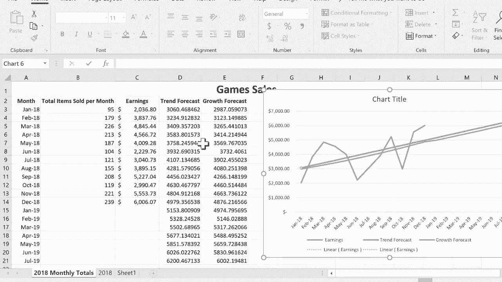

# Excel高级教程（持续更新中） - P5：5）使用图表和函数查看趋势 - ShowMeAI - BV1sQ4y1B71N

在这个Excel教程中，我将展示一些我们可以在Excel中使用的技巧和工具，以识别趋势，查看事物的变化，既包括近期的情况，也包括未来的展望。所以让我们开始吧。正如你所看到的。

我正在一个名为“游戏销售”的电子表格中。这个电子表格记录了一家销售桌游和卡牌游戏的小企业每个月售出商品的总数量。它还跟踪来自这些销售的收益。你可以看到每个月都单独列出。因此，我想做的第一件事是在右侧添加一个图表。

我希望这个图表能够展示趋势。这家公司的收益趋势如何。在之前的视频中，我展示了一些快速简单的技巧，用于在Excel中添加图表。如果你还没看过那个视频，请去看看。但在这个教程中，我想要一种特定类型的图表，就是这种折线图或区域图。

这种图表特别适合展示随时间变化或趋势的原因。所以在我添加之前，首先选择你想要绘制图表的数据会很有帮助。我会点击并拖动收益，直到数据的底部。接下来，我将按住键盘上的控制键。

现在，我要把鼠标移动到列A，仍然按住控制键。我会从“月份”一词拖动到数据的底部。现在我可以放开控制键。现在我可以简单地上到图表组，选择折线图。我可以选择很多不同的图表，但我会坚持使用这种特定的类型。

折线图。我点击它，它给我展示了这家小企业的收益的不错图表。我会把图表稍微向右移动一下。让我们来看看这个图表。这样可以让我获取一些关于趋势的好信息，至少是截至2018年的趋势。你可以看到收益随着时间的推移有所增长，但也有一些下降。

所以为了帮助我们感知未来的趋势，我们可以点击这条线。当你这样做时，它会高亮显示这条线，并且也会高亮显示不同的数据点。每一个点都是左侧数据中的收益金额。现在，我可以仔细右击那条线，并选择添加趋势线。

当你这样做时，会发生什么呢？首先，你会看到右侧打开了一个面板。如果我稍微向水平滚动一下，你会更好地看到。你可以看到我的图表中已经添加了趋势线。所以这帮助我感知事物的趋势，即使有起伏。

看起来趋势是逐渐上升的。现在，让我们看看右侧打开的面板。你可以看到这里有不同的选项。例如，线性趋势线可以改为指数趋势线。老实说，我不完全理解两者之间的区别，除了指数更弯曲而线性是直的。

还有对数多项式，我认为这些基本上都是统计术语。所以如果你学习过统计学，你可能比我更了解这部分内容。我想我会坚持使用线性，选择线性。如果我稍微向下浏览面板，看看我可以做什么，有一个预测选项，我可以预测四个字，假设五个周期。我在键盘上按回车，你可以看到这有什么效果。

它调整了我的图表，包括五个月的预测。我可以将其更改为，例如20个周期。让我们看看现在的情况。现在你可以看到趋势线，它显著上升。如果我们将其改为指数型，效果类似，但有一些区别。现在，在你进行这个操作时。

当你观察趋势和未来预测时，注意这里还有一些其他选项。有一个设置截距。如果你理解那意味着什么，就去做吧。还有在图表上显示方程和在图表上显示R平方值。根据我的理解，这个R平方值与预测的准确性有关。

注意有一些趋势线选项。例如，你可以添加一些效果。如果你想添加阴影，我刚放了一种桃色阴影。你可以添加光晕。我的意思是，如果我们想的话，可以真的把它做得很华丽。我实际上要把那个去掉。此外，还有一些颜色选项。我可以将其从蓝色更改为红色或黑色。

我想要那条线的任何颜色。在这一点上，我要撤销我刚刚所做的所有工作，回到插入趋势线之前。我只是按住控制键并按Z撤销。接下来，我想展示如何添加同样的趋势线。

但是要直接在电子表格中使用Excel函数来做到这一点。那么，你为什么要以这种方式做呢？首先，它使你能够实际跟踪多种趋势线。稍后你会明白我的意思，还有其他原因。

你可能想以这种方式做的原因。所以我会把这个图表稍微向右移动一点。然后我会在这里输入收入旁边的“趋势预测”，在它旁边输入“增长预测”。我只需按回车，看起来文本不适合。所以我将点击并拖动以突出显示这两列，然后双击它们之间，应该会扩展到文本完美适合的大小。

下一步有点棘手。在我进行下一步之前，我们需要考虑这一点。我将要做的是创建一个公式，查看这些数据的趋势。如果您想想，趋势不能仅仅依赖一个单元格或一条数据，这没有意义。如何能基于一件事来有趋势呢？因此，出于这个原因。

我不能仅选择D3单元格并输入我的公式。相反，我必须点击并拖动以突出显示我数据右侧的整个范围。接下来，我将输入等于。因此这个范围基本上等于。我会输入单词trend，然后左括号。然后我将选择我想要作为趋势依据的数据。

所以我点击并拖动以选择整个范围。接下来，我应该放入右括号，但我不必这样做，所以我不打算。现在，想想看。通常，当您将公式放入单元格时，完成后只需按回车。但在这种情况下，您不能。原因是因为这些数据涉及一个数组。

这涉及的不仅仅是一个单元格或一列，而是一个完整的数组。因此，您需要按住控制键，按住shift，然后按回车，看看它做了什么。它根据左侧的这些数字创建了一些趋势数据。这就是趋势。现在，不知为何，它将这个特定单元格设为粗体。

我不知道为什么我要去掉这个。因此，如果我们回去看看我们的图表，目前为止没有任何变化。因此，我要重新做这个图表。我只是删除这个图表，然后再次点击和拖动，这次我会点击并拖动以突出显示收益和趋势预测列。

然后我按住控制键并选择月份。现在我上去选择这个相同的折线图，看看这个。图表现在结合了我的收益数据和使用趋势函数计算的趋势线。

所以这有点不错，我真的很喜欢不同的颜色。当然，您可以通过选择一条线来更改这些颜色，您可以进入并更改它的颜色。现在我想给您展示的最后一件事是，如果您想显示指数预测，可以做类似的事情。而且，我并不完全理解两者之间的区别。因此在这种情况下。

和之前一样，您需要点击并拖动以突出显示整个范围，输入等于，增长，左括号，然后选择将要依据的数据。我想在键盘上按回车，但那样不对。我必须按住控制键和shift，然后按回车。这就是我的数据。现在，如果我再次创建相同的图表，这次。

点击并拖动以突出显示我想要包含的所有数据，然后按住控制键，因为我不一定需要售出的项目。我会直接去选择月份，点击并拖动以获取月份，然后去那个同样的图表点击。现在你可以看到三条独立的线，每条线的标记都不同。收入用蓝色表示，趋势预测用橙色表示，增长预测用灰色表示。现在，如果你还记得。

当我右键点击添加趋势线时，它给了我查看未来的选项。向前看5个月、10个月、20个月。那么如果我想用我刚才展示的另一种方法，即使用 Excel 函数来做到这一点，会怎么样呢？我们首先需要改变这些数据。所以如果你仔细观察，这里的数据实际上是基于公式的。我们需要将其改为仅值，做到这一点的一种方法是点击并拖动到。

突出显示整个范围，然后将鼠标放在该范围的最底边，右键点击并稍微向下拖动一点，或者向左或向右都可以。然后再拖回到原位。Excel 对此的解释是我们想要将这些数据复制回到自身上。

不过，这次我们只会复制值。所以我选择这个。现在如果我点击这里，你可以看到这不是基于公式的。这只是一些数字。我们也来做一下增长预测。所以我会点击并拖动，突出显示整个内容，将鼠标放在最底边，右键点击，向下或向右拖动。

无论我想去哪里，然后再拖回到原位。只复制值。所以现在我可以点击并拖动以获取整个范围。我可以去范围的右下角，你可以看到自动填充手柄在那里。如果你看过我之前的教程，你对自动填充手柄应该很了解。

但是你将鼠标放在上面。然后点击并拖动，我将把这个范围扩展，可能五六个月，也许七个月。我放手，现在它基于趋势进行了一些预测。我们在这里也来做一下增长或指数数据的同样操作。右下角，点击并向下拖动。好了。现在我也可以做类似的事情，扩展月份。

现在如果我点击我的图表，你可以看到我需要在这里做什么。我需要扩展这个范围，以便在我的图表中包含所有这些新数据。这样就好了。现在我们有一个完全基于这个电子表格中数据的图表。是的，我确实使用了几个函数，趋势和增长。

但是这个图表依赖于左侧的数字。所以我们看了两种不同的方法来创建一个跟踪近期趋势和未来预测的图表。我们看了更简单的方法，只需右键点击图表并添加趋势线。然后我们也看了如何使用趋势函数和增长函数自己创建图表。

