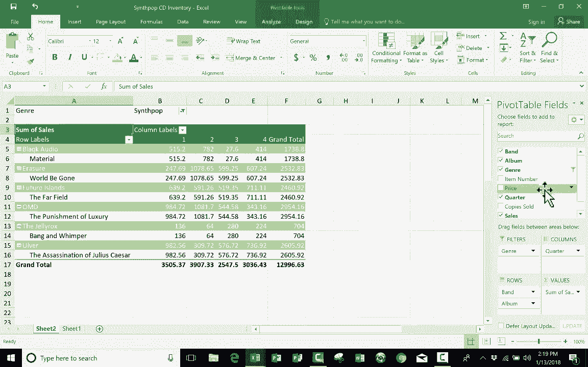

# Excel高级教程（持续更新中） - P8：8）创建数据透视表 - ShowMeAI - BV1sQ4y1B71N

在本教程中，我们将学习如何在Excel中使用数据透视表。不知为何，数据透视表被认为有点难以使用。起初，对你来说，可能确实会显得如此。但在观看完这个视频后，我希望你会发现它们并不是那么复杂可用。对于这个教程。

我创建了一个电子表格，列出了合成流行音乐CD的库存。假设我拥有一家只销售有史以来最好的音乐类型的CD商店，那就是合成流行音乐。我并没有这样的商店，也许我应该有。但我没有。但我在这里做的是创建了这个电子表格，列出了我希望追踪的关于我假设的合成流行音乐CD商店的一些重要信息。

我在这里列出了几个乐队。其中一些你无疑听说过，比如Depeche Mode或也许Erasure和OMD。但这里还有一些相对不太知名的乐队，但我认为他们非常优秀。接下来，我们有专辑，这些是他们最新的专辑。这些是我最近自己买到并且非常喜欢的专辑。

接下来，我们有一个类型的列。实际上都是合成流行音乐，但出于某种原因，其中一些被标记为摇滚，例如，The Killers，他们确实有摇滚和合成流行音乐以及新浪潮的混合。但无论如何，我们列出了类型和商品编号。

这更多是一个内部数字，仅供我假设的商店使用，我们有CD的价格，而这恰好是CD在亚马逊上的当前实际价格。接下来是季度。因此，我在追踪每年的每个季度，以及这些CD在该季度的表现。

接下来，我有每张专辑在每个季度售出的副本数量，然后我这里有一个公式来计算总销售额。换句话说，就是带来的收入，而这是一个简单的公式：售出副本的数量乘以价格。

所以这是一个很不错且实用的电子表格。它帮助我追踪我的小型企业以及我的企业的主要盈利点。问题是有这么多数据，对我来说，深入挖掘并真正查看某些信息可能会有些困难，比如说。

我在第一季度的整体表现如何，所有这些CD和他们的销售情况如何？我的生意在第一季度表现得怎么样？这有点困难，我可能需要将每个第一季度的销售数字复制粘贴到另一个电子表格或这个电子表格的另一部分，然后我需要做一个公式来计算那个数字，或者再举一个例子。

如果我想具体知道我卖出的“黑暗音乐”表现得怎么样，或者如果我不仅仅在卖一张CD，而是在卖两张不同的CD或三张不同的CD，如何？如果我想计算“德佩什·模式”的CD总共卖出了多少份，不管专辑是什么，我能自己计算吗？是的，我可以，基本上我可以通过创建一份报告来做到这一点。

突出复制粘贴，但老实说，这可能需要相当多的时间，而且我可能会犯错误，这真的是一项繁重的工作和努力。但是幸运的是，数据透视表在这种情况下真的能帮助我。简单定义一下数据透视表，数据透视表是一个Excel工具，可以让你重新组织和汇总电子表格中的某些数据，特别是在选定的列和行中。它不仅重新组织和汇总这些数据，还会生成一份报告，这份报告将对你有所帮助。关于数据透视表，一个重要的事情是，它们实际上不会更改你的任何数据。当我在稍后创建这个数据透视表时，它不会改变我电子表格中的数据，这些数据将保持不变。

什么都不会被更改。它只是帮助我以新的方式查看这些数据，所以让我们开始吧。现在，当你准备创建数据透视表时，首先要考虑的是，确保你的数据组织良好是非常重要的，它确实需要是一个列表。

你需要有带标题或名称的列，所以我有带有乐队、专辑、类型等的列。然后是一系列项目。正如你所看到的，它们可以是重复的项目，这没问题，但需要是一个垂直列表。此外，重要的是你不能有任何空行。有时由于某种原因，人们在电子表格中会出现空行，这样的话，如果你想使用数据透视表，就不好了。

所以在使用数据透视表工具之前，确保你的数据是好的，没有空白数据。因此，我将删除那一行，以使其恢复到良好的状态。此外，你还需要小心额外的数据。例如，在这个电子表格中，如果我在右侧写了一些笔记，比如“需要更新”，那可能只是我给自己的一个提示。

也许我在这里写了“总计”这个词，然后我放入了一个公式来汇总所有数据，你不希望在数据旁边或下方有额外的数据，你需要一个整洁的数据集，不要有多余的信息。因此，我的下一个建议是，在使用数据透视表工具之前，你不必这样做，但我强烈推荐你将数据格式化为表格。为了做到这一点，我只需在数据中点击某个地方，所以我将在“材料”这个词上点击，然后在“主页”选项卡的“样式”组中点击“格式化为表格”，我可以选择任何一种样式将数据格式化为表格，我选择这个样式，然后它让我确认我是否包含了所有数据，看来挺不错的，但如果需要，你可以更改这些数字。是的，我的表格有标题，这些是顶部的列标题。

我点击“确定”，看，它把我的数据格式化为表格。我喜欢这个样子。因此，即使在使用数据透视表时不需要这样做，格式化数据为表格也是个好主意，原因是现在它已经是一个表格。假设我向库存中添加了另一张CD，假设是Brandon Flowers，注意当我添加这条信息时，它会直接添加到表格中。

它识别出这是这个数据集的一部分，并将其与其他信息一起格式化。不仅如此，当你使用数据透视表时，数据透视表中的信息会在你向表格添加额外数据（在这种情况下是CD）时更新。所以让我们为这张充满惊人CD的表格创建一个数据透视表。为此，我只需上到“插入”并选择“数据透视表”，Excel立刻让我提供一些关于数据透视表的信息。注意，首先询问的是数据是表格还是范围，或者我是否希望使用外部数据源。

我想使用一个表格。它是一个表格，它猜测我想使用table3，而这就是这个表格table3。如果猜错了，你可以选择不同的，但在这种情况下，它工作得很好，它猜对了表格，很可能是因为我的鼠标在那儿。接下来，我需要选择要将数据透视表报告放置的位置，是否放在现有工作表中的某个地方。如果是的话，我需要指定位置。对我来说，我几乎总是选择新工作表，这样它会给我另一个工作表并把数据透视表放在那里，这样更整洁。所以我准备创建数据透视表了，我只需点击“确定”，看，它为我在这里创建了另一个工作表，并给我一些构建报告的简单说明。从数据透视表字段列表中选择字段，数据透视表字段列表在右侧，你可以看到右边打开了一个面板，这是数据透视表。

字段面板或面板。在这里我们有一个我在原始电子表格中输入的列标题或列名称的列表。所以是“带”，“专辑”，“类型”，等等。“带”，“专辑”，“类型”。然后在下面我有这四个区域，过滤器、列、行和值，这个是为了Excel在我即将创建的这个透视表报告中基本上在问我。

我希望在行中排列什么？我希望在列中排列什么？在这个报告中，我关心哪些值？最后，我想对这个报告应用哪些过滤器（如果有的话）？所以假设我想知道哪些带是我第一季度的畅销品。

好吧，带的列将会很重要。因此我会在这里点击“带”，然后把它拖下来，并将其放入行框中。一旦我这么做，看看发生了什么。我得到了一个所有带的列表。现在，我关心哪些数据呢？我想知道总共收入了多少钱。所以我点击“销售”，并把它放在下面的值框中。

现在我可以看到每个带的收入是多少，我假设我的小企业收入了多少。现在也许我决定不，这是个错误。我不一定想知道收入的金额，我只想知道我卖出了多少单位。所以“销售副本”将是拖到那里的一项。现在这改变了我的透视表。它现在显示我不同的信息，老实说。

不过，我觉得我更想看到销售额。所以我把那个放回去。但记住，在我的例子中，我对总销售额不感兴趣，我对每个带在第一季度的总销售额感兴趣。所以季度对我来说也很重要。这次我将把季度拖到列框中。所以现在我可以看到每个带和每个季度，销售它们的CD收入了多少钱。

现在，如果我把季度拖到行而不是列，那会是什么样子呢？我将移除那个字段，以便你能看到。我会把它拖到“带”下的行中。所以现在数据仍然是一样的，只是屏幕上的排列方式不同。我在这里有第一个带“黑色音频”，它在一行中，但我也把季度放在了一行中。

所以它列出了与“黑色音频”相关的四个季度，就在“黑色音频”下面。因此，Excel在这方面真的很聪明。它明白这些在原始电子表格中的季度显然是指“黑色音频”的季度，因此它将这些数据保留在一起。

然后，契约的销售季度被列在那里，像“topesh mode”，“the killers”等等。所以我只是想让你看到，相同的数据可以基于你拖动列名的框而以不同的方式展示。好了，现在我们需要考虑的最后一个框是过滤器，所以我也要把季度拖到过滤器中。

一旦我这么做了，看看发生了什么。标题为“季度”的列不能同时在这两个框中。因此，它从列框中消失了，移动到了过滤器框中。还有，看看它对我的数据做了什么。它不再按季度分布了。但没关系。我在这里基本上应用了一个过滤器，顶部显示的是“全部季度”。

但是如果我点击这个下拉箭头，而不是“全部”，我可以尝试选择一个。现在，它显示了每个乐队的第一季度销售情况。看起来“杀手乐队”是我假设公司第一季度最好的乐队，他们的新专辑《美妙，美妙》确实很精彩。

我觉得你应该看看，如果你还没看过。不过，我希望你能看到这有多有用。当然，这些透视表报告可能会变得相当复杂。如果我想，我可以在这里的行中包含专辑。我可以在过滤器中包含类型，这样我就可以筛选掉。

假设除了合成流行音乐外的所有音乐。这大大减少了数据量。如果我想，我可以把价格放在列中。因此，您实际上可以在这里制作一些复杂的透视表报告。在未来的教程中，我会告诉你另一种创建透视表的方法，这种方法是快捷的，许多人觉得更简单，但我认为如果你打算使用透视表，学习如何以传统方式手动选择所有内容并组织透视表报告是很重要的，因此请留意那段未来的视频。

