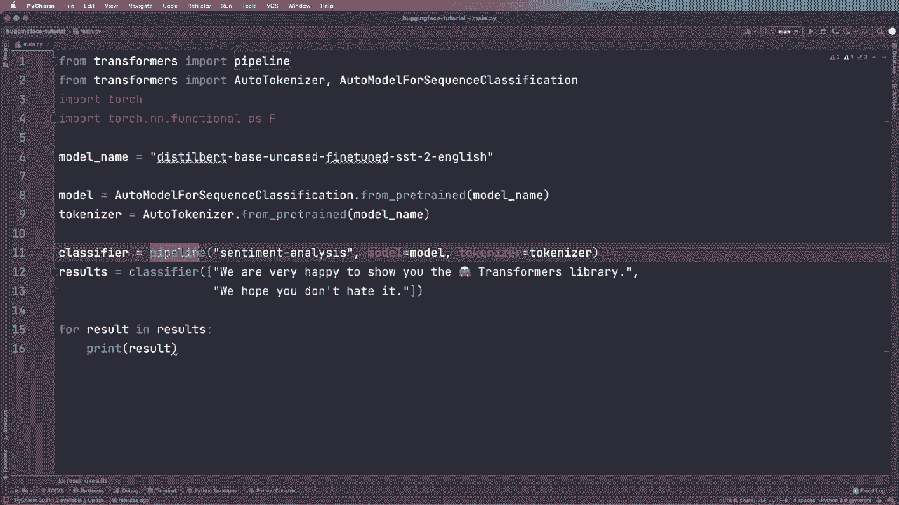

# Hugging Face 速成指南！一遍搞定 NLP 任务中最常用的功能板块＜实战教程系列＞ - P2：L2- Pipeline 管道 

首先安装 pytorch 或 TensorFlow。然后为了安装 Transers 库，你只需输入 Pip install transformers。或者你也可以在安装页面找到 Conda 安装命令。让我们这样安装。所以我已经做了这个。然后我们可以开始使用它。所以我们可以从 transformers 导入一个管道，作为第一步，来看看这个。

然后我们还从 Pytorch 库导入了一些需要的工具。所以我们导入了 torch，以及 torch 的 N 和 functional S F。所以我们稍后会使用这些。现在我们可以开始使用这个管道。假设 classifier 等于，然后我们创建一个管道。我们需要指定我们想要的任务。所以在这个案例中。

我们想进行情感分析。所以我们必须这样调用它。你会在网站上找到不同可用的任务。这里我们可以看到，例如，我们有情感分析，这只是文本分类的别名。但例如，我们还有一个问答管道、文本生成或对话管道。

是的，这就是我们如何定义一个管道。管道的作用是为你提供一个便捷的方式来使用模型进行推断，并为你抽象出许多事情。你会在一会儿看到我的意思。所以现在我们只需使用这个分类器，通过说 rest for results 等于来对一些文本进行分类。😊。

然后我们调用这个分类器，我们想对一个示例文本进行分类。所以让我为你复制粘贴一些示例文本。我们想要分类的文本是：我们很高兴向你展示 smileyface transformers 库。然后让我们打印结果，看看这看起来如何。让我们运行代码。好的。

正如你所看到的，我们得到的标签是正面的，分数是 0.99。因此，它非常确信这是一个正面句子。正如你所见，使用这个管道只需两行代码就能创建情感分析代码。所以，是的，这正是我们所需要的，我们需要查看文本的标签，看它是负面还是正面。

我们还得到了分数。所以，是的，这真的很好。现在让我们看看一些可以用这个管道做的事情。首先，😊。可以一次输入更多文本，所以我们不仅可以使用一个，而是可以给它一个列表。让我们，例如，使用一个列表，然后再使用另一个示例文本。

所以让我也把这个复制粘贴到这里。所以我们还想对这个进行分类：我们希望你不要讨厌它。然后我们得到多个结果返回。让我们称这个结果为 result，然后我们可以对其进行迭代。所以我们可以说四个 result 在 results 中，然后我们想打印结果。现在让我们运行这段代码，看看它看起来如何。

好的，正如你所看到的，对于第二个文本，我们得到了另一个结果。所以这里标签是负面的，分数可能在这种情况下不太确定。所以这个文本可能有点令人困惑。我们希望你不会讨厌它。但基本上这就是你如何一次性传入多个文本的方式。现在，嗯，现在。

我们只使用默认管道和默认模型。但是现在让我们看看如何使用具体模型，以及如何使用具体的分词器。我们可以做的是指定模型名称，并说模型名称等于。在这种情况下。

我使用的是dist bird base uncased，然后在SST上进行了微调到英语。稍后我会告诉你我在哪里获得这个字符串或名称。但现在，嗯，这基本上就是一个dist bird模型，这是一个更小更快的bird版本。但它是在同一语料库上进行预训练的。然后你会看到它也经过微调，这只是数据的名称。

所以在这种情况下，这是来自斯坦福情感3银行版本2的英文数据。嗯，现在如果我们有模型名称，我们可以将其传递给我们的管道，并使用模型参数。所以我们可以说模型等于，然后使用这个模型名称。现在在这种情况下，我可以告诉你，情感分析任务的默认模型已经是这个模型名称。

所以这应该完全相同。但稍后我们会切换这个，然后看看我们如何使用不同的模型。所以首先，让我们再运行一次，看看这仍然是一样的。好的，所以我们看到这仍然是同样的结果。所以这有效。现在我们只需使用这个字符串来定义我们的模型。

但是现在让我们换一种方法来定义模型和分词器。这将为我们以后提供更多的灵活性。因此，为了😊，我们想说从transformers开始。然后在这里我导入一个自动分词器类和用于序列分类的自动模型，这是一个通用的分词器类，这也是一个通用类。

但在这种情况下，我想要为序列分类提供更具体的内容。然后它将为我提供更多的功能，专门针对这个任务。所以现在不必担心，你也可以在文档中找到所有可用的模型类。如果你感兴趣，可以看看这个。如果你使用Tensorflow。

然后这里你必须说Tf，然后是这个类的名称。但其余部分实际上是相同的。所以，嗯，这就是你如何使用Tensorflow。现在在导入之后。😊。我们可以创建两个这个的实例，所以我们可以说模型等于，然后使用这个类。所以自动模型用于序列分类，然后我们使用一个叫做的函数，所以我们说点从预训练开始，然后它还需要模型名称，分词器也是如此。

所以我们说 tokenizer 等于 auto to tokenizer dot from pretrained，然后它需要模型名称。所以这个 dot from pretrained 函数在 Haging 阶段是一个非常重要的函数，你会经常看到它，所以稍后你会再看到几次。现在我们创建了这个，我们也可以给分类器提供实际模型，而不仅仅是字符串。

或者给管道，所以我们可以说我们的模型等于我们的模型，我们的 tokenizer 等于我们的 tokenizer。所以现在如果我们运行这个，应该仍然得到相同的结果，因为这些是默认版本，没错。如我们所见，我们仍然得到相同的结果。但是如果你想使用不同的模型或 tokenizer，那么你就知道如何切换它们。只需在这里为管道使用不同的模型和 tokenizer。

所以现在不再使用这个管道。
