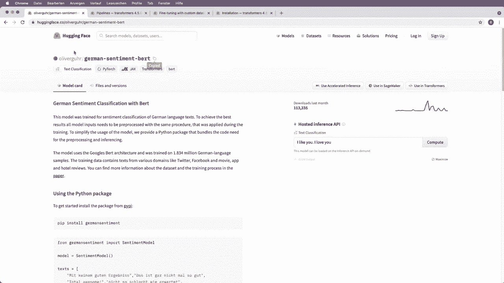
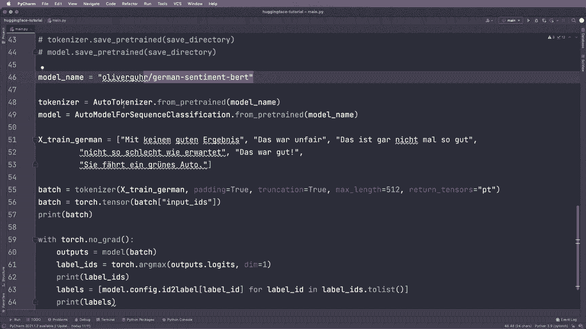

# Hugging Face速成指南！P6：L6- 模型中心(Hub) 

现在让我们看看如何使用不同的模型。就像这里一样。如果你已经在电脑上有一个打印模型，可以从磁盘加载它。但你也可以去huggingface模型中心。你可以在huggingface.co/models找到这个。

在这里你有模型中心，可以搜索不同的模型。例如，你可以按任务进行过滤。在这种情况下，我们想做文本分类，这与情感分析是相同的。然后过滤器应用了这个过滤器。所以你可以看到最受欢迎的模型已经是这个。

然后我们可以点击这个，获取更多信息。正如你所看到的，这正是我们使用的模型名称。😊！

在我们的代码中。一旦你决定了一个模型，你可以点击这里复制这个名称，然后粘贴到你的代码中。那么在这种情况下，我们想使用不同的模型。所以在这种情况下，我想用Germanman句子进行情感分类。所以当然，我需要一个针对Germanman训练的模型。所以你可以在这里进行过滤，可以搜索，我可以再次搜索distilbert，看看有哪些不同版本可用。

或者让我搜索Germanman。然后这里，让我们选择最受欢迎的一个。所以是Oliver Gour。然后我们看到这是一个德国情感鸟。接着我们获取更多信息。有时我们还会看到一些示例代码，这很有帮助。所以是的，这很好。现在我们要做的是点击这里并复制。这样就会复制名称。

然后在我们的应用中，让我把这个注释掉。接下来再说模型名称等于。现在我点击粘贴。所以现在它在这里粘贴了这个字符串。现在我们有了这个。现在我们可以给我们的模型和分词器设置模型名称。所以模型名称和模型名称。现在我们来处理一些示例文本和Germanman。所以让我把这个复制并粘贴到这里。😊

所以基本上，让我快速翻译一下，这不是一个好的结果。这是不公平的。这不好，不如预期那么糟糕，这很好，她开了一辆绿色的车。所以基本上这三条文本是负面的，这条相对积极，而这条是中性的。

那么我们看看我们的模型是否能正确检测到这一点。现在再次像上面一样，我们执行相同的步骤，可以复制和粘贴，所以我们复制并粘贴，然后和上面一样，我们说用torch torch.dot no grad，然后调用模型。所以我们说outputs等于模型，然后在这里解包我们的批次，这样我们就有了模型。

标签I，所以我们假设标签I等于。然后我们用torch do arc max函数与输出，并且沿着维度等于1，让我去掉这个，然后我们打印标签I。打印标签I，然后我们做和这里相同的事情。所以我们想通过调用model.config I将它们转换为实际的标签名称，为标签在这里我们称这个为label Is to list，然后打印标签，现在让我们运行这个，实际上我们在这种情况下也打印批次，看看它的样子。

所以让我们运行这个，我得到一个错误。所以这里我忘记了。说outputs.loets就像我们之前做的那样。让我们再试一次。这只有两个结果。所以当然，在我们的tokenr中，我们想使用这些文本。所以让我们称这个为X train underscore grman，然后在这里使用x train underscore Germanman，然后让我们再运行一次。好吧，正如我们所见，我们得到了标签1，1，1，0。

0和2，这等于负负负然后两倍的正面，然后中性。所以是的，这正是我告诉你的，前面三句话相对负面，而两个是正面的，这一个是中性的。所以是的，现在我们的Germanman模型也有效。这就是我们如何使用不同模型的方法，所以我们简单地搜索模型库。希望那里有一个已经预训练的版本来完成我们想要的任务，然后我们可以把这个作为我们的模型名称使用，然后我们就可以开始了。如果没有已经预训练的版本，那么我们就得自己动手找到自己的模型，稍后我会告诉你如何做到这一点，但现在我想提到的还有一件事。

所以我想谈谈这个返回的Tenos等于P。这里我们打印批次，这里的输入是，然后我们看到这是一个Tenor，所以现在它已经是Pyth格式了。我们可以在这里使用Tenorflow，或者我们可以省略这个，如果省略这个，那么我们就没有Tenzo格式。所以现在它只是一个Python列表。我想你可以这样做，你可以转换这个，所以我们可以说batch等于，然后我们通过说torch.dotenor将其转换为tenor，然后我们给它，我们称这个为batch，这就是一个字典，所以我们可以说batch，然后访问键input IDs，就像我们在这里看到的，现在我们用这个创建了一个实际的tenor，然后我们不必像这样解包它，所以现在我们去掉这个，如果我们再次运行，那么这也应该工作，是的，这也有效，所以我们得到了相同的结果，这里我们打印了我们的批次，现在我们看到这直接是一个tenor，所以是的，小心指定你想要的。所以如果你使用pytorch，那么实际上用这个会更简单。

作为返回参数。所以返回tenos等于P。但是如果你不使用这个。那么你知道你可以做什么。好吧，所以现在我们知道如何使用不同的模型。是的，尝试在你的语言中为其他模型测试一下，看看这是否有效。现在让我们有。

