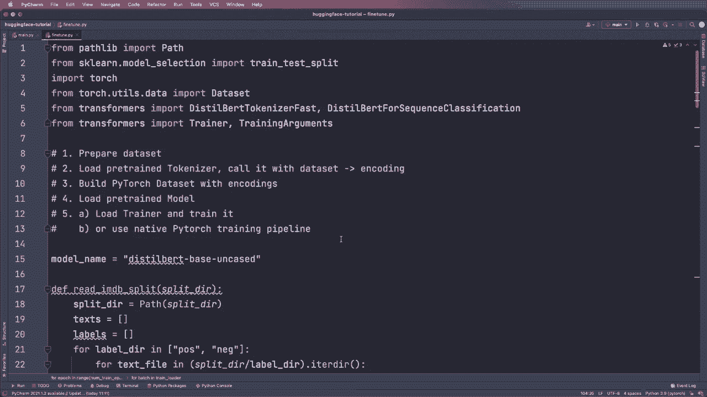
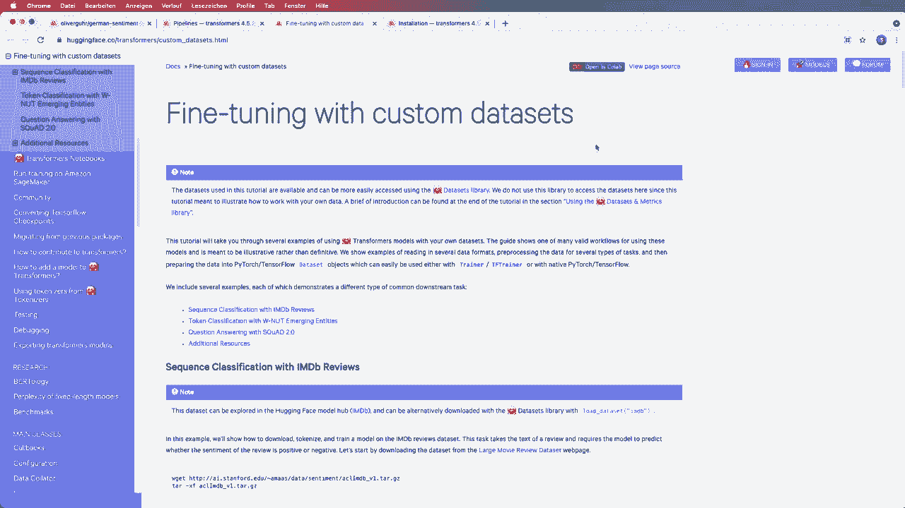
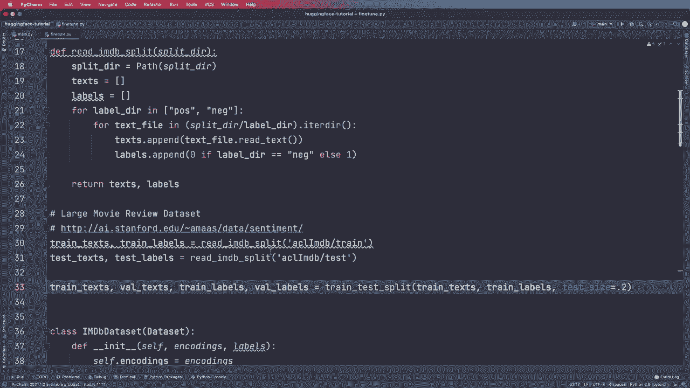
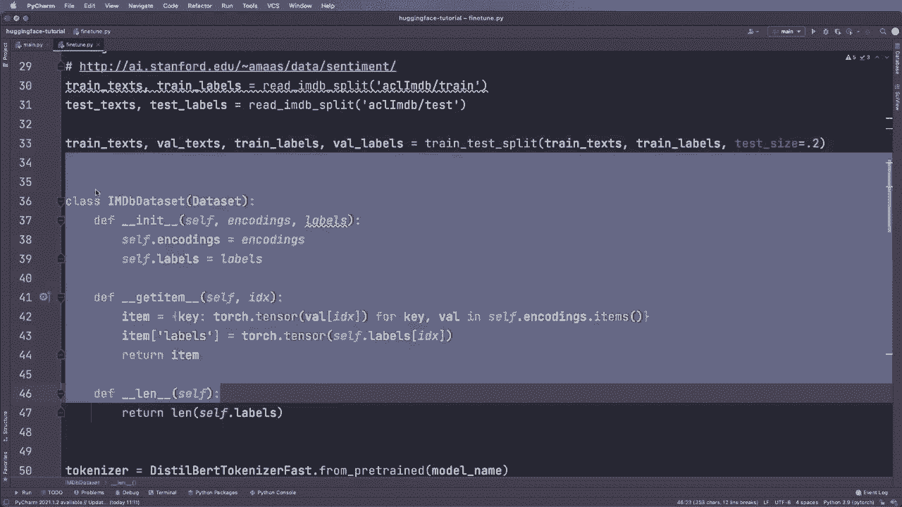
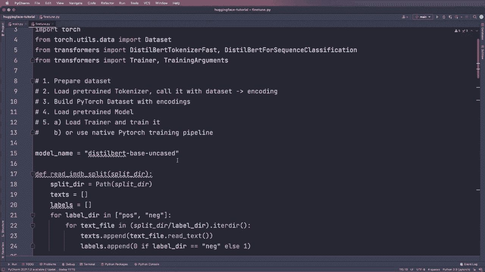

# Hugging Face速成指南！P7：L7- 微调(Fine Tuning) 

另一个我们如何微调自己模型的看法。这非常重要，我已经准备了一些代码，我会大致介绍，但还有很好的文档可以参考。因此，我们可以访问这个文档页面，你也可以在colab中打开它。

无论是使用Pytorch还是TensorFlow代码，这真的很有帮助。因此，我鼓励你查看一下。但现在让我们快速浏览一下。基本上，你需要做五个步骤。在这个例子中，适用于Pytorch。我们必须准备我们的数据集，例如，从Cv文件或其他地方加载。

然后我们必须加载一个预训练的分词器，然后用我们的数据集调用它。然后我们得到编码或tokens。😊。

然后我们必须根据这些编码构建一个pytorch数据集。如果你不知道什么是pytorch数据集，我这里会有一个链接来解释这个。然后我们加载一个预训练模型，然后可以加载Hugging Face训练器并进行训练。这抽象了很多事情，或者我们可以使用一个本地的或普通的pytorch训练管道，就像我们其他pytorch代码中一样。

是的，这就是我们必须做的。让我们很快浏览一下。在这个案例中，我们定义我们的基础模型名称。因此我们想从这个distilbert面部uncased版本开始。例如，在这个案例中，不是微调的那个。所以仅仅是这个。然后步骤1。我们准备数据。我们写一个有用的函数来创建文本和标签。

从实际文本中，这里我们下载了一些数据集并放入我们的文件夹。因此，我已经在这里做了，是的，这可以在这个网站上获得，包含电影评论，因此我们希望在电影评论上微调我们的模型，以进行情感分类。因此，在这里我们使用我们的助手函数创建训练文本和训练标签，我们还进行训练测试拆分，以获得验证文本和标签，然后下一步我们创建或定义一个Pytorch数据集。

这继承自pytorch数据集，因此torch U数据我们导入数据，然后在这里定义它。因此，我有一个教程来解释这个是如何工作的，但基本上它需要编码。

标签将被存储在这里。所以，是的，这需要编码。因此，对于编码，我们需要一个分词器。再一次，我们使用这个来自预训练函数的模型名称，在这个案例中，由于我们知道使用的是distill bird模型，我们可以使用这个类。所以记住，我们之前使用的是一个通用分词器，这个自动分词器类。

在这里，我们使用了一个更具体的示例。因此，我们使用了远程鸟分词器快速处理，然后将其应用于训练、验证和测试集，并获取编码。然后，我们将它们放入数据集中，并创建 Pytorch 数据集，接着导入一个训练器和训练参数。

这在 Trans us 库中是可用的，我们可以设置它来创建参数。例如，在这里，我们指定训练纪元的数量、输出目录、学习率和其他参数，然后再次从具体模型类创建我们的模型，使用这个 dot from pretrained 函数，然后设置这个训练器，提供模型、训练参数、训练集和验证集，然后我们只需调用训练器的 train，这将为我们完成所有训练，之后你可以在测试数据集上测试它，然后你就拥有一个微调的模型。

是的，这基本上就是你所知道的，然后我还想告诉你，如果你想手动操作并获得更多灵活性，可以使用普通的 Pytht 训练循环。为此，我们使用数据加载器并需要一个优化器。在这种情况下。

我们使用了来自 Transformers 库的优化器。然后在这里我们指定了设备，再次创建这个模型。我们将其推送到设备并设置为训练模式，然后创建数据加载器和优化器，接着进行典型的训练循环。我们说，对于每个纪元和训练加载器中的每个批次，我们执行我们通常做的事情。我们说优化器零梯度，如果需要也将其推送到设备。

然后我们调用模型，使用这个计算损失，在这种情况下，它已经包含在输出中，因此我们可以这样访问损失。然后我们调用损失的反向传播和优化器步骤，进行迭代，之后我们可以将模型设置为。

评估模式再次启用。是的，这就是我们在原生 Pythtorch 代码中执行的方式。这基本上就是我们如何进行微调，然后可以微调我们自己的模型。之后，如果需要，你还可以将它们上传到 Hugging Face 模型中心。所以我觉得这非常酷，今天我想展示的就是这些，希望你喜欢这个教程，也期待在下一个视频中见到你。

😊。
