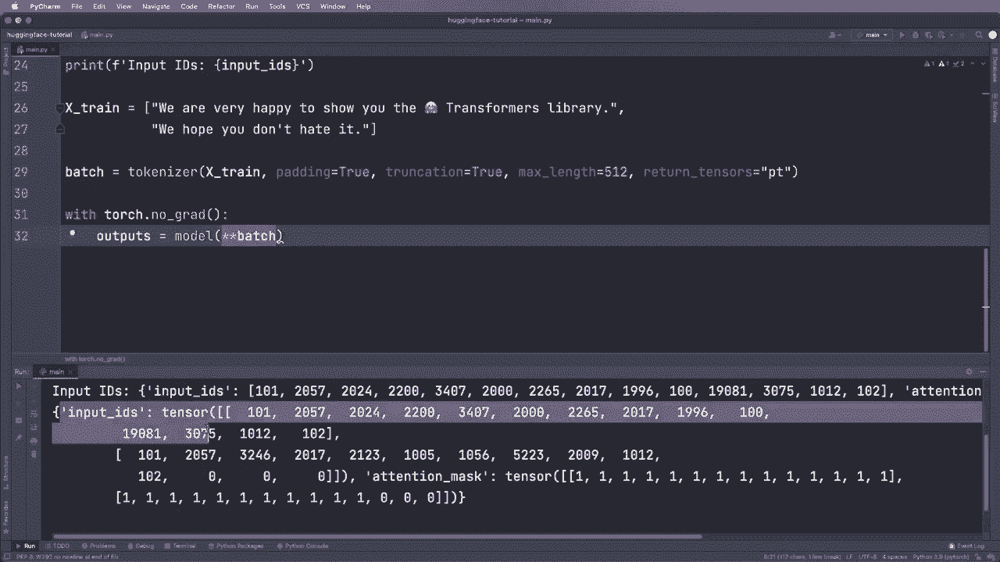
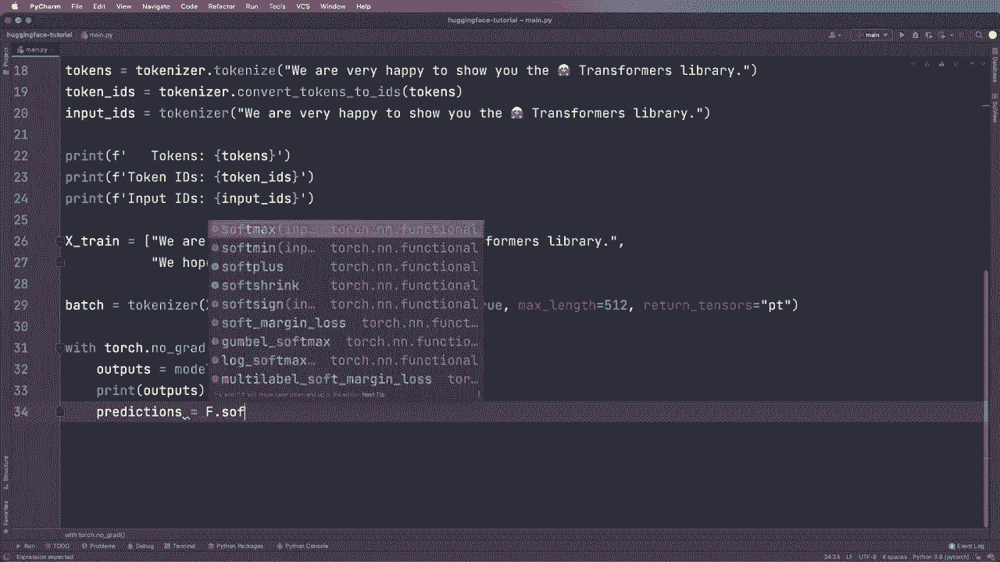
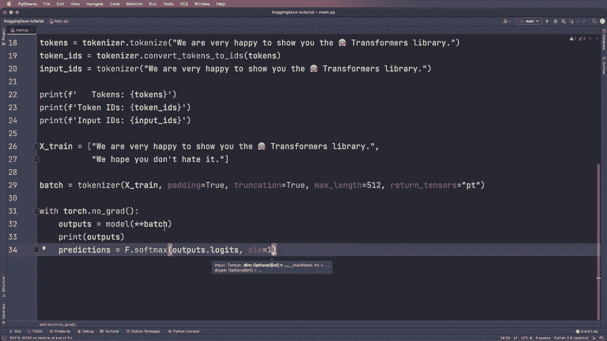
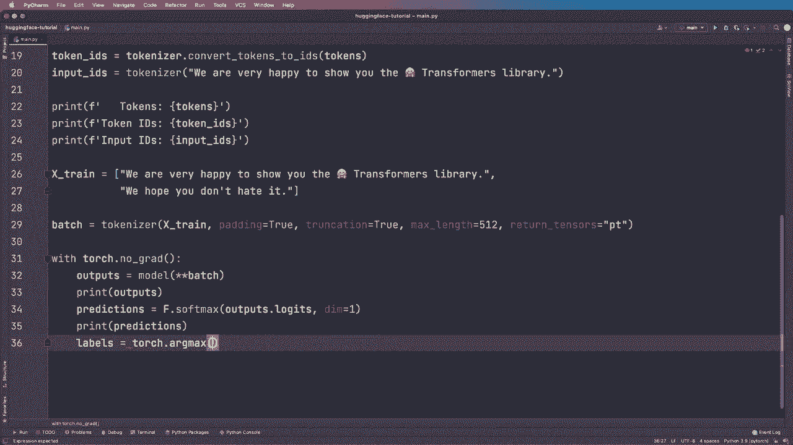
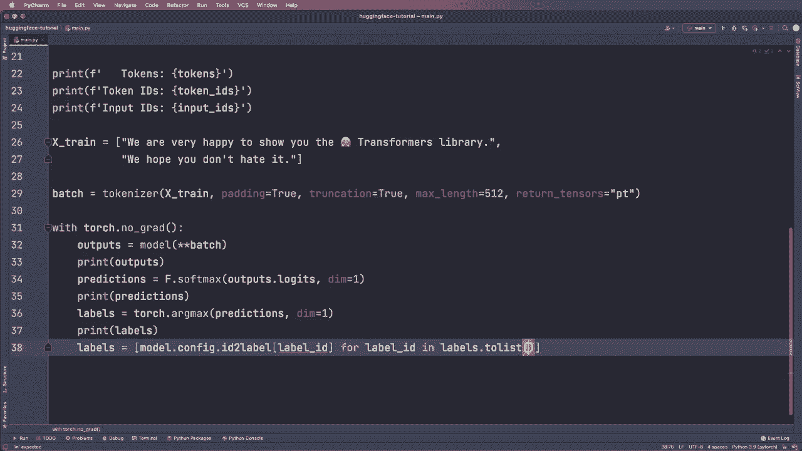
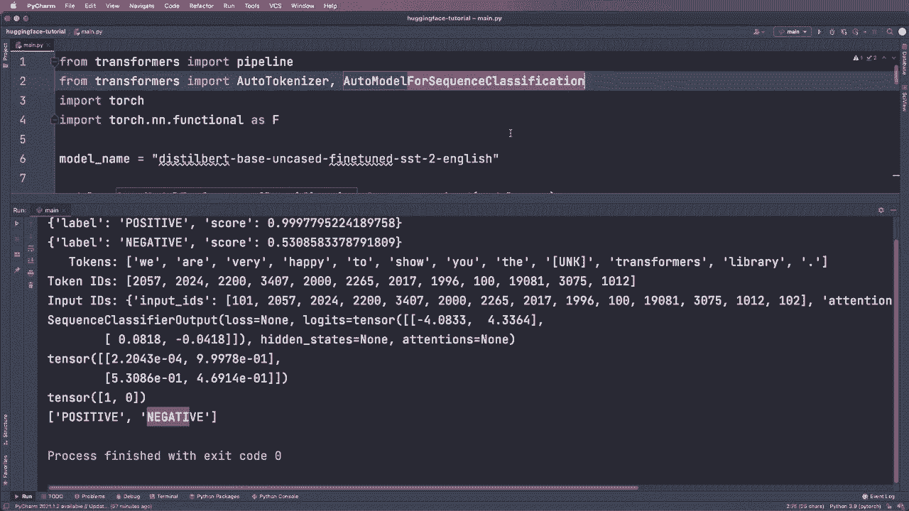
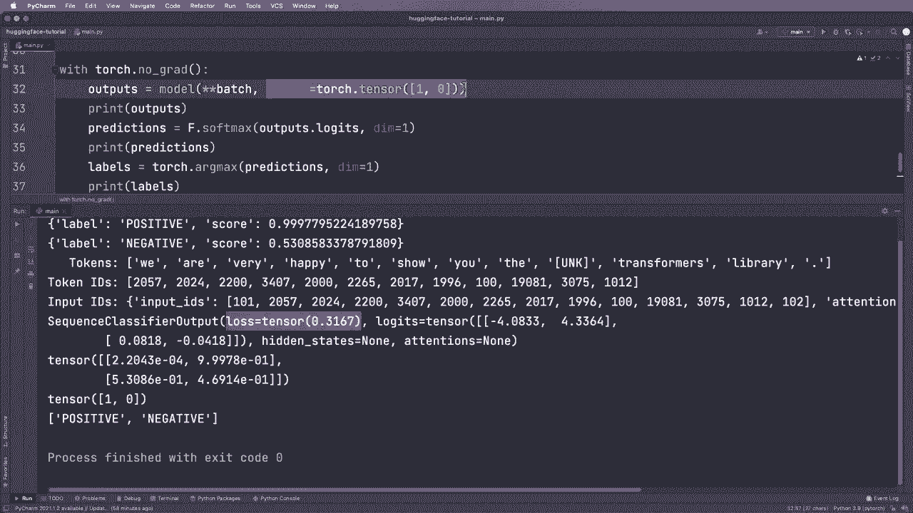
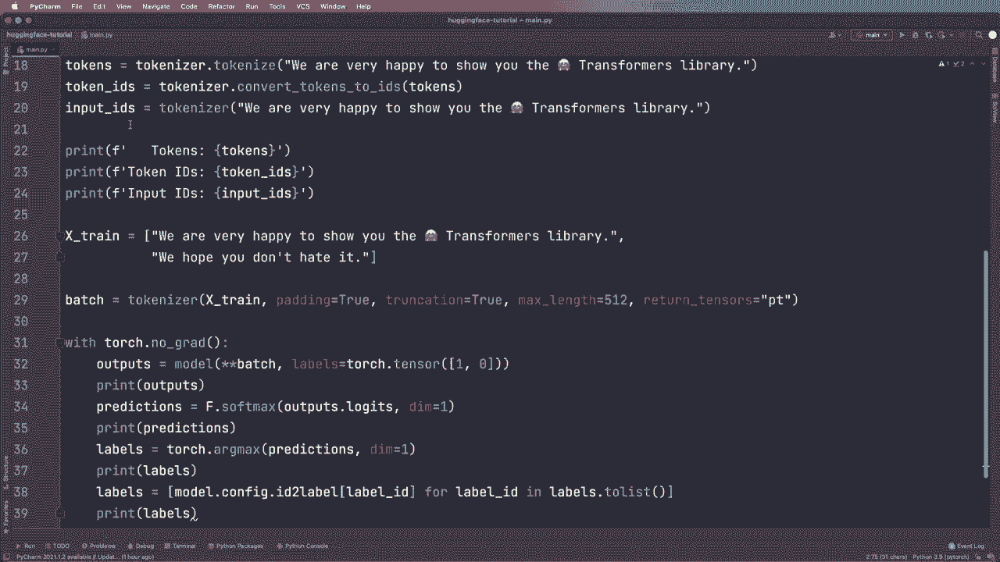

# Hugging Face速成指南！一遍搞定NLP任务中最常用的功能板块＜实战教程系列＞ - P4：L4- 基于PyTorch的分类实现 

我们手动进行此操作，看看如何调用我们的模型。在Pytorch中，当我们进行推理时，我们还想说使用torch点no grad。这将禁用梯度跟踪。我在很多教程中解释过这一点。如果你想了解更多，可以看看它们。然后我们可以通过说outputs等于来调用我们的模型。接着我们调用模型。

然后在这里我们使用两个星号，然后解包这个批次。如果你记得，这里是一个字典。基本上，通过这个，我们只是解包了字典中的值。对于TensorFlow，你不需要这样做。你只需像这样传入批次。但对于Pytorch，你必须解包。现在我们得到了模型的输出。那么，让我们继续。

打印输出。正如你所知道的，这些只是原始值。因此，为了获得实际的概率和预测，我们可以应用soft max。假设预测等于torch，或者我们也可以在F点soft max中使用，然后在这里我们说outputs点logics，我们希望在维度等于1上进行此操作。接着我们也打印预测，然后再做一件事。

所以让我们也获取标签，labels等于，我们只需通过获取具有最高概率的索引的预测来获取这一点。所以我们通过说torch点argmax来获得这个，我们可以选择输入预测或。

我们可以放入输出，实际上不需要这个，但为了演示我们使用预测，然后再次设置维度等于1，然后也打印标签。现在我们实际上再做一件事，所以让我们通过说labels等于来转换标签，然后我们使用列表推导并调用model点config点I到label，然后它需要实际的标签ID，我们迭代，所以我们说for label ID in labels to list。现在你会看到这在打印时发生了什么。我们打印标签，现在让我们实际上。

R这个看看是否有效。好的，这个有效。正如你所看到的，我们打印了输出。这是我们的输出。这是一个序列分类器的输出。正如你所见，它有launchets参数。这就是我们为什么使用outputs.dot.launchet。😊。

然后我们得到了实际的概率。为了获取标签，我们使用了Arcm。因此，这是一个包含标签1和标签0的tensor。然后我们将每个标签转换为实际的类名，然后得到了正和负。顺便提一下，这个函数，我认为只适用于序列分类的自动模型。

例如，如果我们只使用一个自动模型，那么我认为它将不可用。这就是这些更具体的类会为你做的事情。它为特定任务提供了更多的功能。因此我们看到在这种情况下损失为零。如果你还想有一个损失可以检查。

然后我们可以给出损失或者。😊。

不是损失，而是我们模型的标签参数，它知道如何计算损失。因此，我们说标签。然后我们通过torch.dot.tenor创建一个torch.tensor。然后作为一个列表，我们给它标签1和0。现在让我们再次运行这个。然后你应该看到我们在这里应该看到一个损失。现在，这里我们看到了损失。

再次强调，这个标签参数，我认为是专门针对这个序列分类的automod。

所以，是的，这样做有效。现在如果仔细看看概率。首先，我们看到标签为正和负。这里第一个的概率是最高的。是9.997。第二个的概率是最大的。所以选择了这个。它是5.30。如果我们将它们与我们从管道中获得的结果进行比较。

然后我们发现这些数字完全相同。现在你可能会看到管道和直接使用分词器与模型之间的区别。使用管道时，我们只需要两行代码。然后我们实际上得到了我们想要的。因此，我们得到了标签和我们感兴趣的分数。这可能是可以的，但是。😊。如果你想手动操作，你可以像我展示的那样做，你将得到相同的结果，然后可以使用。

所以，是的，这就是你如何使用模型和分词器。所以在你想要对模型进行微调时，使用模型和分词器是非常重要的。因此，我稍后会告诉你大致如何做，但是，是的，这就是你如何使用模型和分词器。我们假设我们在模型上进行了微调。

