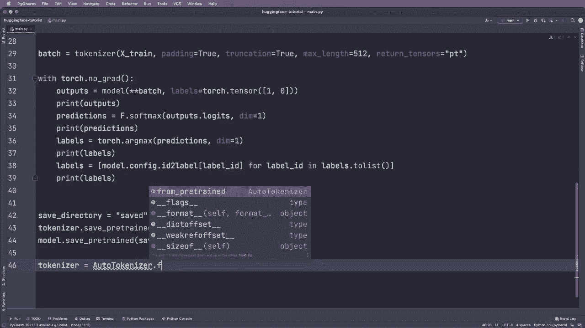
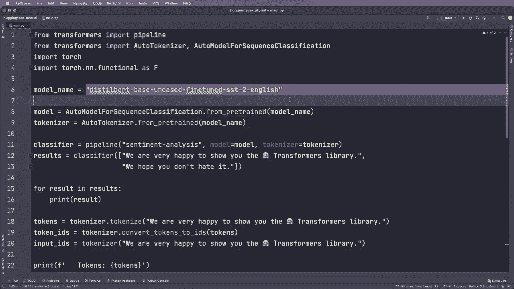
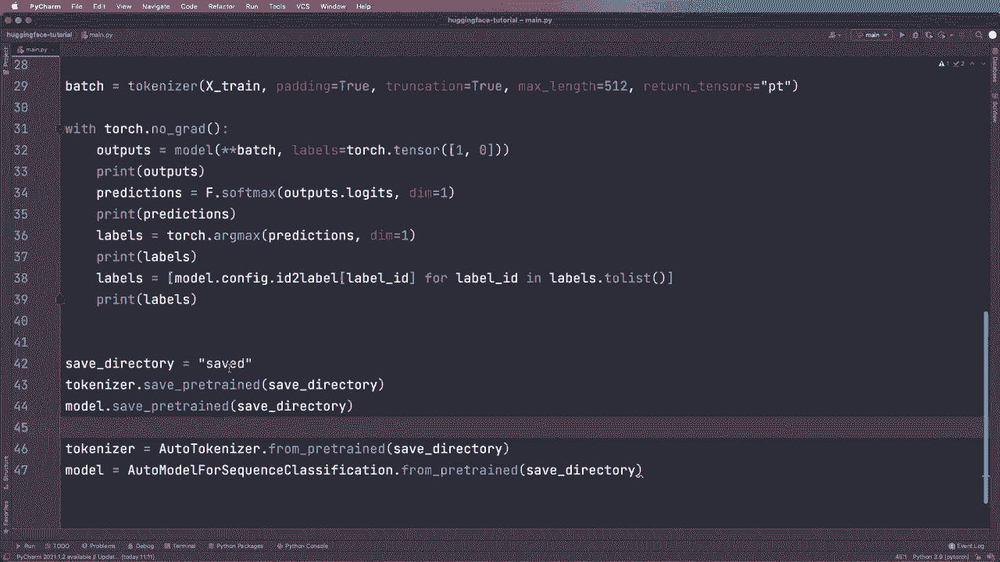

# Hugging Face速成指南！一遍搞定NLP任务中最常用的功能板块＜实战教程系列＞ - P5：L5- 模型保存和加载 - ShowMeAI - BV1cF411v7kC

然后我们可以做的是，指定一个保存目录。我们称这个文件夹为saved，然后我们可以调用tokenizer，然后调用dot safe pretrained，然后是保存目录，模型也是如此，所以我们可以说model dot save pretrained save underscore pretrained，然后再次是保存目录，然后我们可以在另一个应用程序中加载它们。

例如，tokenizer等于，然后我们再次使用这个自动tokenizer类，然后是from pretrained，在这里我们可以给它一个目录。因此这个from pretrained我们可以给它一个模型名称，或者我们可以给它这个目录，再次。

模型同样如此，所以模型等于。然后我们使用这个自动模型进行序列分类的from pretrained，然后是保存目录。所以这应该可以工作。然后你应该得到完全相同的模型和tokenizer包。是的。正如你所见，这些模型在这些from pretrained函数中非常重要，你会经常使用它们。好的，我想这些是你构建管道或手动应用模型和tokenizer所需的基本功能。

