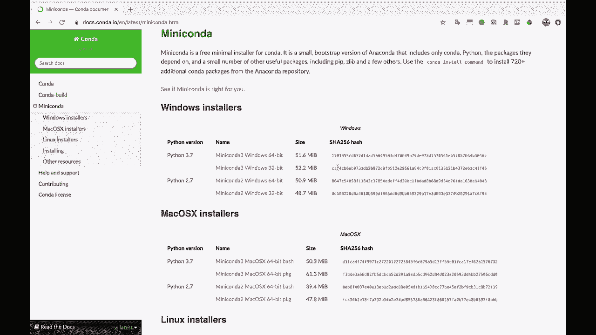

# Jupyter Notebook 超棒教程！50分钟，把安装、常用功能、隐藏功能和 Terminal 讲解得清清楚楚。学完新手也能玩转！ - P3：3）安装 Python 和 Jupyter Notebook - ShowMeAI - BV1yv411379J

好吧，首先，无论何时开始使用 Jupyter 笔记本，我们需要安装 Python 和 Jupyter。如果你已经安装了 Python 和 Jupyter，可以跳过这一步。如果你当前不想在电脑上安装任何东西，可以使用 Google Colab。

所以 Google Colab 有点像云端的 Jupyter 笔记本。你可以直接在浏览器中运行它们。它们不会完全与 Jupyter 笔记本相同。因此，我们在这个教程中讲到的一些内容可能不完全相同。！

但这是一种快速启动代码笔记本的好方法。你知道，这基本上是相同的概念。你有文本，还有代码，并且可以与人分享。所以这是完全相同的概念。一些具体细节会稍有不同。

但是如果你不想在电脑上安装 Jupyter，或者由于某种原因无法安装，那么可以自由使用 Google Colab。我觉得这是一个很好的资源。😊！

但是，对于那些在电脑上安装 Python 和 Jupyter 的我们来说，我们来看看 Miniconda。因此，我推荐通过 Miniconda 安装 Python 吗？

你在使用 Python 时所用的各种数据科学包。那么，什么是 Minconda 呢？Minconda 附带 Python，同时也包括这个方便的 Conda 工具。现在，Conda 用于安装像 pandas、Jupyter 笔记本以及你需要安装的其他 Python 库。

Conda 也用于创建虚拟环境，虚拟环境是将你的 Python 安装和包封装到一个与主 Python 安装隔离的目录中的最佳实践之一。无论如何，如果你想，可以自由地进行更多研究。

我建议你为你的系统安装正确版本的 Python，安装 Python 3.7 版本。大多数人现在使用 Python 3.7，除非你的公司特别使用 Python 2.7，那你可以安装它。所以安装适用于 Python 3 的 Miniconda，然后在安装完成后。

让我们跳到终端，或者 bash，我在使用 Zsh。如果你在 Windows 上，可以使用命令提示符。所以，好吧，我们要做的是，我喜欢通过创建新的虚拟环境来开始每个新项目和新教程视频。

所以我们将创建一个漂亮的小地方来安装 Jupyter，同时我也会安装 pandas，因为我想展示一下 pandas 数据框在 Jupyter 中的样子。所以，😊，让我们用 Conda 创建一个新的虚拟环境，我要给它命名。

我现在就把它命名为Jupiter。我可以在创建这个新虚拟环境时立即列出我想安装的包。所以我想安装Jupiter。我想安装pandas。我想这就是全部了。

所以我会创建这个名为😊，Jupiter的虚拟环境，这个`-n`标志代表环境的名称。我将把Python包Jupiter和pandas安装到这个虚拟环境中，并且它也会安装所有这些Jupiter和pandas的依赖项。

这些必须安装才能正常工作。所以它问我是否想继续。我会直接输入“yes”来确认。这将开始安装所有内容，等安装完成后我会回来。好的，看起来一切都成功安装了，Conda非常友好地给我们这个小块来激活环境。使用`Conda activate Jupyter`。所以我会继续这样做，这样我们就可以使用它。

我会很快展示给你。如果我现在输入`which Python`，它会告诉我当前使用的Python版本。如果我运行Python。😊。我当前使用的版本在Anaconda 3的bin目录下。现在，如果我激活我的虚拟环境，然后输入`which Python`。

你会看到我现在使用的是一个完全不同的Python版本。这就是虚拟环境的全部意义。我们把安装内容包裹在这个新文件夹里，这样如果需要在电脑上同时有多个安装，我们就能做到。
