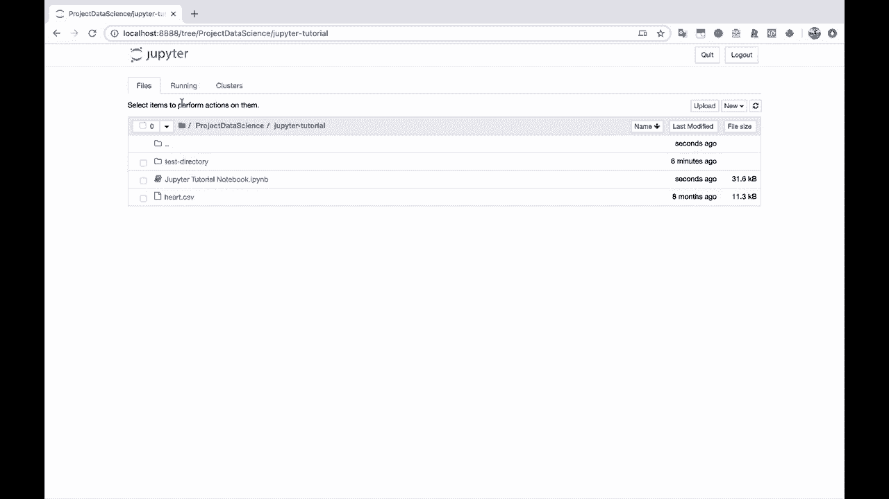
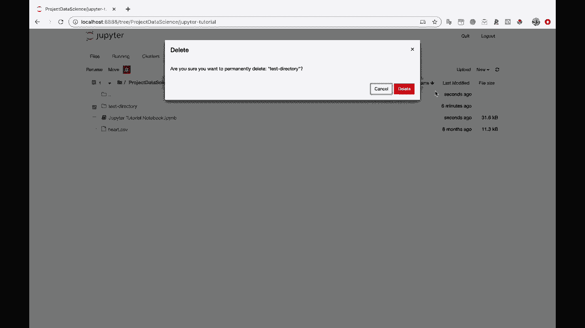
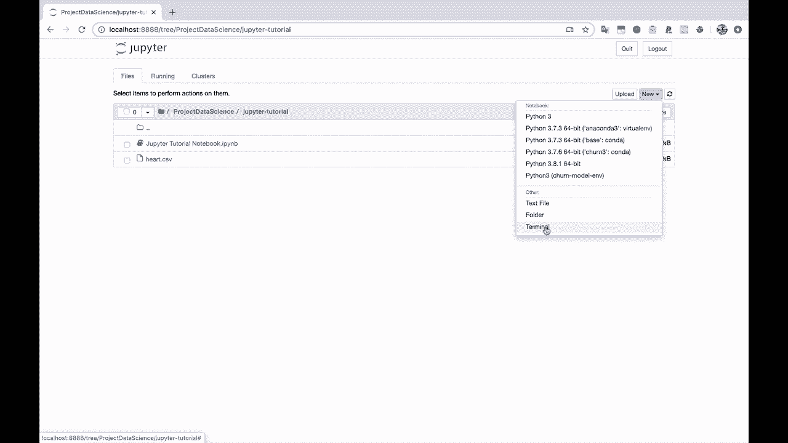
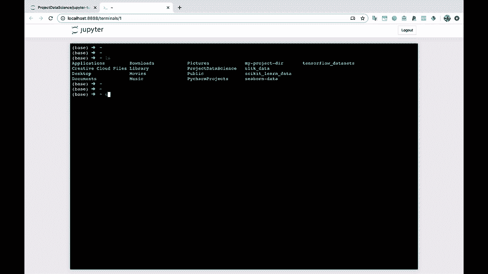
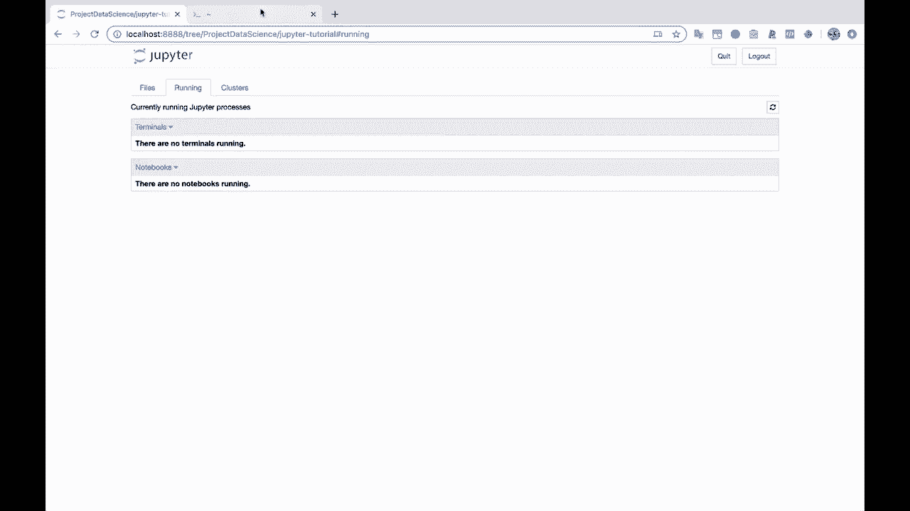

# Jupyter Notebook 超棒教程！50分钟，把安装、常用功能、隐藏功能和Terminal讲解得清清楚楚。学完新手也能玩转！ - P13：13）Notebook之外的其他功能 - ShowMeAI - BV1yv411379J

未来。好吧，让我们保存这个笔记本。所以我会命令S保存笔记本。让我们关闭它。我会先关闭它。

我会删除这个。测试目录是在里面创建的。

让我们在这里展示一些其他内容，然后我会给你一些资源，我们就结束了。好吧，如果你到右边这个新按钮下面去，你会注意到我们在其他选项下有一个文本文件和一个终端。所以如果你想在Jupyter笔记本中运行终端，你可以这样做。

在我的情况下，你会注意到这看起来非常类似于我在这里的终端。所以它正在运行Zish，所以我可以，你知道，我可以使用LS命令打印出这里所有的目录。

如果我想的话，如果我使用git进行版本控制，我可以在这个终端中做那样的事情或其他任何我想做的事情。所以我会退出这个。你会注意到这个现在已经关闭了。

在运行中，没有终端在运行，因为我已经退出了，如果我们让它保持运行。让我们保持这个打开一秒钟。然后刷新。这样你就会看到我们有一个终端在运行。现在。我会关闭它。

这对我们来说就结束了。
