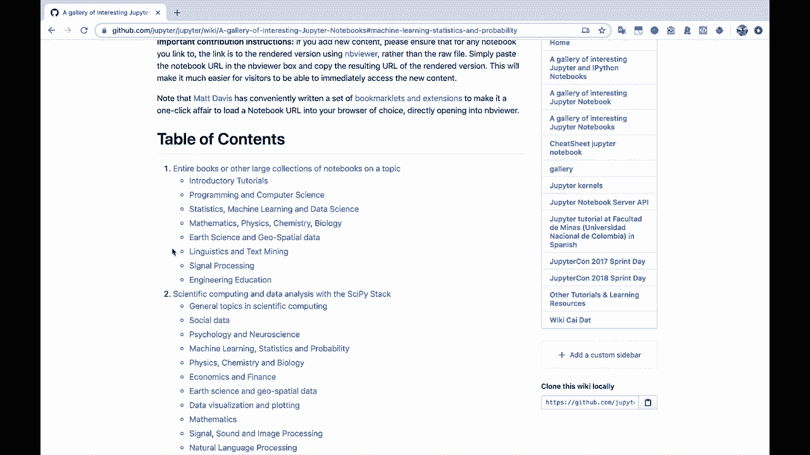
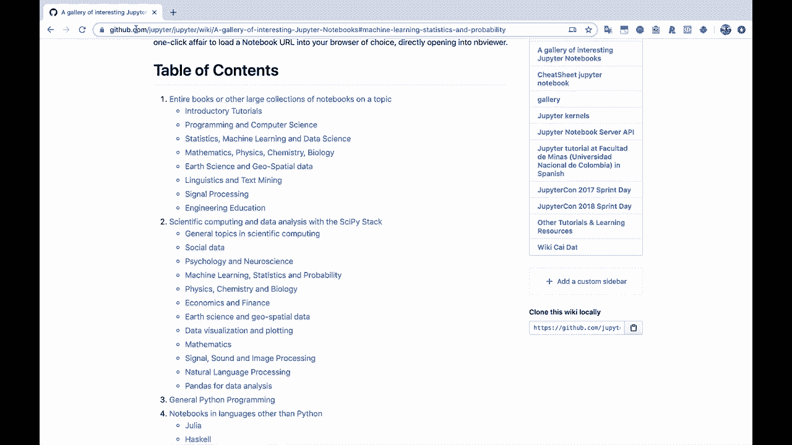
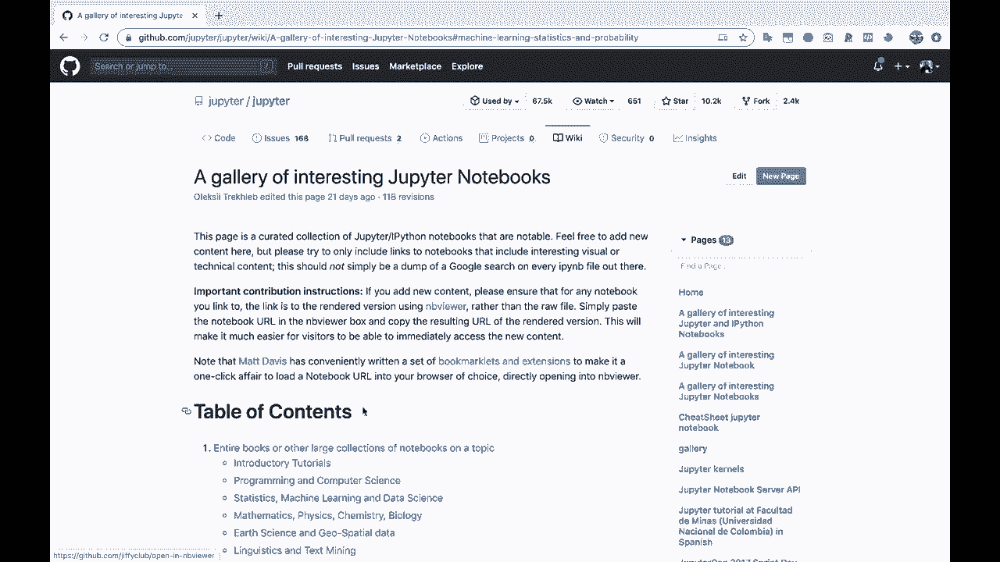
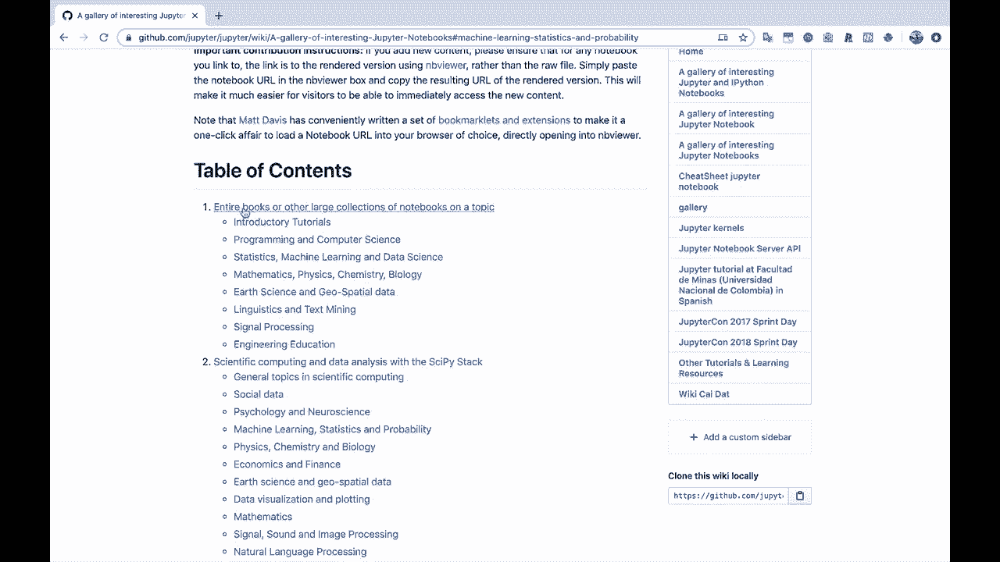
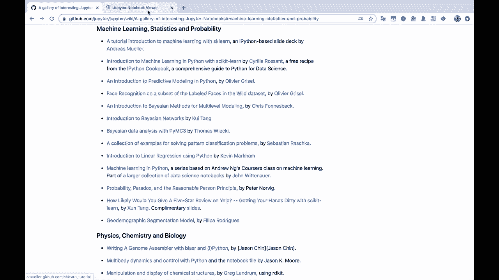
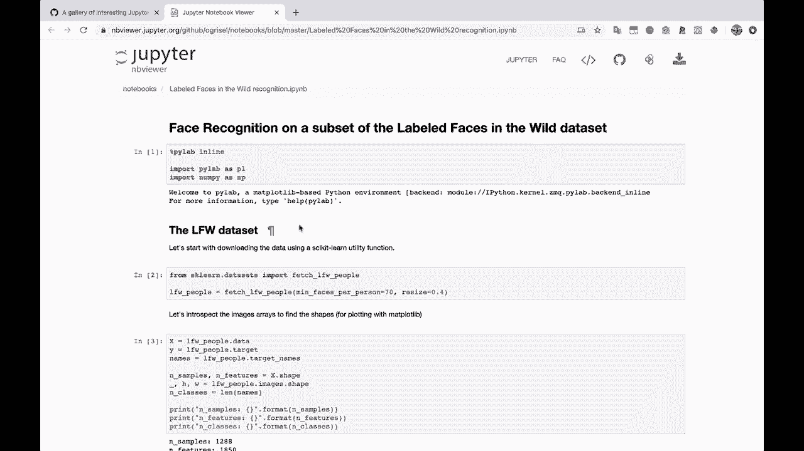
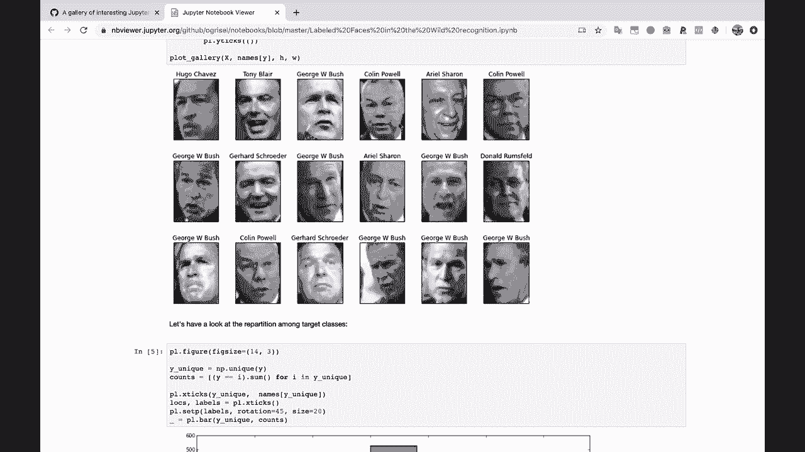
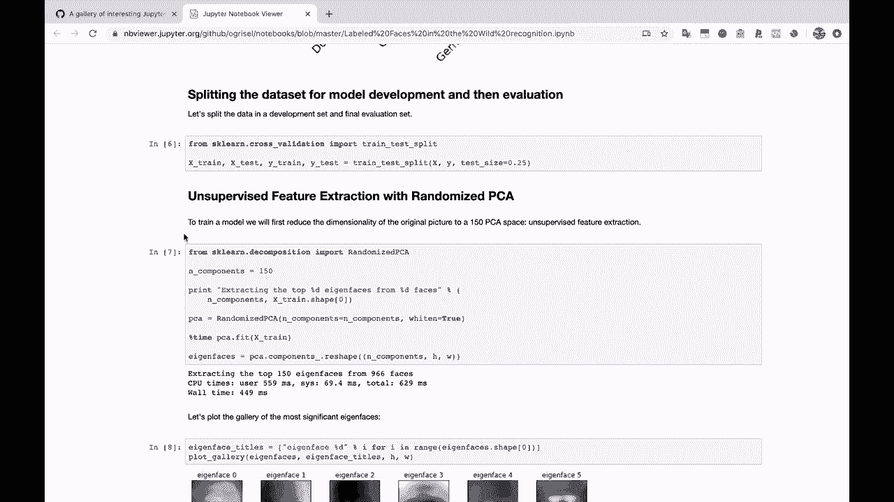
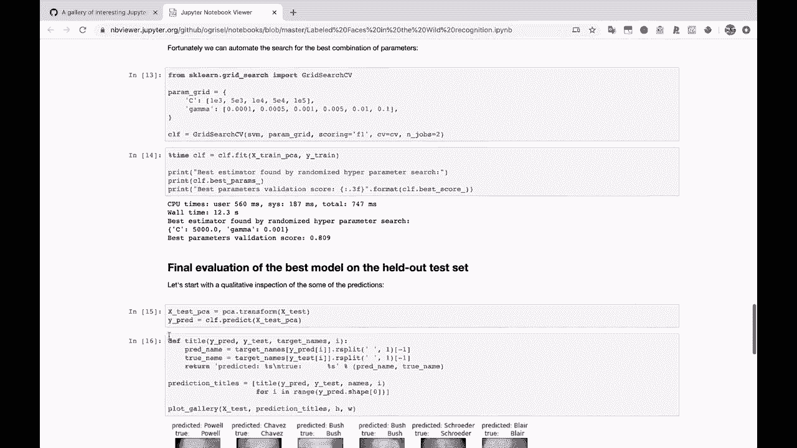
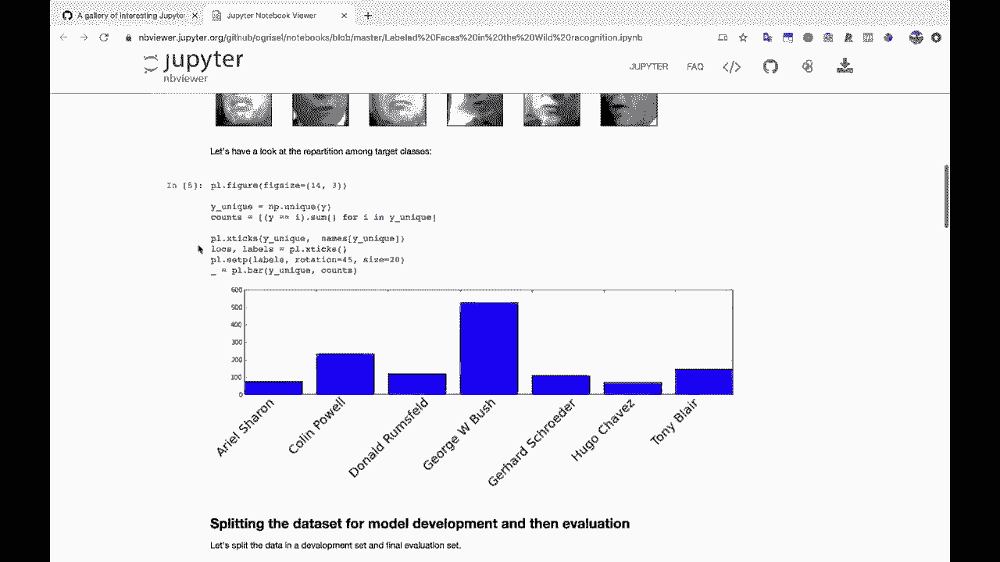

# Jupyter Notebook 超棒教程！50分钟，把安装、常用功能、隐藏功能和Terminal讲解得清清楚楚。学完新手也能玩转！ - P2：2）Jupyter Notebook示例 - ShowMeAI - BV1yv411379J

我将把它拖到这里。我有一个，这是一个Github代码库，里面有一些有趣的Jupyter Notebook画廊。如果你对Jupyter Notebook的用途感到好奇。那么，答案是它们可以用于你可能想用数据和Python做的任何事情。具体来说，这个人，或者我想这可能是由许多人汇编的。

😊。

他们在这里汇总了许多不同的笔记本。让我们看看，我们有一些通用的Python编程和科学计算。我将滚动到我们学习统计学和概率的地方。让我们来看看。

所以，如果我打开这个在“野外数据集中标记的人脸子集”上的面部识别。

你会看到，使用这个不错的inB查看器URL，我们能够查看这个人的Jupyter Notebook，确切地看到他们使用的代码，确切地看到他们做了什么。

并查看结果的图像。查看他们使用的数据的图表。

你可以在这里使用普通文本将其划分为多个部分。这就是为什么Jupyter Notebook在科学界和数据科学家中越来越受欢迎的原因。一般来说，这是因为你能够在一个笔记本中进行一些实验，进行一些建模。

你可以对你的数据进行任何你想要的转换和操作，并训练一个能够进行预测的模型。

你可以写一些关于它的背景信息。你还可以与其他人分享这个笔记本。所以，这是一种非常好的方式。😊。

让你的工作对他人更加可见和透明。而且，你知道的。你可以与任何人分享这个笔记本。他们不需要具备技术背景。你不需要创建一个网络应用程序或任何东西，你也不需要创建一个完整的网站来分享你想做的一些分析。因此，Jupiter笔记本在许多不同的场合都非常方便，而我不确定你想用它们做什么。

不过我相信这一定非常有趣且有用。所以让我来告诉你如何使用Jupiter笔记本。让我们开始深入探讨吧。

