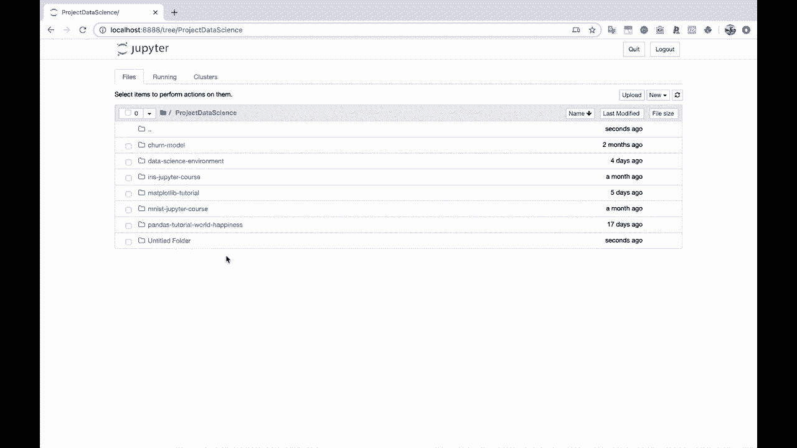
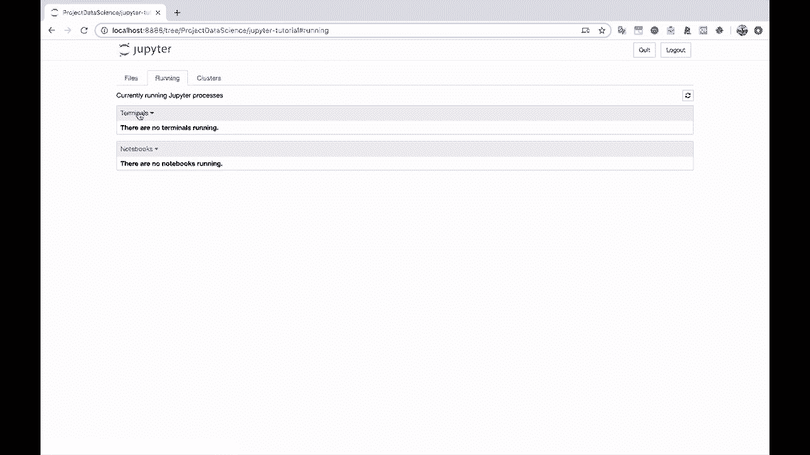

# Jupyter Notebook 超棒教程！50分钟，把安装、常用功能、隐藏功能和Terminal讲解得清清楚楚。学完新手也能玩转！ - P4：4）启动 Jupyter 笔记本 - ShowMeAI - BV1yv411379J

好的，我们现在已经安装了Python和Jupiter。我们需要做的就是输入Jupiter Note，然后在后面加一个&符号，这样就可以在终端后台运行，这样我们还可以继续使用终端。好的，这样在我的另一屏幕上弹出了一个窗口。让我把它拖到这里。

让我们关闭这个。好，现在开始。我们进入了Jupiter笔记本。我在我的主目录中启动了这个。所以你会看到我们可以访问所有文件夹，所有目录。我要创建一个新笔记本的地方是这个项目数据科学文件夹，你会看到这就是我项目数据科学目录中的所有文件夹。

让我们创建一个新的。我会创建一个新文件夹。

让我们重命名它。我们称它为Jupiter教程。

现在，我会点击这里。这是你每次运行Jupiter笔记本时会看到的基本界面。所以我们有一个文件浏览器，还有这个运行标签，基本上显示了我们是否有任何正在运行的笔记本，是否有正在运行的终端。然后我们还有这个集群标签，我们暂时不需要处理它。

