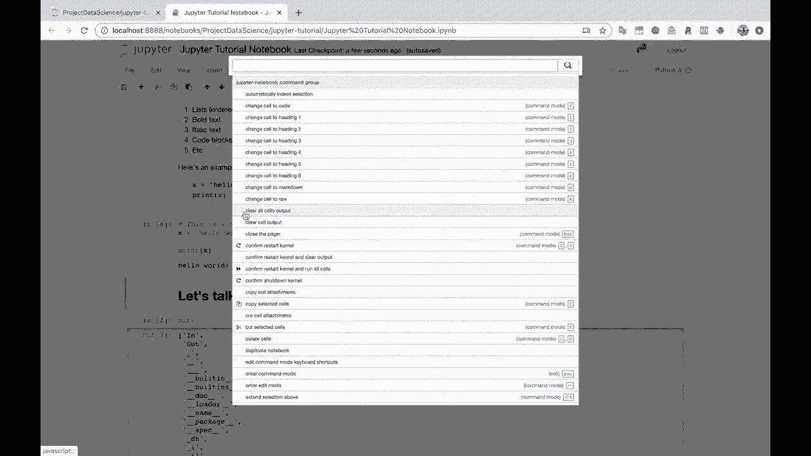
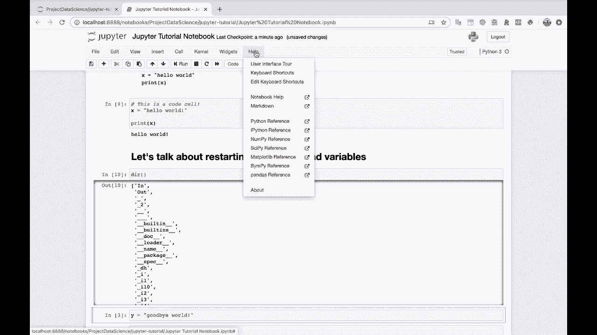

# Jupyter Notebook 超棒教程！50分钟，把安装、常用功能、隐藏功能和Terminal讲解得清清楚楚。学完新手也能玩转！ - P8：8）菜单功能 - ShowMeAI - BV1yv411379J

现在。

好的，让我们快速浏览一下这些文件菜单。所以我们有文件。你可以创建一个新的笔记本。你可以保存和检查点。编辑。你可以拆分单元。你可以合并单元。你可以剪切、粘贴和删除。你可以查看。你可以查看行号，所以你可以在这里切换行号的显示或隐藏。你可以插入单元。

在单元菜单项下，你可以运行单元并更改类型。如果你想清除输出，比如说，我们知道，我们想要清除这个 hello world 输出，来到这里，当前输出。然后清除。或者如果我想清除这个 Dr 这里，你知道，单元当前输出清除。

就好像这个单元没有运行。让我们看看小部件。我们现在不打算讨论这个。然后你有帮助。我现在就给你展示。
