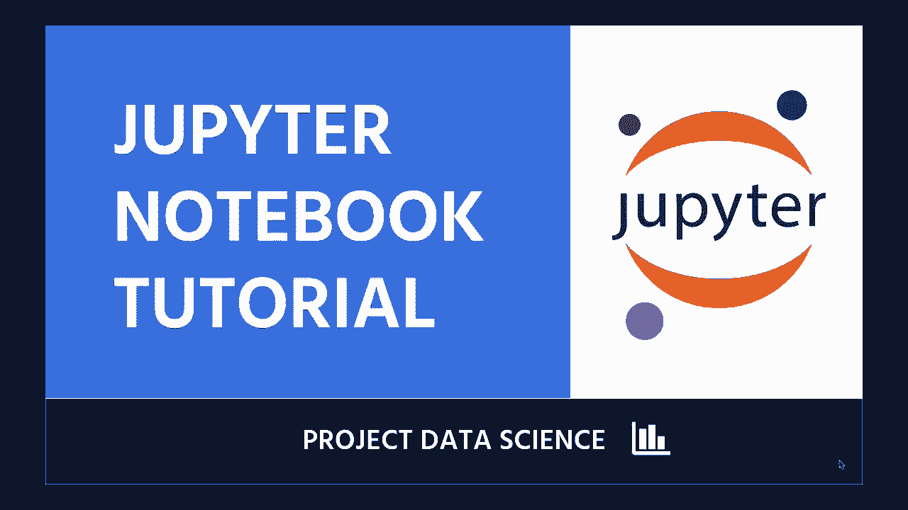
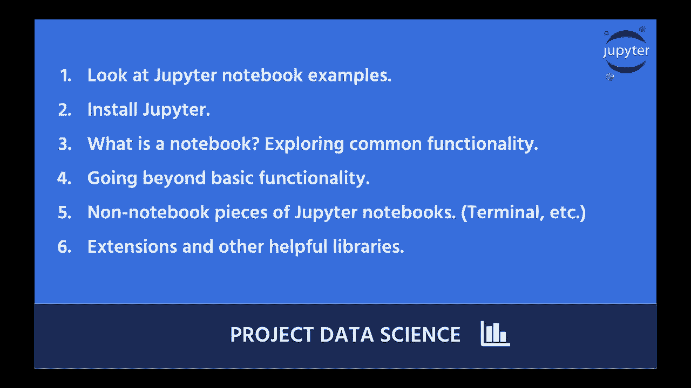

# Jupyter Notebook 超棒教程！P1：1）介绍 

你好，欢迎来到另一个精彩的数据科学项目教程。今天我们将深入探讨 Jupyter Notebook。因此这个教程非常适合从未使用过 Jupyter Notebook 的人，是一个直截了当的介绍。

我们将学习相当多的内容，并且我们将在 Jupyter Notebook 中进行。所以数据科学项目就是通过实践来学习，因此我希望你能有一台电脑并跟着我一起学习。

😊，所以。😊，让我们来谈谈我们在本教程中要做的事情。第一步，我们将查看几个 Jupyter Notebook，以便奠定基础。第二步，我们将安装 Jupyter Notebook。我会帮助你在一个良好的虚拟环境中安装 Python 和 Jupyter Notebook。第三步，我们将打开 Jupyter Notebook，并提出问题。

什么是 Notebook，我们将开始探索。

第四步，我们将看看除了基本功能之外，你还可以在 Jupyter Notebook 中做的一些其他常见操作。第五步，我们将查看 Jupyter Notebook 的其他部分，除了 Notebook 本身，然后我们将看看一些其他内容，比如键盘快捷键、Jupyter Notebook 的一些扩展和我非常喜欢使用的其他功能。

所以让我们直接进入吧，开始吧。
