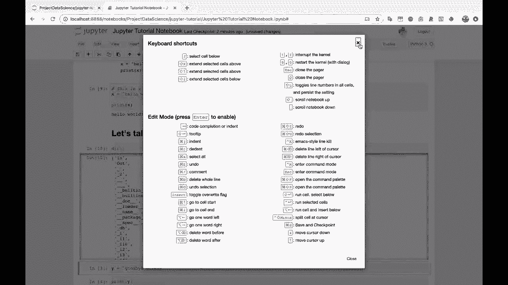
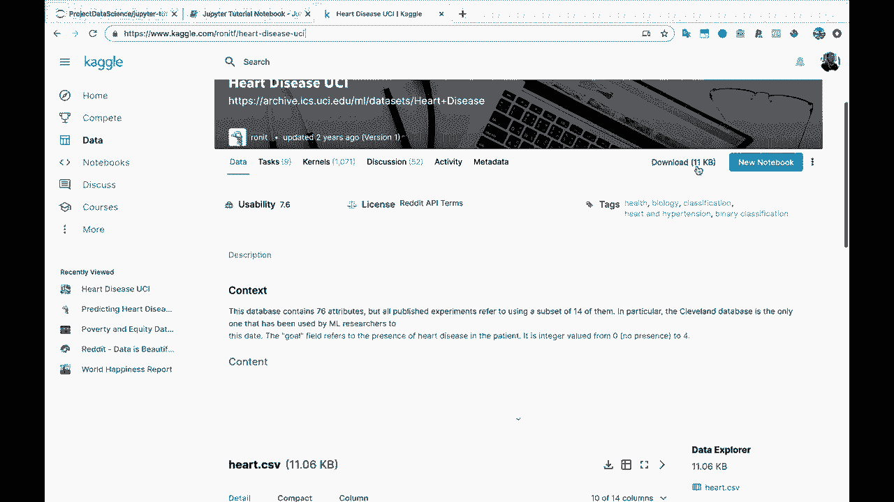
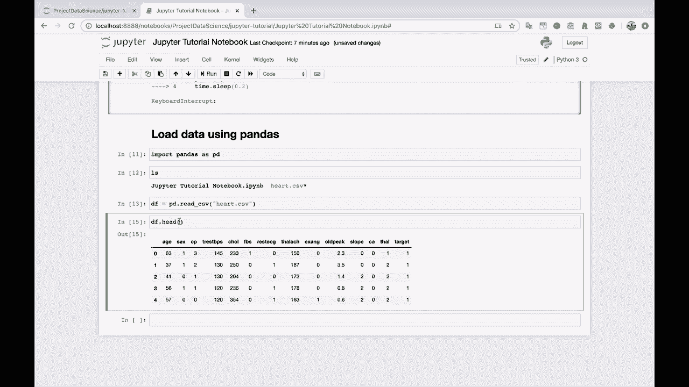

# Jupyter Notebook 超棒教程！P10：10）使用 pandas 加载和显示数据 

好的，你在 Jupyter 笔记本中可能会做的主要事情之一是查看、转换和清理数据。所以让我们使用 pandas 加载一些数据，看看效果如何。所以加载。使用 pandas 加载数据。所以我要做的第一件事是将 pandas 导入为 PD D。如果你看过其他一些项目数据科学的视频，这个 Jupyter 笔记本现在。

因为我们目前的设计是个乱七八糟，这真是一场灾难。我绝对推荐观看其他一些视频，看看如何以良好的流程使用 Jupyter 笔记本进行项目。通常我会把所有的导入放在 Jupyter 笔记本的最顶部。我将它们全部保留在那里。但现在，这只是关于使用 Jupyter 笔记本。

所以我们就在这里做导入。所以我需要一些数据。让我去找一些数据。让我们去，如果你在谷歌上搜索，让我们看看 Caggle 心脏病。所以我相信这个心脏病 UCI 数据集，这是我们在另一个项目数据科学视频中使用的一个。我认为 map plot Lib 教程可能让我们下载这个数据。

我们将在这里点击。解压它。让我把下载界面拖过来，好的，heart.tc CSV。所以我很快回到我的终端。我只是要使用终端来移动这个文件。所以我将从我的主目录移动。从下载到。Home project，数据科学，Jupiter 教程。哦，实际上。

我不想移动整个下载文件夹。我想移动 heart do CSV。好了。这样。好的。所以我运行这个，你会看到 Heart.dot CSsV 从我的下载文件夹中消失。我们来关闭它。回到 Jupiter 笔记本。现在。我要做的第一件事是运行 LS。现在，LS 实际上是一个。

这是一个终端命令。这就像一个 bash 命令，用于列出你当前目录中的内容。但它也可以在 Jupyter 笔记本的代码单元中使用，这真的很好。所以你可以输入 LS。😊并打印出你当前目录的内容。所以你会看到我们的 heart.csv 数据。我将做 DF 等于 P D 点 read，CSV。

我将直接读取我们的数据。所以我们读取这个，你会看到它执行得很好。现在，如果我只做 D F。这里是 Jupiter 笔记本如何显示这些数据。所以这真的不错。实际上。你可以看到，如果你将鼠标悬停在数据行上，它会高亮显示。你会看到这些行看起来很不错。你有这种交替的灰白色。

这样你就可以很容易地看到数据。我将使用`DF dot head`来查看前五行数据。列名都很清晰并且是粗体的，所以你可以看到列名是什么，以及哪些列对应于这些数据。这是使用Jupyter笔记本和pandas读取数据的一个优点。

