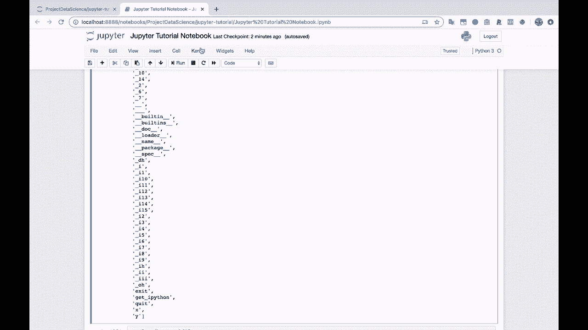
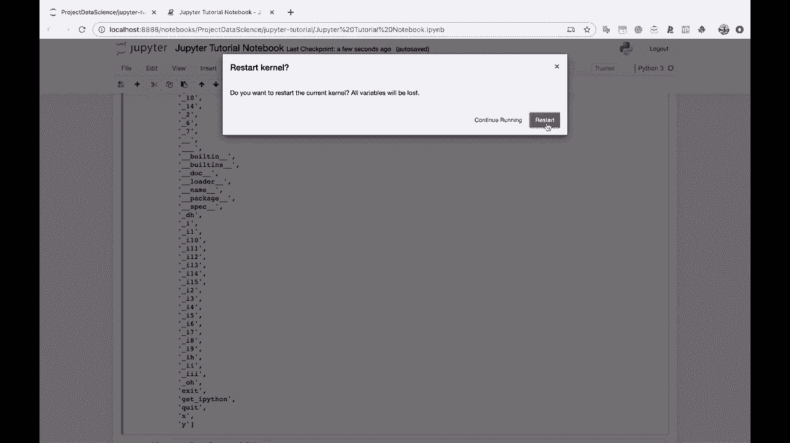
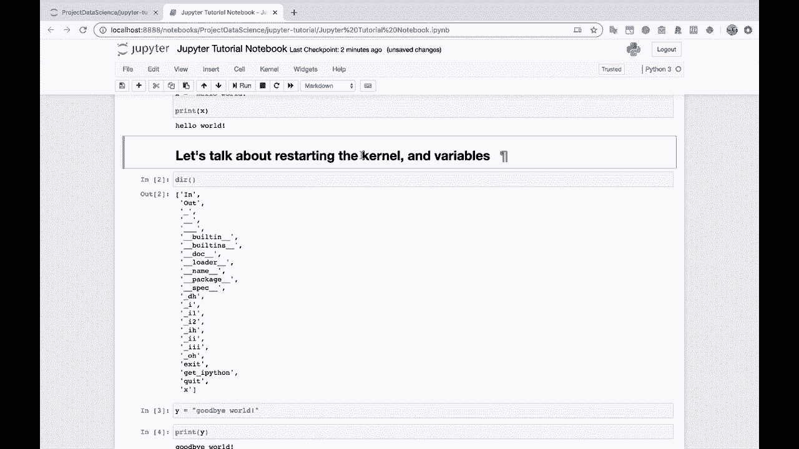

# Jupyter Notebook 超棒教程！P6：6）内核和变量 

好的。那么让我们创建另一个部分。我们来谈谈重启内核和变量。所以这将涉及到我之前提到的。关于分配变量。然后可以访问它们，直到你明确删除。删除变量或重启笔记本。让我们看看我们现在的D。

我们的变量目录以及我们可以访问的所有内容。所以x和y仍然被定义。如果我执行打印y。这仍然存在。因为我们没有使用DEL方法删除它。删除y，所以我们还没有使用那个删除它，也没有重启笔记本。所以我将很快向你展示这两种方法。首先，让我们去掉y。

所以这并不返回任何东西。它只是删除变量。让我们回到这里，再次运行D。你会看到y不再存在于我们的变量中。所以如果我们执行打印y。哦，y未定义。它曾被定义。然后我们删除了它。这就是发生的事情。所以让我们再定义y。Y等于再见，世界。

打印Y。看起来不错。我已经使用X键删除了另一个单元。我将继续使用X在这里删除。如果我们执行D，你会注意到y现在又回来了，Y也回来了。所以我可以退出这个笔记本。哦，是的。实际上，我们确实需要保存我们的更改。谢谢。小弹窗。

所以我要保存我们的更改，命令S，或者你可以在这里文件，保存和检查点。让我们关闭我们的笔记本。你会注意到我们在Jupyter教程文件夹中列出的笔记本旁边有一个小绿色书本。

现在，这意味着它正在运行。这里说正在运行，非常有帮助。如果我们点击运行标签，你会看到这个笔记本正在运行。刚刚连续说了很多次正在运行。好吧，如果我们回到文件。这意味着我们的Python仍然在后台运行。

它仍在跟踪我们所有的变量，一切仍然存储在内存中。所以如果我再次点击这个笔记本并重新打开它。然后我下来这里。到Dr。注意这个数字14，这是在我们保存之前执行的第14个单元。让我们再运行一次。现在是第15个单元。我们仍然可以访问X和Y。

所以我不会再次运行这个赋值单元。我不会运行我们赋值Y的单元。我将打印y。它仍然打印。Y仍然在这里。仅仅关闭标签并不会关闭笔记本。笔记本不会关闭。直到你明确关闭它，你可以点击旁边，然后在我们的主标签中点击关闭。

你也可以做文件，关闭和停止。或者你可以回到终端，直接关闭整个Jupyter笔记本。在这里运行的服务。你可以关闭整个东西，这样就会关闭你所有的笔记本。

所以笔记本会继续运行。直到你告诉它停止。另一种重置这个笔记本的方法是去内核。让我们去内核选项卡。你会看到可以对 Python 内核做不同的操作。所以我将点击。重启，我现在要重启内核。

这和关闭笔记本再重新打开是一样的效果。所以我们所有的变量都会消失。为什么不再在内存中。如果我们想让 Y 等于“你好，世界”。我们需要再次运行这个单元。而且，X 也将不再在内存中。所以这就像重启你的电脑。这是重启笔记本，你会失去一些内容。

你会失去这里内存中的变量。那么我们开始吧。让我们保存它。

让我们去内核，重启。

让我们重启这个内核。好的，这里闪烁成蓝色。内核准备好了。现在让我们运行 D，看看这个数字会发生什么。砰，回到一。这告诉我们。这是一个新版本的 Python。在这里，你会注意到 X 和 Y 现在都消失了，因为这就像关闭 Python 一样。

然后再重新打开它。所以如果我下去打印 Y。我们会得到“名称 Y 未定义”，因为我们正在处理一个新的 Python 内核，而我们还没有定义它。因此，对于 Jupyter 笔记本来说，这一点非常重要。这就是为什么，如果可以的话。尽量运行你的单元。我将要重启。

这里再重启一次。尽量从头到尾写并运行你的单元，这样在运行时一切都能理解。一次一个单元，从单元到单元再到单元。因为。如果你在这里分配了变量 Y。然后在分配之前在这里打印它。这在技术上是可行的。如果你已经运行了这个单元，然后再回到这里运行这个单元。

这就是为什么如果不小心，Jupiter Notes 可能会变得相当混乱的原因。如果你不小心的话。那么如果你重启这个。这本笔记本现在无法按这种时间顺序逻辑运行。因为一旦到达这个单元，我们就试图在分配之前打印它。

通常情况下，你希望你的笔记本在一个良好的逻辑顺序中流畅地进行，从头到尾。如果你保持这种顺序，那将使你成为一个 Jupyter 笔记本的高手，因为我认为很多人。很多人都忘记了这一点。所以你可能已经学到了比很多使用 Jupyter 笔记本的人更多的知识。因为你现在已经了解了内核以及它与存储变量的关系。

