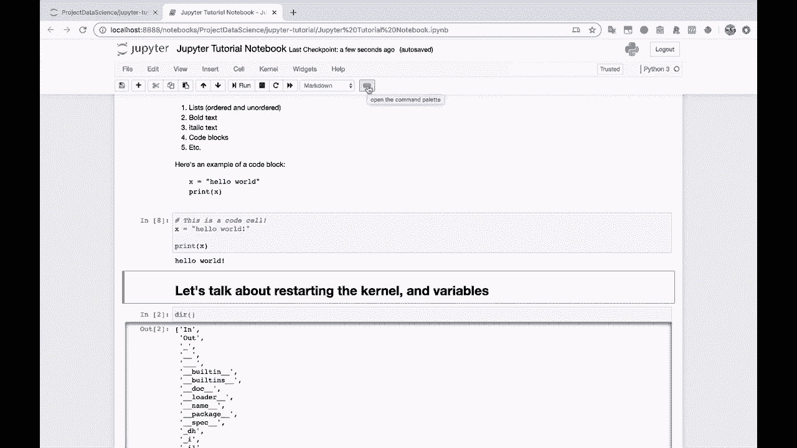
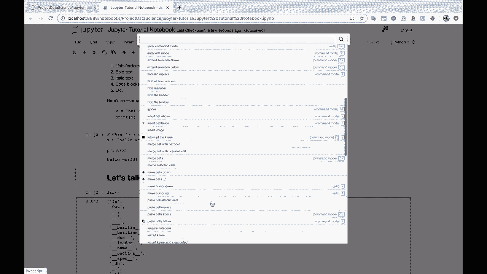

# Jupyter Notebook 超棒教程！P7：7）其他 Notebook 功能 

好的，让我们快速了解一下我们可以在 Jupyter Notebook 中做的一些其他事情。我会很快给你展示的事情之一是。折叠。折叠单元格。所以假设我说，你知道的，对于值在范围 100 内。让我们打印值。好吧。这会产生一个非常长的输出，对吧？突然间，我们的笔记本是。

如果我为 10 这样做，它会变得更加明显。哦。Jupyter Notebook 已经为我折叠了它。所以这实际上有点削弱了我想给你展示的内容。但是请注意，如果我们打印出从 0 到 999 的所有值。我们的 Jupyter Notebook 现在非常巨大。我们必须一直滚动到最下面。😊，所以。

Jupyter Notebook 有一个帮助这个的功能是你可以点击这里的侧边栏，点击这个。它会将这个单元格折叠。变成一个较小的滚动版本，它不占用整个笔记本。所以这非常有帮助。所以我可以继续对上面的这个 du 部分做同样的事情。把它变得小一点。这是非常方便的事情。让我们上去看看。

菜单栏。这些按钮在这里，所以。你有正常的保存按钮，保存和检查点。你有这个加号按钮，它是插入单元格在下面，所以我们可以在这里使用。 我喜欢使用 B。B。快捷键。所以你只需在你的计算机上，或者在你的键盘上按下字母 B。无论你在哪里。所以我想这里有两种不同的模式，我们应该快速讨论一下。

其中一个是文本输入模式，比如打印 hello world。当这里的颜色是绿色时，这告诉你你正在输入文本或代码。如果你单击单元格本身，那就把你放入这种主执行模式，在这里你可以使用键盘快捷键，比如字母 X 删除单元格，或字母 B 插入单元格在下面。B 是下面，A 是上面。好了，回到工具栏。

你可以剪切选定的单元格。你可以复制它们，可以粘贴它们。你可以上下移动单元格。所以如果我点击这个单元格，然后点击这个按钮。那就把它向上移动。这个把它向下移动。你可以运行一个单元格。你可以打断内核。打断内核。我的意思是，让我们练习打断内核。

所以，打断内核。假设我创建一个无限的 while 循环，我做一些愚蠢的事情，比如这样。这真的很愚蠢。而且，你知道的，打印 1。为了。让我们看看。只是为了不小心崩溃内核。我会说 time.dot.sleep 0.2，这样它就。好了，来了。这是永远不会停止的。这总是。

这个将一直运行到时间的尽头，或者至少在计算机存在的时间内。或者只要我的电池还在。那么我该怎么做，怎么停止这个呢？你可以在这里点击这个小停止按钮。中断内核或内核中断，然后我们来点击一下。好了。

让我们向下滚动看看发生了什么。你会发现，基本上，它做的是一个键盘中断。它说，嘿，你知道吗，Colel。不管你在做什么，我们想要停止你。我们想要打断你。你应该停止你正在做的事情。所以在这个例子中，我创建了一个无限循环。

这里有一个无限的循环。我们可以通过那个内核中断来停止它。好的。这次是重启内核，就像我们之前做的内核重启一样。然后这个。重启内核，然后重新运行整个笔记本。所以你会注意到在这里单元格下方，我们有运行单元、运行全部、运行以下所有内容。

这些都是执行你笔记本的不同选项。你知道，如果你想的话。你可以进来。然后从头到尾运行所有单元。如果你有一个想要完整运行的工作流。例如，如果你不在进行，嗯，例如，探索性数据分析。在分析中来回进行更多的操作。好的。

然后我们看到的这个下拉单元，它将单元从Markdown更改为代码。所以如果我将这个单元更改为代码，那么突然之间它就没什么意义了，因为这不是Python代码。我将把它改回Markdown。然后再执行一次，这样它就会格式化得很好。可以将这个单元从代码改为Markdown，你知道的。

它可以运行，但这不是我们想要的。我们希望它是一个代码单元。因为这里有Python代码。好吧，就这样。让我们看看这个最后的按钮。打开命令面板。

所以如果你点击这个，那么你就可以访问一堆不同的命令。太多了，无法一一阅读。
