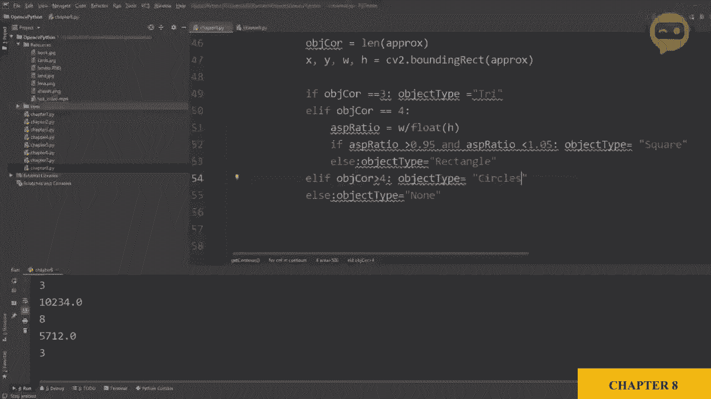
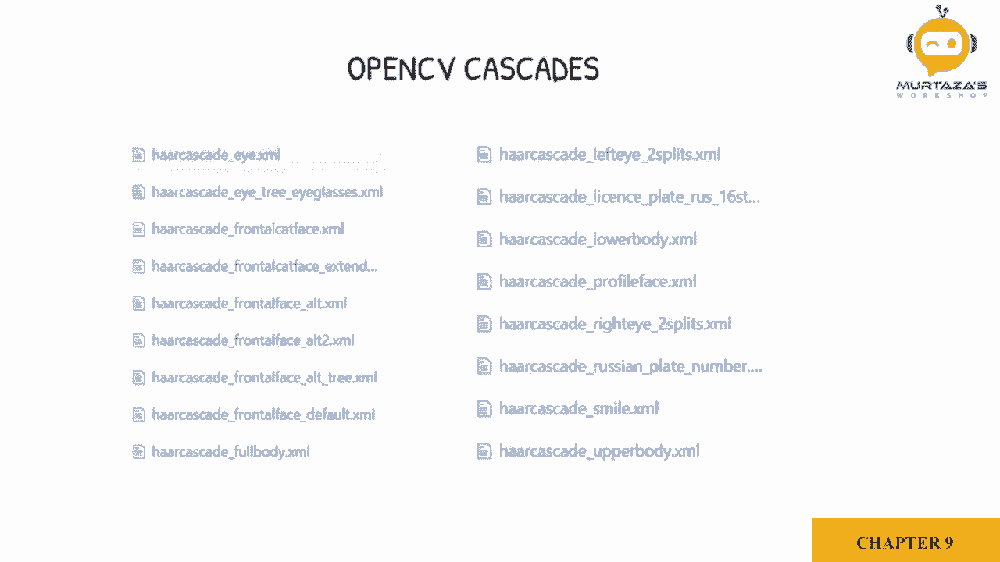

# OpenCV 基础教程，P12：第9章：人脸检测 

要检测阶段，我们将使用 Viola 和 Jones 提出的一个方法。这是最早允许实时物体检测的方法之一。因此，如果我们要检测人脸，我们可以收集大量的正样本，这些将是人脸的图像，同时我们也会收集大量的负样本。

这些将是任何非人脸的图像。使用这些负样本和正样本。我们将训练并创建一个级联文件，这将帮助我们找到人脸。在我们的案例中，我们不会训练模型，而是使用 OpenC 提供的预训练文件。现在 OpenC 提供了一些默认级联，可以检测不同的物体，如车牌、眼睛、全身等。如果你想了解更多关于创建自定义级联的信息。

我有一个单独的视频，这将在描述中提供。

我们从源文件夹中导入 Lina 图像，并使用 IM show 函数显示它。因此，我们要做的第一件事是添加我们的级联。因此，我们将写 face cascade，face.Gas.Kate。等于 C2.dot。Caascade classifier。然后我们必须写下名称。Celes。Soer says。好。Bres。Sources，slash。接下来我们将写 ha。Gass。Skate。Undersco frontal。Face。Underscore default dot X。

M，L。因此让我再检查一下拼写，如何。Ca。Gaiade。😔，而 frontal face default。X M L 看起来不错。接下来，我们将把图像转换为灰度图像，因此 image.Gray 等于 C2.dot CT color，接着是 image。然后我们使用 C2.dot color RGB2 gray。然后我们将使用人脸级联在此图像中找到人脸。

因此我们将说 faces 等于 face.Cascade，dot detect。我们将使用 multi scale，并写 image gray，然后我们必须定义缩放因子。我们将其设为 1.1，然后我们必须定义最小邻居，我们可以设为 4。这些参数可以根据你获得的结果进行更改。

接下来，我们将在人脸周围创建一个边界框。因此，我们必须遍历所有已检测到的人脸，并在它们周围放置矩形，我们将直接获取 x、y 以及宽度和高度的参数。

因此，这四个参数是你实际创建边界框所需的。因此我们将写 x、y 然后是宽度和高度。接着我们将说，在 faces 中。然后我们就画出矩形。让我们在原始图像上写它，然后给出初始点，即 x 和 y。

然后我们需要定义角点，斜点，即 x 加上宽度和 y 加上高度。接着我们需要定义颜色。我们就用蓝色，2，5，5 和 0，0。然后我们将定义厚度。我们设为 2。所以，差不多就是这样。让我们运行看看。好了，现在我们已经检测到人脸，并且为它创建了一个边界框。

如果你想检测更多对象，网上有很多人已经训练好的级联可用，或者你可以创建自己的自定义级联来检测汽车、手机、电视，任何你能想到的东西都可以使用这些级联方法进行检测。现在，这种级联方法并不是最准确的，但它很快，因此很多摄像头也使用这些硬级联方法来寻找人脸，尽管这是一种相对较旧的算法，但在某些情况下仍然有效且表现良好。

