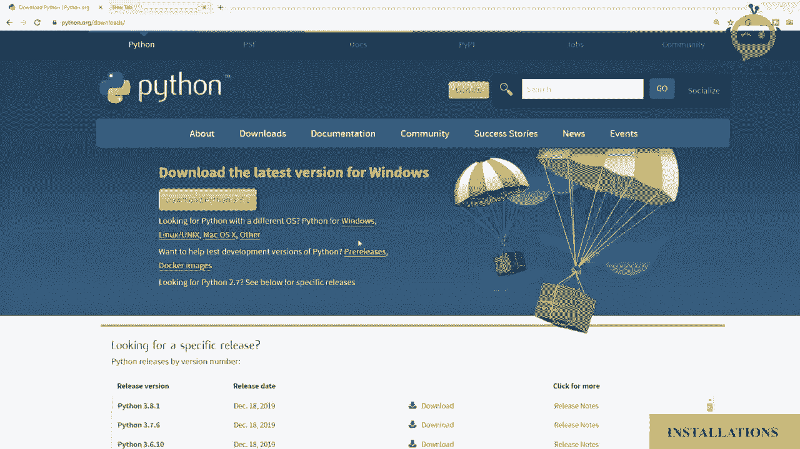
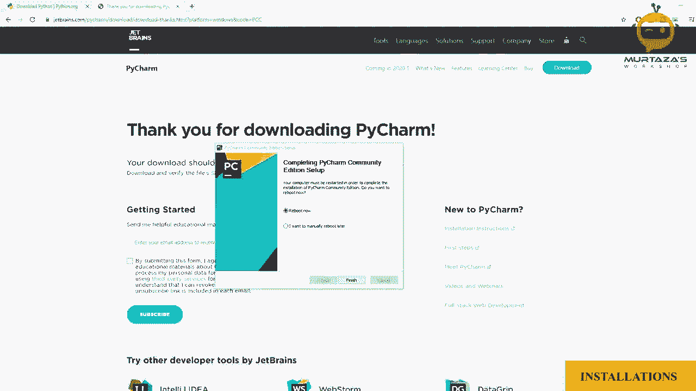
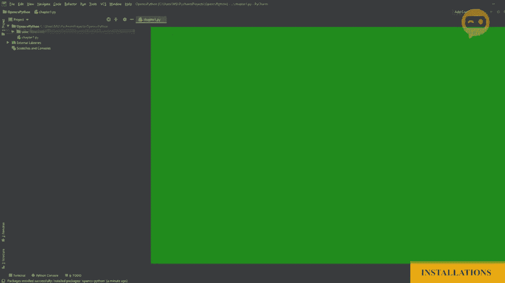
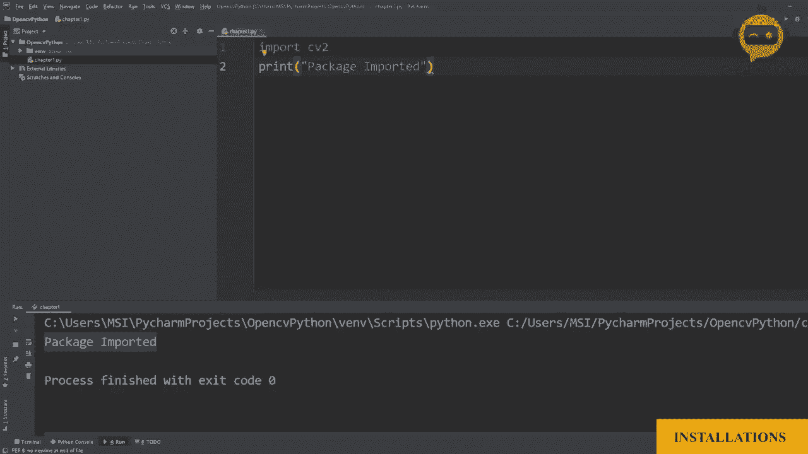

# OpenCV 基础教程，P3：第0章：安装 

现在让我们开始安装。首先，我们将去 Python 或 Rg，然后我们将前往下载部分。在这里我们不会下载最新版本，而是下载 3.7.6。

由于它与 Open C 配合得很好，所以我们将点击下载，然后前往。

针对 Windows 版本。如果你有 Mac，你也可以下载 Mac 版本。一旦下载完成，我们将安装。确保将 Python 3.7 添加到路径中。安装完成后，我们将关闭对话框，并前往 pie charm。现在 Pycharm 是我们将用来编辑代码的 IDE。

这是一个代码编辑器，可以让我们编写代码，但它具有很多功能，可以帮助我们在编码过程中。所以我们将前往它的下载部分，并下载社区版，因为它是免费的。一旦下载完成，我们将运行安装文件。

在这里我们将把 dot pie 文件关联到 pie charm，并且我们还将直接将启动器添加到路径中。接下来，我们将重启计算机并运行 pie chart。

现在我们要创建我们的新项目。在开始项目之前，我们先看看项目解释器。现在必须是3.7。如果自动检测到，那么我们就可以开始了。接下来，写下“打开 TV”，换一托。然后点击“创建”。现在这是 P Char 环境，在这里我们有一个区域可以编写代码，而左侧是项目文件和项目文件夹。

如果我们打开我们的文件夹，我们只会看到环境，即创建的虚拟环境。现在我们需要在这个环境中安装库或包，所以我们将前往“文件”。“设置”。“项目”，项目解释器，然后在这里我们将添加并搜索。现在，我们将写“打开 C”。在这里我们有 Open CV Python，所以我们将点击“安装包”。

一旦安装完成，我们将关闭这个，按 O。现在我们将创建我们的第一个 Python 文件，所以我们将右键点击我们的项目。我们将选择“新建”，并创建一个 Python 文件。在这里，我们将命名为“第一章”。现在如你所见，在我们的项目中，我们有一个 chapter 1 dot by 文件。

这里是我们可以编写代码的地方。

现在让我们导入我们的 Open CB 包。我们将写“导入”，然后是 CV2，CVv2 代表计算机视觉。接下来，我们将打印“包已导入”。现在，如果一切正常，这应该输出“包已导入”。所以我们将右键点击第一章，然后点击“运行”。现在在控制台中，我们可以看到包已导入的消息。

这意味着我们的包已经成功导入，现在我们可以继续进行。
