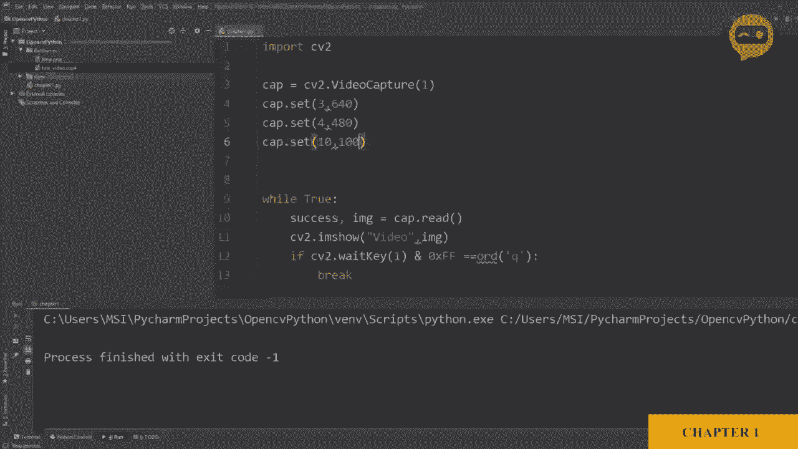
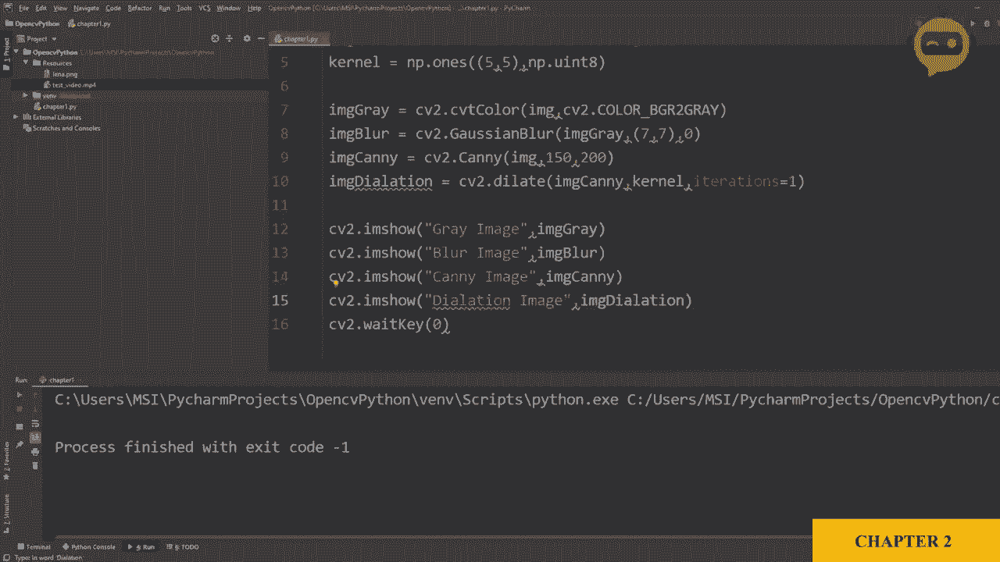
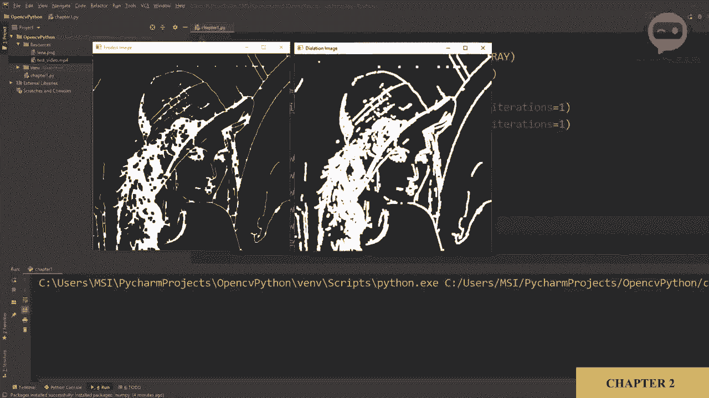

# OpenCV 基础教程，P5：第2章：基础函数 

因此，让我们看一些在构建 OpenCV 项目时需要的基本函数。我们将从导入图像开始。我们将使用 `imread` 函数。我们将把文件定义为资源文件夹中的 Lina。现在，我们做的第一件事是将其转换为灰度图像，因此为此。

我们将定义我们的灰度图像 `img_gray`。它等于2。现在我们将使用来自 CV2 包的功能或函数，称为 `cv2.cvtColor`。基本上，`cv2.cvtColor` 将你的图像转换为不同的颜色空间。因此，你需要定义你想要转换的图像。

然后你必须定义你想要转换成的颜色空间。因此，这里我们将其转换为灰度图像。现在，传统上，我们使用红色、绿色和蓝色，也就是 RGB。但在 OpenCV 的图像约定中，通道是 BGR。因此我们将写 `cv2.cvtColor`。灰度图像。让我们输出它，看看会发生什么。我们将使用 `cv2.imshow`。

在这里，我们将写入文件名或窗口名称。假设我们称之为灰度图像。我们将显示我们的灰度图像 `img_gray`。然后，我们需要添加 `cv2.waitKey`，并将其设置为 0。让我们运行这个，看看会发生什么。这里是我们的灰度图像。现在，让我们进入下一个函数，即模糊。我们将声明我们的模糊图像。现在。

我们将使用 Rossian 模糊函数来模糊我们的图像，所以我们将编写`cv2.blur`。我们可以使用我们的原始图像，即彩色图像，或者我们可以使用灰度图像来添加模糊，所以我们选择使用灰度图像。接下来，如果你看到这里，会看到它说的 k size，也就是你的内核大小。

所以你需要定义内核大小，例如，我们可以说这是 7 x 7。所以它将添加相当多的模糊，内核大小必须是奇数，所以可以是 3 x 3、5 x 5、7 x 7。所以我们将写下这个，然后我们将说我们的 `sigma_x` 是 0。所以不要担心太多的细节。我们只是触及表面，看看如何快速启动。

所以我们将复制这一部分。然后我们将在这里写上 `blur`。在这里，我们也将其更改为模糊。让我们运行这个。在这里我们可以看到这两幅图像之间的区别。这是灰度图像，而这是添加了模糊的图像。接下来，我们将看一个边缘检测器。现在，这个特定的边缘检测器称为 Canny 边缘检测器。

为了找到我们图像中的边缘，我们将使用 `cv2.Canny`。我们将其称为 `image_canny`，然后我们将使用我们的 Canny 函数。我们将分配图像。现在我们将添加阈值值。所以我们有两个阈值。为了简化，我们将其设置为 100 和 100。所以你可以选择更高或更低。但同样。

这取决于你特定的情况。所以，让我们复制这个。然后我们将去写Canny。在这里我们将写Canny。所以让我们运行这个。这样你就得到了Canny图像，模糊图像和灰度图像。所以在这里我们可以看到，我们得到了很多曲线和边缘。如果你想减少这个，我们将改变阈值的值。例如。

我们可以将这个设置为200，将这个设置为150。所以让我们再运行一次。在这里你可以看到差异。现在，边缘非常低。接下来，我们将深入研究膨胀。现在，有时我们在检测一个边缘，但由于存在间隙或未正确连接，它不会被检测为一条完整的线。所以我们可以增加边缘的厚度。

所以为了做到这一点，我们将使用图像膨胀。然后我们将写CBv2点diallate。现在这里我们将使用Canny图像，因为我们在谈论边缘。然后我们必须添加一个内核。现在，内核只是一个我们需要定义大小和数值的矩阵。所以在这种情况下，我们需要一个所有值都是1的矩阵。

但我们还需要定义矩阵的大小。正如我之前提到的，有一个库或包帮助我们处理矩阵，而这个库是Ny。但是我们还没有安装它，所以我们将去文件。我们将去Sis。在这里我们将进入我们的项目。😔然后我们将添加numpy。并且我们将点击安装。

安装完成后，我们将返回并导入Ny作为N。每当我们想调用一个函数时，可以写NP点，函数名。所以在这种情况下，我们要定义一个内核。假设我们的内核等于2。Numpy点1，这意味着我们希望所有值为1。我们将定义矩阵的大小。

这是5乘以5。然后我们只是定义对象的类型，即无符号8位整数。这意味着值可以从0到255。所以我们向下走，在这里我们将添加我们的内核。之后，我们需要定义内核移动的迭代次数，这意味着我们实际上需要多少厚度。所以迭代等于2，假设为1。真的吗？

所以我们将复制这个并写上图像膨胀。在这里，我们将写膨胀图像。Dlation。图像。

所以让我们运行这个，在这里你可以看到。😔这是原始的Canny图像，而这是膨胀后的图像。

所以如果我们增加迭代次数，假设我们做一些戏剧性的事情，把它设为五。那么我们将看到一个巨大的变化。

在厚度中。

所以，我们接下来要学习的函数是扩张的相反，叫做腐蚀。因此，我们要让它变得更薄。为了这个，我们将把我们的图像定义为腐蚀图像。等于C2点Ero函数。再次，我们需要定义我们想要腐蚀的图像。所以我们将取扩张图像进行腐蚀。

然后我们需要再次定义内核，所以我们将保持内核不变。再次，我们需要定义迭代次数。所以在这种情况下，我们将设置为，例如，一次。那我们就把这个设置回一。然后我们将添加我们的图像。用于腐蚀。因此，这里是我们的腐蚀图像，这里是我们的扩张图像，以及原始的cadney图像。

