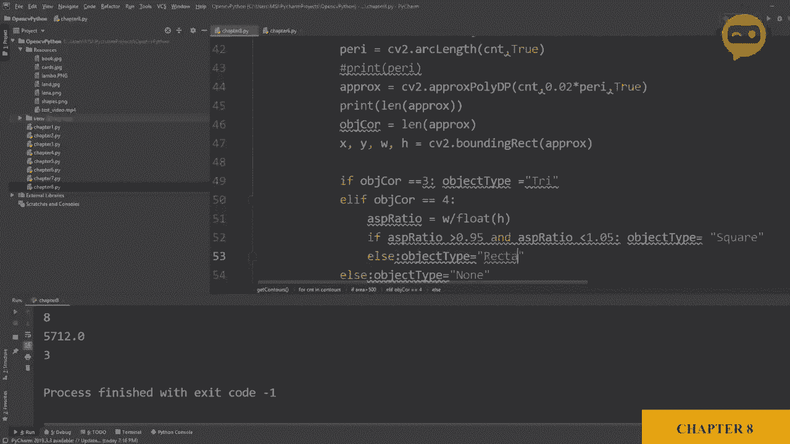

# OpenCV 基础教程，安装、原理、实战，3小时带你搞定这个热门计算机视觉工具库！＜实战教程系列＞ - P11：第8章：轮廓与形状检测 - ShowMeAI - BV1zL411377L

现在我们要在图像中检测形状，因此我们将检测它们的轮廓、角点，并根据这些决定该物体的形状。我们有我们的包，资源中有形状的图像，我们所做的只是使用IM show函数将其打印出来。

这是我们的图像，它包含三角形、圆形、正方形和矩形。我们将检测每一个，并将其分类，显示每个形状的角点数量以及面积。那么，让我们开始。首先我们将预处理我们的图像，将其转换为灰度图像，然后找到边缘以便找到角点。

让我们先将其转换为灰度图像。因此，我们将使用CVT color函数。在这里，我们将写我们想要更改的图像，并定义我们希望通道是什么颜色，因此我们将说BGR2 gray。然后我们会添加一点模糊。因此，我们将使用Wassian模糊函数。

所以我们得到了灰度图像。然后我们需要定义卷积核，假设它是7乘7，然后我们有了sigma，sigma值越高，模糊程度越大，所以我们先将其设为1，看看是否需要更多。接下来我们要检测边缘，实际上，在此之前。

让我们打印出来，看看一切是否正常。所以我们有图像灰度、图像灰度，然后是图像模糊。我们将在这里写灰度，并在这里写模糊。如果我们运行这个，我们应该得到三幅图像。是的，我们得到了灰度图像，并且增加了一些模糊效果。

实际上，此时使用我们的堆叠函数是个好主意，这样我们就不需要过多处理了。在第6章中，我们使用了这个函数。所以让我们复制它，然后回去粘贴到顶部。那么，让我们使用堆叠。所以我们将说我们的图像堆叠等于堆叠图像。我们将其缩放至0.6。

然后我们将定义我们的图像数组。现在，在里面，假设我们将放入我们的图像和图像灰度，然后是我们的图像模糊。我们可以去掉所有这些，然后可以直接说stock。然后，image stuck。所以如果我们在这上面，就这样，我们得到了图像，所有三幅图像堆叠在一起。

接下来我们要在图像中找到边缘，因此我们将使用Canny边缘检测器。我们将写image canny等于C2.dot scanningny。Canny，我们将定义图像，给它模糊图像，然后我们必须定义阈值，我们可以选择一些阈值，比如50和50，看看效果如何。

所以我们可以添加另一行。并且。我们可以添加。图像 Gny。图像，Gny。然后其余的。我们可以保持不变，或者我们可以定义一张黑色图像，所以我们可以定义我们的图像为空白图像，所以我们可以说图像。Mage blank 等于 nuy dot。Zeros，像。图像。然后，我们可以把这个。放在这里。让我们运行这个。就这样。所以现在我们有了我们的边缘。从这些边缘，我们将找到我们的轮廓。

所以，让我们回去。现在我们要创建一个函数。之前我们没有创建函数，但因为这段代码稍微多一点。所以现在我们要创建一个函数。所以让我们在这里向上定义一个名为 get contours 的函数。在这个函数中，我们将定义我们的图像。它将输入一张图像。从这里开始。

我们将找到我们的轮廓。所以我们要做的第一件事是写。轮廓。然后。我们将写层级。Hi are。让我们保持小一点。然后我们将使用我们的 C2 dot find contour 函数。查找轮廓。在这方面。我们必须定义我们的图像，即我们要查找轮廓的图像，第二个参数是我们的检索方法。

我们有不同类型的检索方法。我们要使用的是外部方法。所以检索。我们将写 R E。是什么，R，E T。E 是，没错。R，E，T，E，R 对，外部。这做的就是它。它检索极端的外轮廓。还有其他替代方法可以检测所有轮廓。它们不会被过滤掉。

但如果你想找到外部细节或外部角落，这个方法特别好。所以我们将使用这个。然后我们有了近似，你可以请求所有信息。或者你可以请求压缩值。因此，它将为这个例子减少点数。我们将获取所有找到的轮廓。所以我们会说。C，V2 dot chain。

近似为 none。所以一旦我们有了轮廓，它们将保存在轮廓中。我们将说我们想要循环遍历它，所以对于。C 和 T 在轮廓中。干。Tos。所以对于每个轮廓，我们将。首先找到区域。所以我们会说区域。等于 CB2 dots。Contour。Area，我们只需提到我们要查找区域的轮廓。现在。

我们要做的第二件事是绘制这个轮廓。那么好吧，等一下，在此之前。让我们先打印出来，以便你能看到。我们得到了什么样的区域。所以如果我们运行这个。哦，实际上，我们必须调用这个函数。天哪。所以我们需要下去，在这里我们会说。获取轮廓，我们将发送图像 canny。就这样。

所以这些是我们为每个你所说的形状找到的区域。接下来，我们将绘制它们，以便清楚地看到。我们将使用 drop contours 函数。所以 C V2 dot draw。Contours。我们将给它我们想要绘制的图像。所以我们将创建。

我不想把它放在原始图像上。所以我们可以做的是创建一个原始图像的副本。因此我们可以在这里说。图像轮廓。等于。图像.复制。因此我们将复制图像，以便我们可以。在此图像上绘制图形，即图像轮廓。因此我们将定义它在哪里。所以我们将说图像轮廓。我们想把它放在那。

然后我们必须给它轮廓本身。所以这将是C和T。然后我们有轮廓索引。因此这里我们将说负一，因为我们想要绘制所有的轮廓。接着我们必须写2，5，5。然后我们假设，我们将要制作它。那是什么颜色？是蓝色。好的，然后我们将其设置为厚度为3。

因此，每次循环时，它将绘制在CNT中找到的完整轮廓。这就是这个语句所做的。所以让我们运行它。

哦，我们没有在这里放图像轮廓。所以图像。

轮廓。

这就是结果。因此现在我们有了所有的形状，并且我们检测到了所有的轮廓。你可以看到它们周围有一条蓝线，似乎检测得相当好。

所以下一步，我们要做什么。因此接下来，我们将检查最小面积。因此我们将给它一个阈值，通常，如果这只是一个图像，你不需要。但是给一个最小阈值以确保它不检测到任何噪音是个好主意。因此我们可以说，如果我们的。面积大于，例如，500，500像素。

然后我们将进行计算，数学运算，如果你想完全忽略它。那么我们就把它放在这里，而不是上面。

如果我们写下这个，我们可以看到所有的形状的面积都大于500。所以我们不应该有任何的。

问题，因此我们接下来要做的是计算曲线长度。因此曲线长度将帮助我们近似边缘的角落，形状的角落。因此我们将把它写下来。所以我们将写这里。周长等于C，V2.阿兰。我们想找到我们轮廓的阿克兰。我们将说它是封闭的。

所以我们将其设置为真。因此，我们可以。如果你想看到它打印出来，我们可以打印出来。巴里和。因此。现在我们正在获取每个轮廓的长度，弧。阿克兰或控制参数。你称之为什么？或者控制参数。因此接下来，我们将近似。角点，我们有多少个角点。因此我们将写一个pro等于。C，V 2点。

近似多边形。我们将给我们的轮廓，然后我们将给它一个分辨率。所以你可以在这里进行调整。如果你没有得到好的结果，我们将用我们的长度乘以它。这里你可以稍微调整一下，如果你没有得到好的结果。然后你可以再写一次，因为它是封闭的。

我们希望所有的形状都是封闭的。那么接下来，我们将打印出我们的块的值。现在，这将给我们每个角点的坐标。所以对于它们中的每一个，每个形状都是如此。所以如果我们在这里看到，对于它们中的每一个，我们都有一定数量的点。所以这里，例如。

我们有三个点。这里我们有超过三个，也许是七个或八个。然后我们有1，2，3，3。然后继续。那么我们可以做的是，不打印这些。我们可以打印每个形状的长度。这样就能让我们了解形状是什么。所以在这里你可以看到我们有383，所以我们可以说3是三角形。

4要么是一个正方形，要么是一个矩形，我们稍后也会找到答案。然后我们可以说，任何大于四的形状都是一个圆形。所以因为我们只检测三到四个类别，所以我们可以假设。那么接下来，我们将创建我们的对象角点。对象角点等于我们近似值的长度。

现在我们将为我们的检测对象创建一个边界框。所以现在我们将获得边界框的值。如果我们要在我们的对象周围绘制一个边界框，那么X和Y，以及宽度和高度将是什么？那么让我们获取那个X、Y、宽度和高度。

所以我们将从C2点获取这个。边界框，边界矩形，然后一个rockx。好的，我们在这里放一些空格。然后这里也是。好的，这将给我们每个对象或形状的X、Y坐标和宽度、高度。让我们立即绘制它们，以便我们能清楚地了解我们在做什么，C2点矩形。我们想绘制它。那么你想在哪里绘制它？让我们在图像轮廓上绘制。

然后我们将给它第一个点，这将是你的X和Y。它将是X和Y，而你的第二个点将是X加上宽度和Y加上高度。所以它将是X加上宽度和Y加上高度。接下来我们将给它一个颜色。让我们给它一个不同的颜色，这样我们就能辨别它是一个边界矩形。

然后我们将给它一个厚度。这样就可以了。那么让我们重新运行它。

就这样，现在我们可以看到我们在检测的每个形状周围都有边界框。通过这些边界框，我们可以获取信息，例如对象的总宽度和高度，以及对象的中心点在哪里，这些信息在其他项目中可能会很有用。

但现在我们要做的是对这些对象进行分类。

关于它们是圆形、三角形、矩形还是方形。首先，我们从最小的开始，那就是我们的三角形。所以我们可以说如果。我们的对象。角数是3。然后我们希望我们的对象类型。对象类型。这个变量将是。三角形。这只是一个字符串。

我们可以做的是把这个字符串打印出来。在我们的图像中，所以我们可以说CB2.dot put text。我们将定义我们的图像轮廓，然后我们将写下我们想要打印的内容。那就是我们的对象。我写成什么了，哦，这个要大写。让我们改成小写。对象类型。然后我们要写下我们希望在哪里打印它。

所以让我们在对象的中心稍微偏移一下打印它。那么对象的中心是什么呢？这会占用一些空间。所以我会把它放在这里。那么对象的中心将是x加上。等等。除以2。然后我们稍微偏移一下，所以我们会减少10个像素。接着我们会写出y的中心，也就是y加上。高度。

除以2。这个我们保持不变。还是应该我们加一些你说的。偏差在这里。所以让我们设为-10。这样会比中心点稍微高一点。那么接下来是什么呢？是的，接下来是字体。所以我们会写C V2.dot font。我们不想要什么花哨的东西。所以我们会写。我们将使用第一个。

然后我们会写出我们的缩放。缩放，我们设为0。5。然后我们有我们的颜色。所以我们设定颜色为0，2，5，5，以及2，5，5。然后字体缩放，我们设为2。好的。那么我在哪里出错了，Ca它没有正确显示。是的，逗号。好的。那么这应该让我们在每个地方都有三角形。之前的对象类型引用。

对象类型。好的，所以我们没有定义如果不是3会发生什么。所以现在，我们可以说else。对象类型等于。等于none。

所以你看。哦，那是黄色的。

这有点难以阅读。所以我们将换成不同的颜色。让我们用黑色。我认为黑色会更容易阅读。我们还可以稍微增大一点尺寸。这样更容易看清。而且我们还可以增加尺寸，因为我们还有一些空间。所以，让我们运行这个。看吧。现在我们可以看到所有的三角形。

它们被正确检测，其余的没有。因此接下来。我们将定义其余的。这将在这里。如果我们的对象或者应该是否则如果。我们的对象。角数等于4。现在这个有点棘手，我们要检查我们得到的是正方形还是矩形。我们怎么能判断呢？我们知道，如果我们将宽度和高度相除，应该得到1，因为正方形的宽度和高度是相同的。我们可以查看，如果我们将它们相除，将得到宽高比，如果该宽高比在某个范围内，我们可以说它是正方形；如果不在，我们将说它是矩形。

所以我们要做的第一件事是获取宽高比。所以我们将写宽高比等于宽度除以高度。由于我们处理的是小数，我们必须将其中一个定义为浮点数。这样可以给我们。浮点值。因此，一旦我们有了，我们将放置另一个if语句，如果我们的宽高比。大于0.95。并且。

我们的宽高比。小于1.0，5，这意味着我们可以有5%的偏差。然后我们将说我们的对象类型。等于2。正方形。如果不是这样。则我们的对象类型等于2。矩形。

那么我们来运行一下。就这样。这里我们得到了一个正方形矩形，正方形，正方形。矩形正方形。接下来，我们将为圆形编写代码，所以我们会写。

否则，如果。对象的角数。大于4。那么我们将写对象类型等于2。圆形。所以，让我们运行一下。

就这样。现在我们有了圆形、矩形和平方三角形。它们都被正确检测，除了这个。解决这个问题会稍微复杂一些，但我们可以稍后再尝试。
