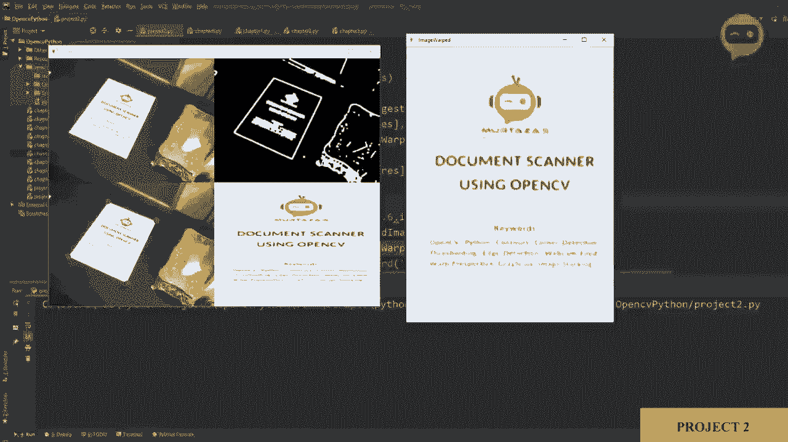
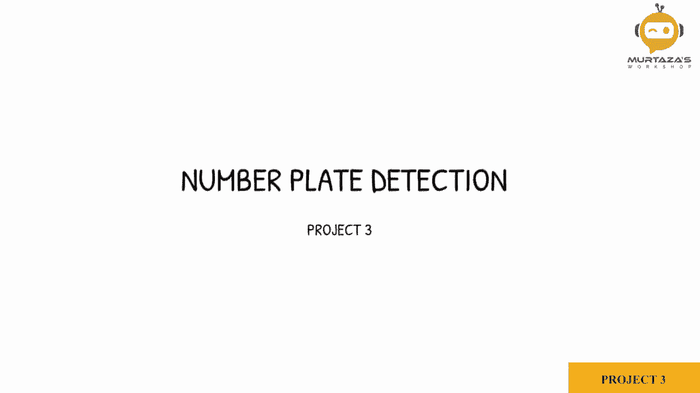
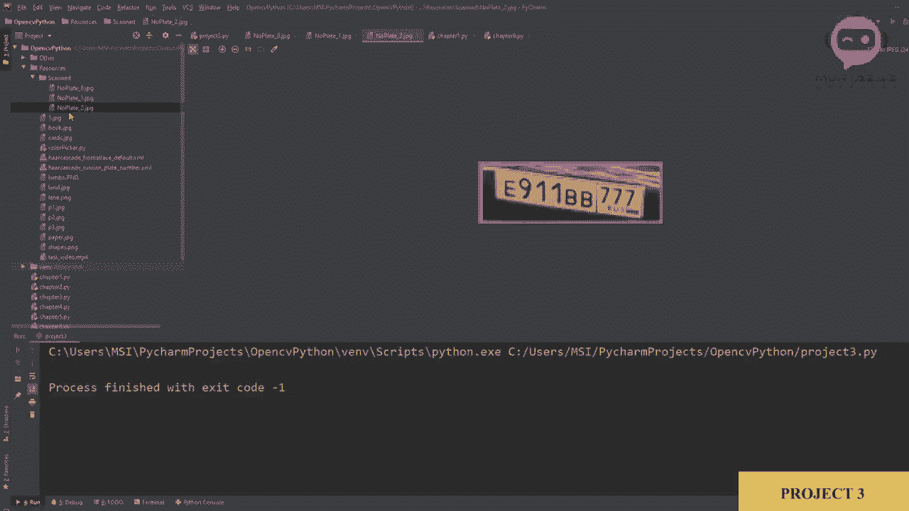

# OpenCV 基础教程，安装、原理、实战，3小时带你搞定这个热门计算机视觉工具库！＜实战教程系列＞ - P15：项目3：车牌检测 

在这个项目中，我们将从我们的网络摄像头开始，然后我们将检测不同汽车的车牌，我们将实时进行此操作，并且我们将使用之前在Fse检测章节中学到的级联方法。让我们从第一个章节开始。

使用网络摄像头，我们将复制那段代码。再一次，我们将其改为1。让我们运行它，看看是否正常工作。这里我有我的网络摄像头，它已连接，我们可以看到我们有几张汽车的图片，我们要检测它们的车牌。

一旦我们完成了这一点，我们将进入第9章，在那里我们做了我们的级联方法。我们将复制这个。啊。我们将在项目3中粘贴它。所以在这里获取级联，我们不需要一遍又一遍地定义它，尽管我们必须获取图像。我们从网络摄像头获取的图像，我们可以去掉这个，我们必须把它提上去。

在我们的参数中。所以在这里我们可以定义我们的参数。然后。我们将图像转换为灰度，这是可以的。然后我们检测。面孔。在这种情况下，我们可以说车牌。我们可以复制这个并粘贴到这里。所以我们应该说。车牌级联，例如。或者车牌。Goashk。

所以在这里我们可以说。然后再做一次。好的，它正在围绕它绘制矩形。现在，一旦我们检测到我们的对象，我们需要首先创建一个过滤器。所以我们只接受大于某个区域的对象。然后我们需要定义一种方式，在获取到车牌后可以保存我们的图像。

所以我们来做这个。首先，我们将添加我们的过滤器。为了做到这一点，我们需要找到我们的区域。区域等于宽度乘以高度。然后我们需要定义我们的最小区域，所以我们可以说如果我们的区域大于，例如，500。这是我们的最小区域，因此我们将说最小区域。我们将在这里定义它。

最小区域等于500。如果大于500，那么我们将其检测为矩形。接下来我们要做的是标记它。所以我们将说C2。点放文本。我们想把它放在我们的原始图像上。然后我们将放一个名字，所以我们可以说。号码，车牌。然后我们有我们的x和y。

所以我们可以写x和y，我们想把它放得稍微高一点，所以我们将减少，比如说5。然后我们将写上字体。所以，C2点。字体，我们可以选择任何，来。选择复杂小号。然后我们将设定1作为我们的缩放比例，接着我们将放一个颜色。我们可以定义颜色。然后我们将厚度设定为2。颜色我们可以向上去。并在这里定义为2，5，5，0，以及。

2，5，5。是的，然后我们可以提取我们的感兴趣区域，我们的车牌。因此，一旦我们有了矩形的x、y、宽度和高度，我们可以使用这些信息来获取我们的原始车牌图像。所以我们可以说我们的图像。我们的感兴趣区域图像是图像，我们的原始图像裁剪。

正如你所知，我们正在使用裁剪。所以第一个元素将是我们的高度。因此我们在说y。て。Y加上H。总高度。然后我们将说我们的宽度。告诉我们的，抱歉，不是宽度x。告诉我们的x加上宽度。所以这应该给我们车牌的区域。因此每当检测到对象时，我们需要在这里放置这个，每当检测到车牌时。

只有这样我们才会显示我们的图像。最后一件事是改变我们的级联。这是正面人脸。在资源中，我们有俄罗斯车牌号。所以我们将使用它。因此，我们将其更改为。俄罗斯。下划线车牌，下划线。数字。所以。让我们运行这个。好了，我们在原始图像上得到了我们的车牌。

然后我们提取我们的ROI，正如你在这里看到的。它有点小，更难抓取。但你可以看到，我们正确地得到了我们的图像。但是这里的颜色是蓝色，为什么是蓝色？是的，我们需要将其改为255，没问题。所以这是我们得到的，接下来我们可以做的是将这个图像保存在我们的扫描文件夹中。

所以在资源中，我创建了一个扫描文件夹。我们要做的是编写一段代码来保存这个车牌，并且还会给我们反馈，告诉我们已保存。因此，为此，我们将写C2。首先，让我们将其从Q改为S。每当按下S键时，我们将写Cv2，Cv2点权重。CV2。我是对的。

我们将写入文件名，所以我们会说资源，然后是扫描。在里面，我们将写入数字。车牌下划线。然后我们将为其添加一个字符串。在这个字符串中，我们将放入账户。这样我们可以同时保存多个不同名称的图像。因此我们可以说点JPG。然后我们会说这是我们的Ri图像。现在，这个计数是未定义的。

因此，我们需要定义计数。每次按下这个，我们需要将其添加到我们的计数器。所以我们不会中断。我们将说计数。加等于1。而且。我们需要在开始时定义计数。计数等于0。这样就能保存它。但我们需要一些反馈，告诉我们实际上保存得很好。

我们可以做的是创建一个矩形，然后我们可以在上面显示文本，以便我们知道它已经被保存。因此，我们可以写cv2点矩形，然后写入我们的图像。在这里我们将其放在0200，然后最后一点是640乘以，让我们说300。然后我们将放置颜色0，2，5，5，0。然后Cv2点填充。

然后我们将放一些文本，CV2。想法，放文本。我们将放上我们的图像，并且我们将说扫描。我们说扫描，已保存。然后我们将设置初始值，所以我们设置为 150 和 265。接着我们将选择字体 C2 dot font。我们来选一个随机的。然后。让我们把。

让我们将字体缩放设置为二。然后我们将放置我们的颜色。0。0 和 2，5，5。然后我们将把厚度设置为 2。最后，我们将显示我们的图像。所以我将展示。然后我们将写上同样的名称结果。我们将展示同样的图像。为了能正确看到它，我们将添加一个延迟 c2。

t 权重关键，我们将设置为 500 毫秒。所以如果我现在运行这个。😔，好了。如果我按下 S，它会说扫描已保存。然后如果我去下一个图像，我可以。再保存一次。我可以去下一个图像，也可以保存，所以这三个车牌都应该已经保存，如果我们去我们的扫描文件夹，这里。我们可以双击它，看到我们有三张图像，这是第一张。

这是第二张，这是第三张。

