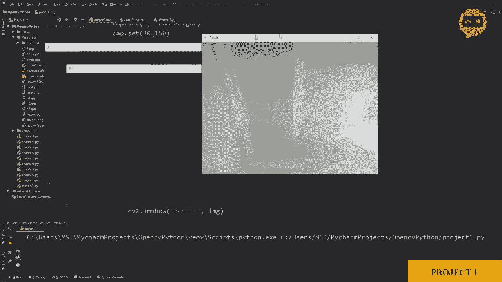

# OpenCV基础教程，P13：项目1：VR绘画 

对于这个项目，我们需要找到我们的颜色，并需要使用网络摄像头找到它，然后我们可以在找到颜色的地方放置不同的点，以创建绘画示例。所以我们首先需要网络摄像头，所以我们将从不同的项目中提取代码，然后将它们合并，以便我们可以看到如何有效地创建不同的项目，所以我们要回到第一章。

这里是我们的网络摄像头代码，所以我们将复制这个。然后我们会把它粘贴到我们的项目中。正如我们所见，我们正在导入我们的库，设置帧的宽度和高度，这些是ID号三和ID号四，然后我们还在设置亮度，设为150，然后我们的设备现在不是零，而应该是1。

然后我们进入宽循环，在这里我们获取图像，然后使用IM显示函数展示它，这差不多就是这样。所以如果我现在运行这个，它应该会显示网络摄像头。就这样。这里是我们的网络摄像头。

让我们看看是否能看到，是的，清晰可见。所以一旦我们有了这个，接下来的步骤是找到我们的颜色，为了找到我们的颜色，我们需要引入颜色检测的代码，这在第7章或第6章。不是第7章。所以这里是代码，我们不需要堆叠。

我们试图简化它。所以我们不需要那个。我们将要做的是复制我们边缘检测的主要代码。这基本上就是上限、下限和掩模。所以这是我们所需的主要内容。我们还需要将其转换为HSV空间。所以将普通图像转换为HSV。

所以让我们先复制这个，我们将在这里复制它。然后我们将定义一个函数来查找我们的颜色。所以我们会说，查找颜色。然后我们将输入一张图像。至少现在我们会把它保持为一张图像，然后我们会将这张图像转换为HSV空间。

然后我们将使用我们的上限和下限。2。所以，让我去掉那个。在这里我们有上限和下限，然后我们能做什么呢。我们可以看看它是否正常工作，所以cv2。我展示。我们可以放，比如，图像，我们需要展示我们的掩模。这只是为了测试，我们稍后会去掉它。

所以我们不想只找一种颜色。我们想找到不同的颜色。因此每当我们调用函数找到颜色时，我们想找到所有不同类型的颜色以及存在的内容。我们希望将其视为输出。所以我们可以做的是。在这里顶部。我们可以定义一些作为我们颜色的最小和最大色调的列表。

我所说的是什么意思？让我写下来。我们将说我的颜色。等于一个列表。现在。这是一个列表。让我。常见的盘，烦人。所以我的颜色基本上是我们想要检测的颜色列表。因此我们需要给出最小和最大色调和饱和度值，为此我写了一段名为颜色选择器的代码，基本上它帮助我们使用网络摄像头选择正确的色调和饱和度值，所以这几乎是相同的代码，但增加了我们在颜色章节中使用的网络摄像头。

在这里我们有我们的网络摄像头，颜色是橙色，所以让我找出它的值。你需要做的是把橙色保持为白色。

其余的你需要删除。所以在这里你可以看到。你需要一直向下。是的。我会说这是一个好点，所以如果我把它移动一下，也还不错。但我的手的颜色也被检测到了，所以我们需要把它去掉。😔，把它稍微往下调一点。这样就好多了。所以我们需要记下这些值。

所以是5，107，019，255，所以我们将创建一个列表。

在这里，在那个列表里，我们要把这些值写下来，所以让我把它写下来。我们有五个。我们有五个。5，10，7，0，19，2，55，然后255。这些是我们的值。你可以在这里看到。因此我们将创建一个这些值的列表，包含不同类型的颜色。在哪里。哦，发生了什么？我们将写下我们想要检测的所有不同颜色类型。

所以我已经为蓝色、非蓝色、紫色和绿色做了这些，我们就复制一下这些值。这是其中一个值。然后我们还有另一个值。在这里。这些是我们的值。所以第一个是橙色，然后是紫色，接着是绿色。这些是你可以从颜色选择器中找到的值。一旦我们完成这些。

现在我们可以简单地。创建我们的掩膜。所以在这里。我们可以看到。没问题，我们需要添加nupi。所以。导入数字。需要N。我们需要做的第二件事是。写下我们的值。所以我们知道这里的部分基本上是前面三个值。然后这一部分是其他三个值，抱歉，是这里的其他三个值。

所以我们能做的就是简单地写下。那。我们的。你把我的颜色列表叫什么。基本上。我的颜色。然后我们可以定义，比如说我们选择第一个元素，也就是零。然后我们写下从0开始。从0到3，我们需要这些作为第一个元素。所以。我们可以在这里定义需要我的颜色作为输入。然后我们可以在这里做同样的事情。

这将是上限，从三到六。所以这应该给我们其中一个，也就是第一个，我认为是橙色，所以让我们运行它。这是我们需要运行的之前的代码。项目1。所以让我们运行它。现在我们也需要调用这个函数。所以在这里之后，我们要调用我们的函数。嗯。

我的颜色。所以让我们转动一下。

看吧，我们得到了掩模，如果我放入我的橙色。颜色。你可以看到它被正确检测到了。但问题是我们仅仅检测到了橙色。我们需要检测到这个列表中的所有颜色。为此。我们需要添加一个for循环，这样我们可以保存。

假设颜色。我的颜色中的颜色，对于这些颜色，我们将创建一个掩模。所以我们不需要写下这个，我们可以用颜色来替换它。颜色，然后再次。颜色。因此，如果我们想显示出来。我们不能有一个通用的名字。我们需要给一个变化的名字。让我们使用。所以第一个元素对它们每一个都是不同的。

所以我们可以把它作为一个名字，所以我们可以说字符串，然后颜色。第一个元素。这应该给我们三个不同的窗口。所以如果我们运行它。

看吧，所以我们得到了三个不同的窗口。暂时忘记命名，我们只是测试一下，如果我放入橙色，我可以看到橙色。如果我放入紫色，我可以看到紫色，然后如果我放入绿色，我可以看到第三个绿色的。如果我想添加更多颜色，我可以简单地将它添加到列表中，这样就能给我。

更多颜色，比如说，如果我现在移除这个。让我移除它，这样只会给我两个掩模。所以它将不再显示绿色。

通过这种方式，我们创建了某种通用的东西，可以用于多种颜色，所以你可以不断添加。现在对于我们检测到的每个掩模，让我注释掉这个。对于我们检测到的每个掩模，我们需要找出在图像中找到的这个对象的位置。现在要找到这个，我们需要获得轮廓，并需要近似包围框，以便找到对象的位置。

为此，我们需要进入我们前几章的代码中，我们学习了如何找到轮廓，如果我们回去。这是找到轮廓的代码。因此，我们要做的是直接获取这个函数。我们不需要区分不同的形状，所以我们会一直获取到我们的边界框。我们将复制这个。在项目中，我们将粘贴它。这里。

这是我们的获取轮廓函数，现在我们需要稍微更改一下，以便获得我们所需的相关信息。因此，改变的东西不多。让我们去掉任何东西。图像轮廓。好吧。我们可以创建一个新图像。我们可以说，假设图像。结果等于图像拷贝。因此，这将是包含所有最终信息的图像。

所以所有的绘图和所有内容都将在这个图像上，因此我们可以复制图像结果并在这里替换。所以它将在这个图像上绘制轮廓。然后。我们不需要的，好的。我们可以去掉参数，不需要长度或对象。就这些。所以我们现在可以做的就是看看我们是否在正确的轨道上。

我们只需要看看它是否正确打印。因此从寻找颜色中，我们将发送我们遮罩的图像来找到轮廓，所以我们会发送这个。我们会说获取轮廓，然后发送遮罩。因为我们在调用这个函数，它应该在这个图像上绘制，让我们看看是否有效。那么发生了什么，好吧，我的意思是，是的。

我们移除了那个，因此不应该显示任何遮罩，让我们试试看。橙色，绿色。紫色，所以它们都没有很好地工作。让我们找出原因。当我们发送遮罩时。哦，好吧，因为我们没有在这里放图像结果。所以我们需要显示图像结果，因为那才是有元素的地方。让我们运行一下，看看，橙色，绿色和紫色，完美。

现在我们知道我们得到了那些，并且周围有边界框。我们需要做的就是发送这些值。现在我们可以发送中心点。但是我们想从笔尖开始绘制，而不是从检测到的物体的中心开始。因此我们会发送笔尖而不是中心。我们要做的是返回。

所以这里我们将返回。我们将返回x的值，加上我们的宽度，除以二。因此它在中心。然后我们将按原样发送y的值。所以这将给我们笔尖的顶部点以及它的中心。如果没有，如果不大于500或者没有检测到，我们仍然需要返回一些东西。

所以我们需要将这些声明为零，我们可以说x，y，w和高度。以防我们稍后需要它，我们可以将它们全部设为零。因此，我们可以获得这些。这将返回这个值，所以我们需要在这里获取这个值，以便我们可以使用它，所以我们将其放在这里作为x和y。获得该值后，我们可以在周围绘制一个圆圈，所以我们可以说Cv2.dot.circle。

我们需要在图像结果上绘制它。我们的中心点将是x和y。然后我们将定义半径，假设为10，然后我们需要定义颜色，暂时设为25，5，0和0。然后我们将写C2.dot.filled，因为我们希望它填充。因此，如果我们现在运行看看会发生什么。如果我去这里，是的。

我现在得到了蓝色点，我可以看到。我得到了正确的点。现在再次，这是边界框的中心，所以如果我围绕边界框旋转，它将是边界框的中心，而不是轮廓的中心。解决这个问题有点棘手，所以我们不打算深入细节，但现在如果我们保持笔直应该没问题。

我们需要更改的一件事是颜色，所以它不应该是蓝色。它应该是我们正在检测的颜色。因此，我们可以移除轮廓。我们不再需要轮廓，我们知道我们正在正确地检测，但我们需要更改这些对象的颜色，因此我们需要定义我们的颜色值，例如。

如果检测到这个，我的绘图颜色应该是什么？我们可以说这就是我的颜色值。再一次，我们需要将其创建为一个列表，并在该列表中定义所有我们想要显示的颜色。我们有三个，因此我们将定义三个。接下来，我们将在这里写下我们的值。

那么你如何找到这些值呢？在这里我们可以看到一个示例网站，你可以找到RGB值。如果我选择橙色，现在橙色，如果我点击它，你可以看到它是2，55，153和51。这就是我的橙色值。那么我可以在我的代码中使用这些值。

但是再次提醒，你必须确保以BGR的格式书写。所以让我在这里写下来，它是BGR，而不是RGB。因此我们这里将有51，然后153，然后255。同样，我们可以找到紫色和绿色，对于紫色，它是255，0和255，对于绿色，我们都知道它是BGR，所以它应该是0，255和0。

这些是我们的颜色，现在我们可以根据这些值绘制圆圈的颜色。发生了什么？我们可以说，我们需要我的颜色值作为输入。如果我们继续，当我们发送这些值时，我们也需要我的颜色值，所以我们可以说。我们可以说，好吧，我们需要一个计数器来实际计算次数，所以我们将计数设为0。

每次计数时，我们需要知道我们在谈论哪个颜色。所以我们可以在这里说`count`加1。因此，在我们主要的蓝色这里。我们可以说`my color values`。我需要获取我计数器索引的值。因此，我的计数现在。不管我的计数是什么，我需要从这个我们所称的列表中获取那个值。

所以如果计数等于0，它将得到这个值。计数是1，它将得到这个值。所以我可以在这里写。呃。计数。所以这应该给我们我们所称的标记的正确颜色。让我们运行一下。如果我有紫色，它给我紫色，如果我有橙色，它给我橙色，稍微有点难以看到。

但是你得到了手势，然后你有绿色，所以我们得到了绿色。这很好，我们得到了正确的颜色和正确的值。现在我们需要做的是绘制这些点。因此，绘制实际上很简单，我们将创建一个点的列表，每次都显示它，我们将循环它。

所以在底部，我们先去顶部，我们将创建一个名为`My pointss`的列表。在这个列表中，我们将有三样东西，我们将有x的值。我们将有y的值，我们将有颜色的值，或者不是颜色本身。让我们放置颜色的索引。所以我们可以说，如果它是零，它将是这种颜色，如果是1。

它将是这种颜色，依此类推。因此，我们可以放置这个而不是实际的东西。让我复制一下。让我把它放在这里作为注释。所以。所以我们可以说我们可以循环这个`my point`，每次检查x和y的值，并在这个点绘制这个颜色的圆圈。

所以这很简单。为了做到这一点，我们可以创建一个新的函数。称为`drawaw`在画布上。所以，我们可以把它命名为`Draw`。在画布上。接下来，我们需要什么呢？我，是的。我们需要那些点。我们还需要颜色值。带颜色的值。因此，我们将说对每一个点。在我的点中。

我们需要做的是迭代，我们只需要绘制一个圆圈。让我从上面复制。这里。你复制它。这个圆圈。我们可以把它放在这里，我们需要做的是在我们的图像结果上绘制。因此，这一次，值是在点内。

所以我们会说`point`的第0位是我们的x，`point`的第1位是我们的y，`point`的第2位是我们的ID。所以这将给我们这个颜色的点。现在，我们需要做的是每当我们找到颜色时。我们需要发送给绘制。好的。因此，我们可以说我们的新点。

点等于我们从颜色中得到的任何值。然后我们需要绘制它们。因此为了绘制它们，或者我们应该先这样做，让我们回到上面，并在这里返回一些东西。因此一旦我们找到颜色，我们需要返回我们的新点。但是我们需要确保这些点没有被正确检测，这些不是00，如果是00。

如果x和y，如果我们返回的值是00，那么我们不需要做任何事情。我们不需要绘制它。它将仅仅添加到内存中。所以我们可以说在计数之前。我们可以看到如果x不等于0。并且如果y不等于0。那么只有在这种情况下我们才会附加我们的点。所以我们将说新点。点附加。

我们将说我们要写下X、Y和计数，因为那是我们的ID，我们需要每次定义新点。因此每次新点都会变化，所以它将从一个空列表开始，然后附加并返回这些值。所以在这里我们需要写返回。不在循环中，我们需要在这里写返回。

然后我们将返回我们的点。因此每次它都会添加到这些点上。它将把这些新点发送到这里。现在一旦我们有了新点，我们可以检查新点是否实际上存在。所以我们将说，如果我们新点的长度。

我们得到的东西并不等于0。那么，哦，那是什么呢？等于0。那么我们需要遍历我们的点，所以对于新点。嗯，新点。我们将添加我的点。我的点，思想附加。我们将添加我们的新点。那么，为什么我们在这里放一个完整的循环，因为我们得到的是一个列表，所以我们不能将一个列表放在另一个列表里面，然后在画布上运行我们的代码，因为那样是不行的，我们需要所有的点，而不是一个列表里面有一个列表，所以这是一个列表，我们需要将其分解为点，这就是我们在这里放循环的原因。所以对于新点，在我们的新点中，我们将逐个添加到我们的点中。

最后，我们需要做的就是在这些点可用的情况下绘制它们，所以我们可以说如果我的点的长度。不等于0。那么我们需要绘制它们，因此绘制。绘制在画布上和我的点，并使用我的颜色值。所以这应该在正确的值中绘制所有颜色，让我们看看。

所以这里有我们的紫色，来吧，你可以看到它在绘制紫色。然后我们有橙色，它在绘制橙色。然后我们有绿色，所以它在绘制绿色。所以你看，这很简单，而且是一个非常通用的代码，你可以在其上进行添加，它并不是硬编码的，这种颜色等于这种，这种颜色等于那种，我们并没有创建很多硬编码的掩码并将它们放在一起。因此，如果你想添加一种新颜色，这非常简单，你需要做的就是去添加到我的颜色和我的颜色值。例如，如果我想做蓝色。

我检查了蓝色的值，你可以使用颜色选择器代码找到这些值。你可以添加这些，我们已经知道蓝色的基本值是BGR，因此它将是2550和0，所以这将添加蓝色。如果我们现在运行它，让我在这里尝试一下蓝色。

就这样。所以现在它也能检测蓝色了。这就是添加更多颜色的简单方法。好在它能够同时检测所有颜色。如果我们看看这里，我们有这四种颜色，可以同时检测它们。你可以看到效果不错。

