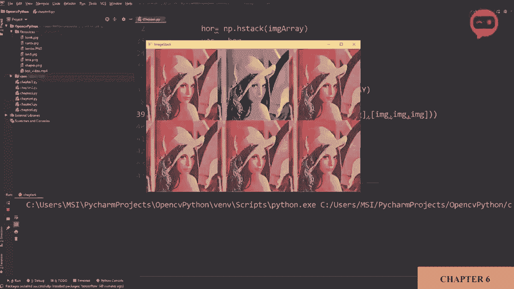
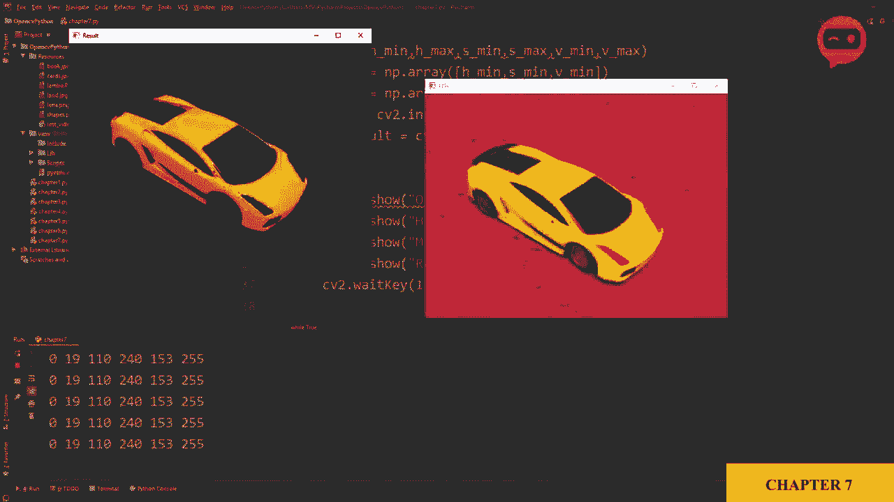
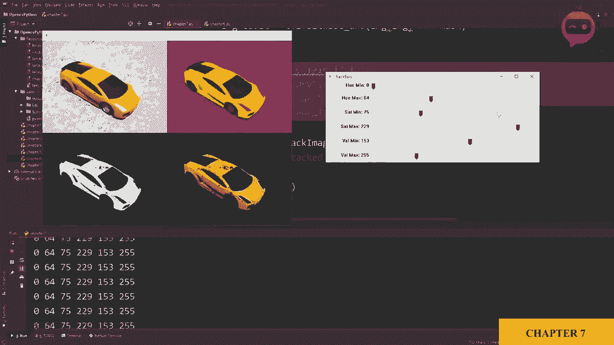

# OpenCV基础教程，安装、原理、实战，3小时带你搞定这个热门计算机视觉工具库！＜实战教程系列＞ - P10：第7章：图像颜色检测识别 

所以我们在导入我们的库，同时也在导入名为Labo的资源文件夹中的图像。我们使用IM show函数显示它，并添加延迟，以便它不会消失。所以这是我们的图像，我们的任务是检测图像中的橙色。因此，首先我们将其转换为HSV空间，所以我们会说图像。

HSV现在等于，正如你所记得的，我们一直在使用CVT颜色将其转换为灰度图像。因此，我们将使用相同的函数，C2。颜色将其转换为HSV。因此，我们将说我们希望转换我们的图像，并希望它是c2.dot color。颜色_。BGR到HSV。因此，这将把图像转换为HSV，我们可以复制这个。

然后我们可以检查一下我们的新图像。所以这里是我们的新图像，它是HSV的。我没有写一个新名称，所以它覆盖了HSV。这是原始图像，这是HSV，所以现在我们需要定义一些颜色值。一些我们希望颜色在其中的范围，因此我们将定义色调。

饱和度和数值的限制，在这个限制范围内，如果图像区域在这个颜色范围内，我们将抓取它，所以让我们这样做。但是需要注意的是，我们实际上并不知道这个特定橙色所需的最小和最大值。

我们将要做的是引入一些被称为滑块的东西，这将帮助我们实时调整值，以便找到我们颜色的最佳最小值和最大值。因此，为了引入滑块，我们将创建它。让我们在顶部创建它。

因此，我们将创建一个新窗口，比如命名为滑块。因此我们将说c2.dot命名窗口，我们将其称为track。Mars，然后我们将调整其大小，以便它看起来不那么奇怪，我们将在这里写滑块。现在这个名称应该是相同的，所以请记住不要拼写错误，然后我们需要定义大小。

假设640乘以240。然后我们将创建我们的第一个滑块，CB2.dot。创建，现在我们正在使用创建滑块函数。请记住，这里的T是大写的，因此我们首先将定义我们将使用此滑块更改的值。因此，这只是一个名称，我们可以写任何东西。我们将要更改的第一个值将是h的最小值。

接下来，我们将定义哪个窗口上放置这个滑块，因此我们已经将窗口命名为滑块，因此我们现在将使用它。我们必须定义当前值，因此当脚本运行时，它将使用什么初始值运行，我们将其设置为0，而我们h的最大值现在如你所知这里的最大值是360，但我们在这里没有360。

打开C，我们有直到1，79，这基本上是1，80个值。所以我们将放179，最后我们必须调用一个函数，每次滑块变化时都会运行这个函数，所以每次用户更改滑块时，它将调用这个函数，但我们将以另一种方式获取值，我稍后会展示如何使用，但现在我们确实需要定义这个函数，但我们可以说这是一个空函数。

在顶部，我们可以定义。空的。我们可以说只是传递。这就是了。这基本上不会做任何事情，所以这就是你创建滑块的方法，现在你需要做的就是运行一下看看会发生什么。哦。好的，所以一旦我们运行它，我们就会收到这个错误，提示c2。t resize。其实不是resize，而是resize window。所以我们将其改为resize window，然后再玩一次。

我们应该有一个，是的，我们在这里有滑块，所以我们有h最小值，你可以看到值基本上在变化。我们缺少的是，我们只需在这里放一些东西，它将接受一个参数，就这样。我们将再次运行，如果我们再次使用滑块。现在你可以看到U值在变化。最小值是零，最大值是179。

我们需要多少个值，我们需要六个值，因为我们将有h最小值，然后是h最大值。然后是饱和度最小值、饱和度最大值、值最小值和值最大值。所以我们将复制这个几次。然后我们将其改为Max。然后我们将其改为饱和度。饱和度，然后我们再次将其改为max。

最小值保持不变。这将是值。这将是值，这将是最大值。所以现在这些值的范围是从零到2，5，5。所以我们将写255，初始值我们保持不变，但对于最大值我们将保持在最大。所以这里我们将放179，这里我们放255，这里我们放255。所以如果我们现在运行它。

我们将有六个滑块可以移动。这很好。😔，是的，这基本上很好。那么接下来我们要做的是读取这些滑块值，以便我们可以应用到我们的图像上。所以在这里我们将使用获取滑块位置函数来获取我们的值。因此我们将说我们的边缘最小值基本上等于C2。CV2点获取。滑块。位置。

所以我们来写一下，我们现在讨论的是哪个值，这里的拼写必须完全相同。所以我们将在这里写下这个，然后我们要说它属于哪个滑块窗口？

所以我们的窗口名称是滑块。我将复制这个。然后在这里粘贴。所以确认一下。我们可以打印。边缘_最小值。现在，为了获得值，我们需要将其放入循环中，因为我们必须一次又一次地运行以保持获取那个值。因此，我们需要将图像改为摄像头或者。

只需添加一个循环，以便我们可以在这里写。是的。我们希望它持续运行。我们也会把这个放进去。因此，与其增加复杂性，我们只需在这里放一个，这就足够了。目前我们可以看到值是0。如果我们改变它，你可以看到值一直在变化。对吧。接下来。

我们将对所有这些进行应用。我们将复制这个，以便我们拥有所有的值。因此，我们将重复五次。这一次，将是最大值。然后是最小值和最大值，然后是最小值和最大值。然后我们将有饱和度。好的。然后我们有饱和度，然后是值。然后是值。就这样。

然后我们会在这里写最大值，这里是饱和度。饱和度，然后是最大值。这里是最小值，然后是值。然后，最大值。我们可以将它们全部打印出来，以确保它是正确的。我们将说H最小值。然后。H最大值。然后我们会说S最小值。S最大值和值。值。

最小值和最大值。那么我们来看看效果如何。😔，所以我们得到了017902550和255。因此，如果我改变我的值，你会看到滑动条实际上实时更改这些值。现在我们有了色相、饱和度和亮度的最小和最大范围。我们将使用这些值来过滤图像，以便在该范围内获取特定图像。

在该范围内的特定颜色。因此，现在我们将创建一个掩码，我们将说掩码。等于Cv2.inRange。因此，我们正在创建一个在这些颜色范围内的掩码。那么我们在谈论哪幅图像，我们在谈论。HSV图像，然后我们必须提供最小和最大范围。

我们将说这是下限，我们将说。这是上限。现在我们需要定义这个下限和上限，因此我们在这里写，让我们先处理下限。下限等于2。我们将创建一个N数组，所以让我在这里添加。导入numpy。作为MP。现在在这里，我们将添加一个N数组，所以N。数组。

然后我们将创建最小数组，即边缘最小值。然后我们有S最小值。然后我们有值最小值。唔发。他就没了么。以同样的方式，我们将为最大值做同样的事情，因此我们将说上限等于numpy.array，我们将添加最大限制。即Em。然后是S最大值。然后是vmax。好的，所以这将给我们掩码。

基本上，它将过滤并给我们该颜色的过滤图像。我们来看看效果如何。或者不需要复制。我们可以直接把这个粘贴在这里，我们可以说这是掩码，这将是。😔，掩码。运行一下，我们得到了掩码，这里有原始图像，这里有滑动条。

所以如果我移动这个，你可以看到图像变化的值。所以我们想把所有不需要的颜色保留为黑色，而把需要的颜色保留为白色。所以如果我想检测橙色，我会说这非常好。因此，我建议不断调整值，尽量让它更加平滑。最终。

你将获得一些不错的结果。现在我们有这些值。我们可以把它们作为我们的初始值。所以我们有019、110、4153和255，所以我们可以回到这里。我们仍然可以打开我们的轨迹条。然后我们可以在这里向上移动。让我把它放在一旁，我可以看看是什么。

所以这是零，然后这是19，这个是110。这个是2，40。然后我们有153。然后是255。所以现在如果我再次运行这个，默认情况下，我将得到蒙版。

对，接下来我们可以做什么。

我们可以得到我们的结果，这将是我们的原始图像。因此，我们不再得到这个黑白蒙版，而是得到实际的彩色部分，这里是橙色。我们可以通过使用这个蒙版来做到这一点。我们将创建一张新图像，所以我们可以说图像结果等于2。

我们将使用与运算，所以我们有位运算符。与运算，它将把两幅图像加在一起以创建一幅新图像。基本上，它检查两幅图像，在像素都存在的地方，它将其视为“是”或“1”。并将其存储在新图像中。

所以我们要做的是，我们有一个想要使用的**原始图像**。而我们的新图像将与原始图像相似，但会应用一个**蒙版**。这是我们之前创建的那个蒙版。让我们来看一下图像结果。图像结果，我们应该在这里更改名称。

让我们运行这个。好了，现在我们得到了彩色图像，所以如果你没有明白，基本上我们正在检查这两幅图像。

蒙版和原始图像，我们正在检查这些白色像素，看看我们从这个图像中得到什么，并从中创建一张全新的图像。

这就是我们正在做的事情。因此，我们可以做的一件事是添加我们上一章的功能，其中我们合并了图像，这样我们就不必一次又一次地处理所有这些图像。所以如果我们回到之前的章节，我们有堆叠函数。

我们可以复制这个并把它带到这里。是的，让我们把它带到这里，然后现在我们可以向下。这是顺便提一下，跟踪函数，所以抱歉是堆叠函数。所以它是堆叠图像。所以我们可以向下走，而不是单独显示所有这些图像。我们可以只显示堆叠图像。我们可以说是堆叠。或者我们可以说I M G堆叠。

I M D 堆栈仍然相等。现在我们必须编写我们的函数，内容是。股票图像。我们必须定义比例，比例。让我们将其保持在0.6。然后我们必须定义图像数组。因此我们要在这里放。我们将把我们需要的图像放在这里，所以我们可以放。两个图像，然后两个图像。好的。

所以我们将创建IMG，然后创建IM G HSV。然后在新的角色中，我们可以创建。我们可以添加遮罩，然后是图像。结果。接下来，我们只需要显示最终图像。所以我们可以说开始。图像，我们将在这里写IMD样式。现在让我们移除所有这些，然后再玩一次。

看，这样我们就有了一幅整齐的图像，所有这些图像堆叠在一起，向我们展示了所有的值。所以现在我们可以在一侧查看轨道部分，并且可以实时看到结果的直接应用。所以，让我们检查一下结果是什么。是的，就是这样。所以这就是你如何检测颜色。

