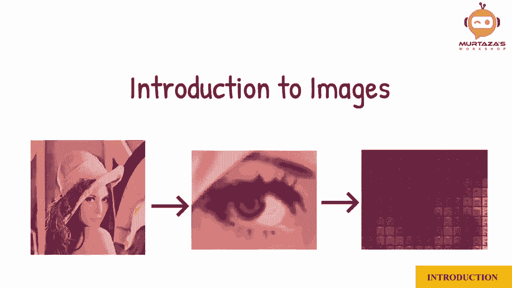

# OpenCV基础教程，安装、原理、实战，3小时带你搞定这个热门计算机视觉工具库！＜实战教程系列＞ - P2：第0章：图像知识介绍 - ShowMeAI - BV1zL411377L

所以让我们从图像介绍开始。那么图像是由什么组成的呢？假设我想显示数字3。我将采用一个框的数组，每个框可以是填充或空的。

所以要写数字3，我们会给一些框上色以创建那个形状。现在，一些框是白色的，而一些框是黑色的。我们可以将所有黑色框表示为0，所有白色框表示为1。在这个例子中，我们有10乘10个框。如果我们想要更多细节，可以增加框的数量。实际上。

这些框是像素。你可能听说过VGA、HD、全高清和4K。这些都代表固定数量的像素。例如，VGA是640乘480。

HD的分辨率是1280乘720。这意味着VGA的宽度是640个像素，高度是480个像素。目前，图像只有两种颜色，黑色和白色。这被称为二值图像。为了获得更多细节，我们可以有一个包含更多级别的图像。这意味着我们将拥有一个值的范围，而不仅仅是0和1。

在这里，我们可以看到2、6和16级灰度的区别，但图像仍然不是很清晰，所以我们将使用8位值。这将为我们提供256的分辨率，其中0是黑色，255是白色。这意味着我们现在在白色和黑色之间有254种颜色。换句话说。

我们有254种灰度。

这个图像现在被称为灰度图像。

对于彩色图像，我们有三种灰度图像，分别表示红色、绿色和蓝色的强度。简而言之，RGB将这些图像相加可以得到完整的彩色图像。这意味着一个彩色VGA图像的分辨率是640乘480乘3。

