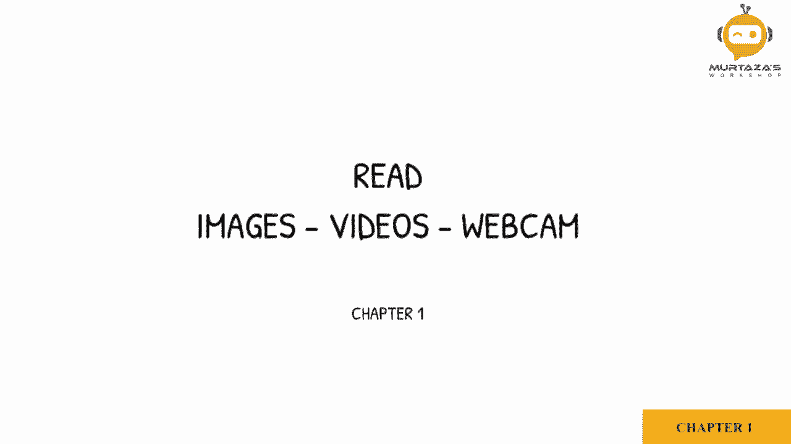
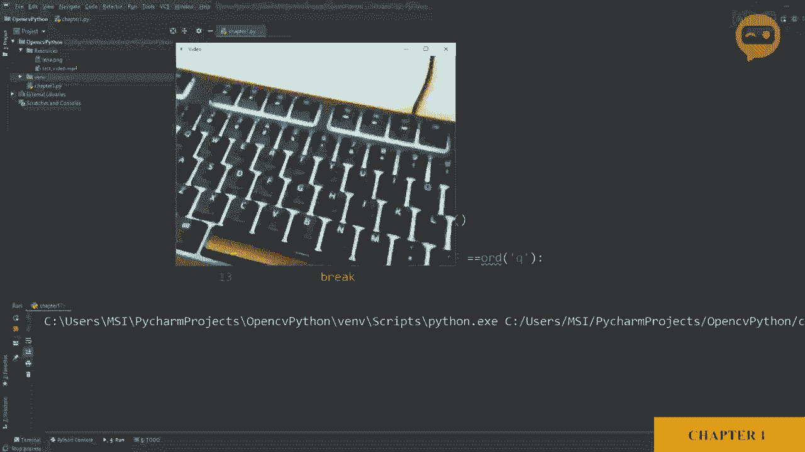

# OpenCV基础教程，安装、原理、实战，3小时带你搞定这个热门计算机视觉工具库！＜实战教程系列＞ - P4：第1章：图像视频摄像头数据读取 

所以我们将学习的第一件事是如何读取图像、视频和摄像头。所以为了读取图像，我们有一个名为I am read的函数。所以让我们开始声明一个变量来存储图像，我们将称之为IMg。然后我们将使用我们的包，CVv2。

然后在那个包中，我们有函数I am read。现在，这意味着我们在读取一张图像。现在，我们只需要提到这张图像所在的路径。所以我创建了一个resources文件夹，里面有图像Lina.pNG。所以，我们将定义这个路径。所以它在resources中，然后是Lena.pNg。

所以这将从我们的resources文件夹中导入图像，但现在我们需要显示它。所以为了显示，我们有一个叫做IM show的函数，我们将使用我们的包CB2。im show，在IM show中我们必须定义两个参数。第一个是窗口的名称。所以我们可以说是我们的输出。然后我们需要定义我们想显示哪张图像。

所以我们将说IMG。所以让我们运行这个。现在图像确实出现了，但它立刻消失了。所以为了添加延迟，以便我们可以看到，我们将写CVv2。weight key，然后添加延迟，如果我们输入0，则表示无限延迟。但如果我们添加一个值，意味着那么多毫秒，例如1000将意味着一秒。所以目前为止。

我们将输入0并运行。所以这是我们的输出图像。接下来我们将学习如何导入视频。所以我们在resources文件夹中有一个名为test video的视频，所以让我们导入它。我们将删除之前的内容。所以现在我们将创建一个视频捕捉对象。

所以我们称之为cap。C，V2。点。视频捕捉。所以现在在这个视频捕捉中，我们只需要定义视频所在的路径。我们将输入resources。然后，我们将说。我们会提到视频的名称，也就是test。下划线video点M4。所以这将导入我们的视频，但现在我们需要显示它，正如你所知道的，视频只是一系列图像。

所以我们需要一个宽循环来逐帧处理。所以我们将添加一个白循环。喂。Zhu。现在我们将捕捉我们的图像。所以所有这些将做的就是将我们的图像保存在这个变量中，然后告诉我们是否成功完成。所以这个变量将是布尔值，即true或false。接下来，我们将展示这个结果。

所以我们将像之前一样使用IM show函数，然后我们将输入我们的视频，例如。然后我们会说I G。现在我们将添加一些内容，增加延迟并等待键盘Q按下，如果我们想退出循环。所以你不需要详细了解它是如何工作的。

你需要知道的是，这会增加一个延迟，并寻找按键的单词“key pressQ”来打破循环。所以让我们运行这个，看看会发生什么。这里我们可以看到我们的视频。现在，这个视频相当短，所以它播放后就关闭了。你可以看到这里。如果我们按“cu”，它将会关闭。所以很好。现在我们已经成功导入了一个视频。接下来。

我们将学习如何使用网络摄像头。使用网络摄像头与导入视频非常相似。所以我们将写下摄像头的ID，而不是文件路径。如果你只有一个网络摄像头或者有一个连接的笔记本电脑，你可以按零，这将使用默认的网络摄像头。如果你有多个摄像头，可以在过程中添加ID。现在我们将创建这个摄像头对象。

然后我们将为它定义一些参数。我们希望它有一个特定的大小。所以我们将定义宽度，ID号为3，设置为640。然后我们将定义高度，ID号为4，设置为480。接下来的代码大致保持不变。所以让我们运行这个，看看会发生什么。这里你可以看到我摄像头的实时画面。

所以你可以看到，亮度不是很理想。所以我们可以从设置中改变亮度，ID为10。比如我们可以写100。现在你可以看到，亮度要舒服得多。
