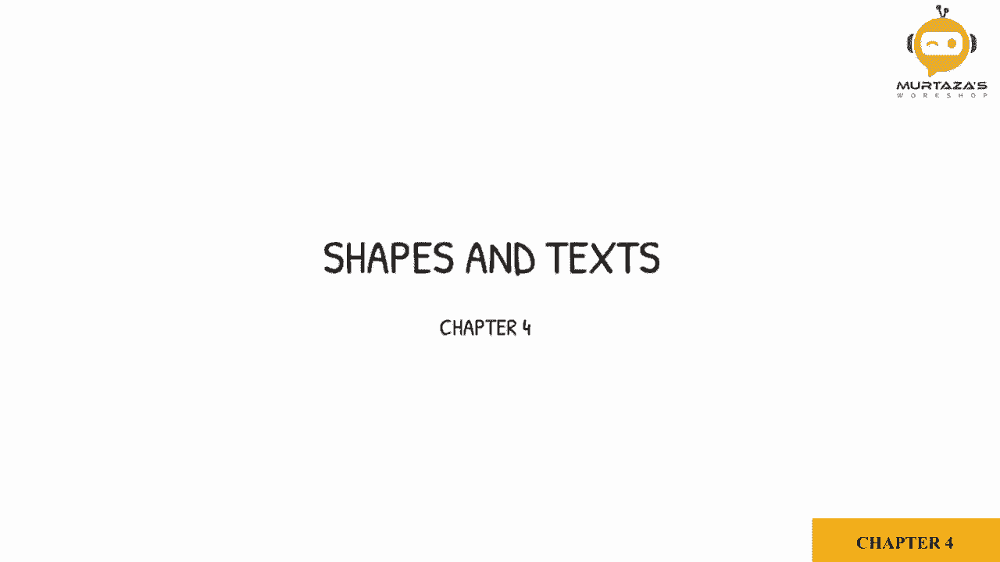

# OpenCV基础教程，安装、原理、实战，3小时带你搞定这个热门计算机视觉工具库！＜实战教程系列＞ - P7：第4章：形状与文本 

现在我们要学习如何在图像上绘制形状，我们将学习如何绘制线条、矩形和圆形，同时还会学习如何在图像上放置文本。所以首先我们将创建一个填充了零的矩阵，现在零表示黑色。我们将使用Ny库来实际创建我们的矩阵。所以我们将写图像。

等于NP.dot zeros。现在，在里面，我们将定义我们的矩阵的大小，将是512乘以512。然后我们只需显示我们的图像。所以让我们在这里写下来。Cv2.dot im show。然后我们有窗口，即图像，然后是图像本身。所以如果我们运行这个。😔，你会看到，这就是我们的块状图像。现在，这就是。

灰度图像因为它只有512乘以512的像素或方块。我们可以通过打印出来来确认这一点，我们可以写图像.dot shape。这是检查图像或矩阵的维度的方式。正如我们在这里提到的那样，这是512乘以512。但现在如果我们想添加颜色功能。

我们必须给它三个通道。所以我们将写这是512，或者这是512乘以512乘以3。这给了我们从0到255的值。接下来我们要看看如何给这张图像上色。如果我们想给整个图像上色，我们只需写IG。我们会说我们想为整张图像做这件事，然后定义颜色，例如我想让它变成蓝色，所以我会写255。

255和0和0，所以如果我们现在运行这个，你会看到整个图像变成蓝色。现在，中间的这个冒号是什么意思？如果你还记得前一章我们做裁剪时，使用了宽度和高度的限制。这是同样的概念。所以例如，如果我在这里写200和300，然后我会写另一个范围。

第一个范围是高度，第二个范围是宽度。所以假设我在这里写100到300。如果我们现在运行这个，你会看到上色部分仅是我们在这里定义的范围。如果我们想给整个图像上色，我们只需写一个冒号，这意味着它是针对整个图像或整个矩阵的。现在继续，我们将学习如何创建，先把这个恢复为黑色。🤢

让我们也将这一行注释掉。现在，我们将学习如何创建线条。对于线条，我们有Cv2.dot line函数。所以Cv2.dot line。然后我们必须定义我们在谈论哪个图像。所以我们将说IMG，也就是我们的图像。然后我们必须定义线条的起点和终点。

起点，假设我们放00。终点，让我们放30和300。然后我们需要定义颜色，所以我们将说0，然后255。再说255。这将给我们绿色。然后我们可以定义厚度。虽然不重要，但你可以定义厚度，所以假设我们将其设置为三。

所以让我们运行这个。😔，你看，现在我们的图像是绿色的，抱歉。我们的图像现在有了一条绿色的线。它从00开始，延伸到300，300。现在，如果你想把它延伸到尽头，我们可以做的是直接用宽度和高度，而不是给一个数字。所以我们知道图像的宽度和高度可以从形状中获取，形状矩阵有三个元素。

高度、宽度和通道，第一个是0，也就是高度，所以在这个注释中我们必须先定义宽度，我们会在这里写1，然后写image.dot shape。然后我们会写这里的0。这是高度。这是高度，这是宽度。

所以如果我们运行这个，我们应该会得到一条对角线。好的，太好了。接下来我们将继续到矩形，所以我们会写cv2.dot rectangle，遵循相同的约定，你必须写下图像，然后定义点。

假设是0，0，然后我们必须定义结束点。所以那将是角落点，对角点，假设是250和350。好的，然后我们将添加颜色。这次我们改变颜色。所以我们将设置为0，0和2，5，5。然后我们需要定义厚度。所以厚度，假设是2。

让我们运行这个，得到你的矩形。现在你可以增加厚度。但如果你想填充这个区域呢？你不能只是不断增加厚度直到它填满，你知道的。虽然你可以这么做，但这不是个好主意。不过C2实际上有一个功能可以做到这一点，你可以写CVv2.dot filled。

你必须用大写字母书写，这样你才能用它来填充你的矩形。接下来，我们将继续移动到小的部分，先把它放回去。然后，我们将继续到圆形。所以我们会写C2.dot circle，然后我们会写我们的图像。我们必须定义这个圆的中心点。所以我们假设是450。

然后我们必须定义半径，假设是30，然后需要定义颜色。颜色我们可以设置为2,5,5,2,5,5。我觉得这会是某种蓝色的阴影。然后我们把厚度设为5。看看，这里来了。好的，现在你有了这个圆。你可以看到我们的中心点是450，这意味着我们从这里开始到这里，400，从这里到这里是50。

我们已经得到了淡蓝色的效果。接下来，我们要学习如何在图像上添加文本。我们有一个叫做Cv2.t put text的函数。我们会像之前一样写我们的图像，然后定义你想要显示的文本。所以我们可以在这里展示，比如说，open.CV。应该说是Open TV，然后我们会写下起始位置。

假设我们想开始。设置为300，然后。设为百。好的，然后。现在这个有点不同于之前，我们需要定义文本的字体。CV2库中已经有几个字体，但数量不多。不过我们有一些，所以你可以写cv2。font。C we2 dot。Fons，然后会显示出一堆字体。

我们不需要任何花哨的东西。所以我们只会选择第一个。然后我们有了我们的缩放比例。接着。我们有了颜色。我们设为1，50，然后0。然后我们有我们的。厚度。让我们运行一下，看看效果如何。所以你看，我们以绿色写下了Open CVv。让我们，把它稍微调低一点。设为200。好的。

让我给你展示一下厚度和缩放比例对文本的影响。如果我把它调高到2。现在你会看到它变得更大，实际上已经超出图像本身了。所以让我们把它调回1，顺便提一下，你也可以设置小数位。所以你可以写0.5。那样它会变得非常小。

然后你可以定义厚度。例如，我们把它设为1。在这里你可以看到差别。
