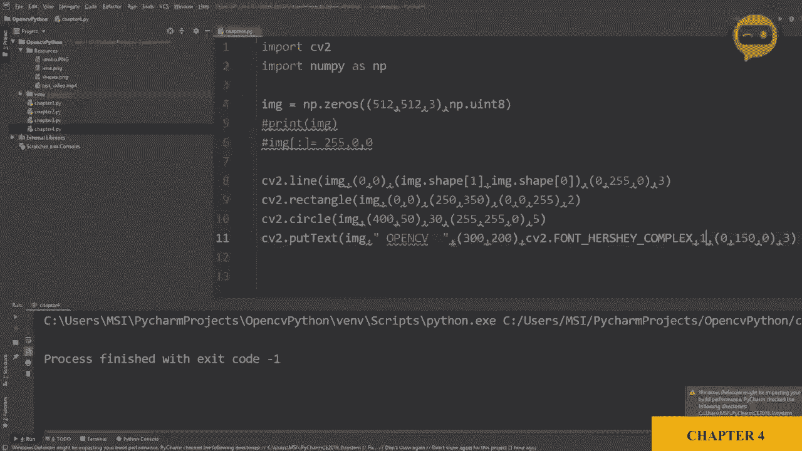
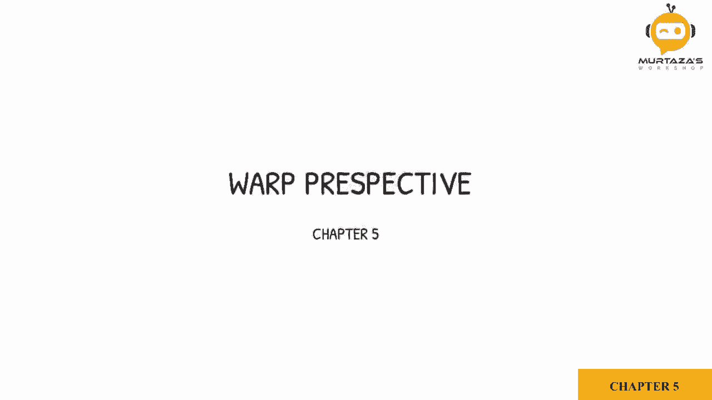
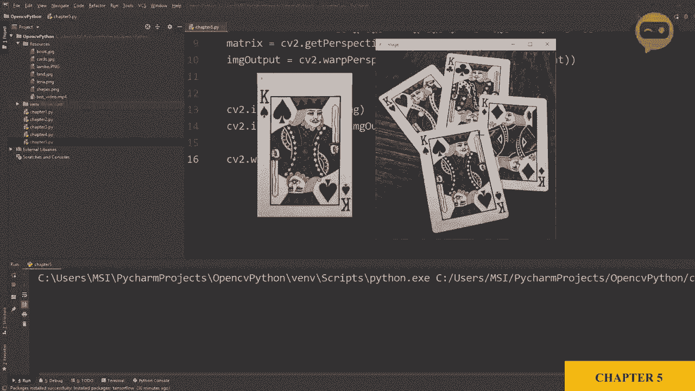

# OpenCV基础教程，安装、原理、实战，3小时带你搞定这个热门计算机视觉工具库！＜实战教程系列＞ - P8：第5章：透视变换 

现在我们将学习如何在图像上使用透视以获得其鸟瞰图。我们这里有一张名为cards的图像，位于资源文件夹中，我们所做的就是使用IM show函数显示它。所以如果我们运行这个，我们将得到我们的图像。

我们要做的是尽量将这张黑桃国王变得平坦。因此我们需要这四个点。使用这四个点，我们将应用透视的概念。首先我们要做的是定义扑克牌的四个角点。我已经记下这些数字，我们只需输入它们，因此我们将声明点。

作为一个浮点数数组。在里面，我们将有四个不同的点。所以让我们输入值，我有111。然后我们有2，1，9。这是针对之前提到的这张特定图像和那张特定扑克牌。因此这是188。然后1，54。如果你想获取这些值，你可以在Windows上打开画图。

当你在底部移动光标时，它将给出像素的值。所以。这些是我们的点。现在，对于每一个点，我们需要定义我们所指的哪个角落。这是左上角的第一个点吗？这是最后一个点吗？

所以你必须定义所有这些。在point2中，我们将对其进行定义。Loat 32。然后我们还有四个点。首先，我们有我们的0，0。然后我们有宽度和0。接着是0和高度。最后是V1高度。现在，我们没有定义宽度和高度。这就是为什么会出现错误。所以让我们定义宽度和高度。一个扑克牌通常是2.5乘3.5英寸。

所以我们将保持纵横比。因此我们可以设置为250乘350。现在我们将得到我们的矩阵，即透视变换矩阵。这个矩阵可以通过C2获得，我们有一个函数来获取透视变换。所以，获取P。透视变换，就这样。所以你必须定义这些点，点1和点2。

现在我们可以根据这个矩阵获得输出图像。因此我们可以说图像输出等于C2。点verp透视。Wp。透视，然后我们需要定义我们的源图像。接着我们必须定义我们的矩阵。然后我们必须定义之前定义的宽度和高度。那就是宽度和高度。所以，现在，如果我们输出这个图像。让我们看看C。

B2点I am show。然后，我们可以说。输出。然后我们有我们的图像输出。它是双重的，好的。让我们运行这个。😔，就这样，所以我们基于这些点得到了这张图像的透视效果。
