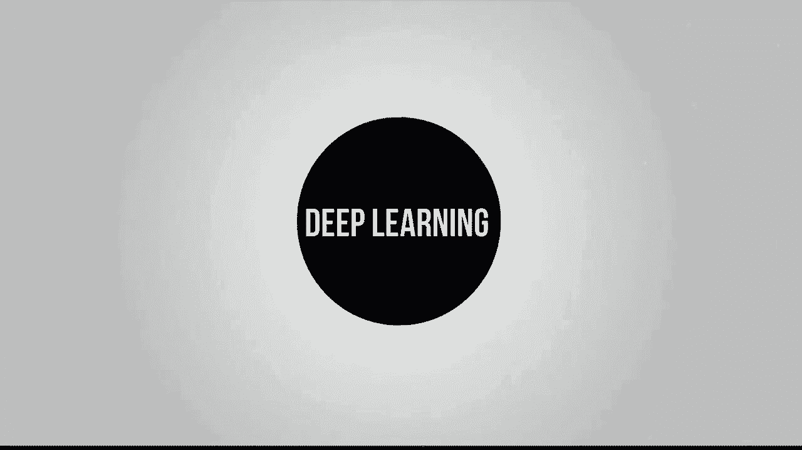
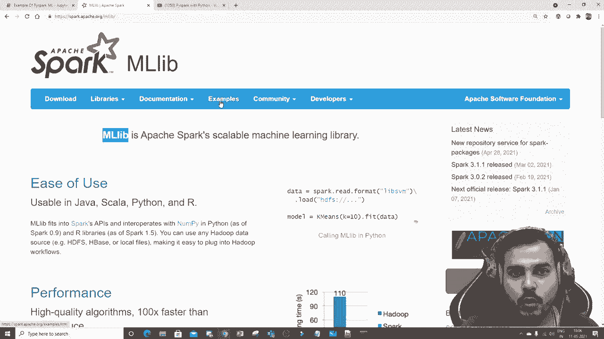

# PySpark 大数据处理入门，6：L6- Pyspark Mlib 简介 

。

所以，Spark Mlib也有出色的文档，涵盖了各种示例。在这里你可以点击示例，基本上查看这份特定的文档。你可以看到不同类型的示例，看看它是如何完成的。但就Spar Ml而言，有两种不同的技术。

一种是RdiD技术，另一种是数据框API。现在我们要做的是，数据框API是最近的，你知道，它在各处都很有名。因此，我们将专注于数据框API。这就是我们在Pipar中非常好地学习数据框的原因。因此，我们将通过数据框API学习，并尝试看看我们如何基本上解决机器学习的用例。

现在，让我们来看一个非常简单的例子，伙计们。永远记住，文档提供得非常好，你可以在这里检查并阅读所有这些内容。让我们继续，看看我们实际上可以做些什么。😊

在这个特定的例子中，我将处理一个简单的机器学习问题陈述。所以让我为你们打开一个特定的数据集，然后可能会尝试一下。好的，这就是我的数据集，伙计们，我知道这里没有很多记录。好的，我有一个数据集，其中包含姓名、年龄、经验和工资。😊

这只是一个简单的问题陈述，旨在向你展示Sp在MLla库中是多么强大。接下来的视频中，我会详细解释回归算法以及我们如何理论上进行实现，所有内容我已经上传了。

你可以看到这里，我将在这个教程之后进行讲解。这基本上是教程6。我会尽量在之后添加它。😊！

每当我上传线性回归算法之前，请确保观看这段数学直觉。好的，我也在播放列表中上传了这个特定的视频。所以在这个教程26之后，因为我也把它添加到了我的机器学习播放列表中。在之后，你也会找到我们讨论线性回归时，如何深入实现，这段视频也会上传。所以让我们继续。这里是我的全部数据，伙计们，这是我的数据。现在我需要根据年龄和经验来进行操作。

我需要预测薪水，这是一个非常简单的用例，数据处理不多，转换不多，标准化也不多。我只会采用这两个独立特征，并根据年龄和经验来预测这个特定人的薪水。

好的，这就是我将要做的。😊！

所以这是一个完美的例子。再一次，细节上，我将尝试逐行向你展示如何基本实现。可能在接下来的几期视频中，我将讨论线性回归等内容。如果我查看这个特定问题，这也是一个线性回归示例。那么让我们先来，和往常一样，我将创建一个 spark 会话。

所以我将使用 frompar do sql import spa session，然后我将使用 spark session do builder.dot app name，这里我实际上是在创建一个 spark 会话。让我执行一下，我觉得这你应该很熟悉。如果你熟悉这个，那么我在这里要做的是，我们只会读取这个特定数据集，使用 test1.dot csv，header 设置为 true，first schema 设置为 true。

所以当我去查看我的训练时，所有的特征都在这里。完美。我也会给你这些数据。别担心。现在，从这些特定数据中，如果我去检查我的打印模式，你将能够看到我获得的特定信息，这是我整个打印模式。😊特征包括姓名、年龄、经验和薪水。现在，如果我去查看训练的列。

这是我的训练列。现在，大家一定要记住，在 Pipar 中，我们使用不同的原理或机制，或一种数据预处理方法，通常我们所做的是。通过使用在 Ecala 中可用的机器学习算法，我们基本上进行训练测试划分，没错，然后我们首先。

将其划分为独立特征和依赖特征，没错，我们使用 x 和 y 变量。然后我们通过在 Pipar 中进行训练测试划分，采用不同的技术。我们所做的是，是的，我们基本上需要创建一种方法，将所有独立特征分组在一起。因此，我可能会尝试创建向量组装器。我们通常称之为向量组装器，我实际使用的类将确保我所有特征都像这样分组在一起，形成年龄和经验的形式。

在这里，我的两个主要特征是年龄和经验，它们是我的独立特征。所以它会像这样为每条记录分组。它会像这样分组。好的，对于每条记录，它会像这样分组。然后我将把这个分组视为。😊不同的特征。

所以这基本上将是我的新特征。对，记住，这个新特征是我独立的特征。所以我的独立特征在年龄和经验的分组中看起来是这样的，这将被视为一个新特征，这正是我的独立特征。因此，我必须以这种特定方式进行分组。为了分组，我们在Pipar中这样做。

我们使用一种叫做向量组装器的东西。因此，这个向量组装器基本上在pipar do ml dot feature中存在。我们使用这个向量组装器，使用两个东西。一个是输入列，所有我们要进行分组的列。因此，两个列，一个是年龄，另一个是经验。对，我们不需要考虑姓名，因为姓名是固定的，它是一个字符串。是的。

如果有分类特征，我们需要做什么，我们将把它转换为一些数值表示，这在我即将发布的线性回归、逻辑回归和其他视频中的深入实现中会向你展示。但在这里你将能够看到，我将以列表的形式获取输入列年龄、经验，然后我将尝试对其进行分组并创建一个新列。

这里叫做😊，依赖特征。这就是我实际上在做的。因此，如果我去执行这个向量在相似的地方。所以在这里我得到了我的特征在相似的地方，然后我进行点变换。我对我的训练数据进行点变换。这基本上是我的训练数据。当我这样做时，当我在这里输出点显示。

你将能够看到我有所有这些特征，并且创建了一个新特征，称为独立特征。好的，所以我们实际上创建了一个独立特征。你可以看到这里的年龄和经验，年龄和经验，年龄和经验。因此，这是我实际得到的分组行。简而言之，我所做的。

我已经将这两列结合在一起，并将其作为一个独立特征。好的，现在这将是我的输入特征。好的，这将是我的输出特征，我们将尝试训练模型。好的，因此在这里现在如果我去查看输出点列，我有姓名、年龄、经验、独立特征。现在我从中做什么。

让我们看看我实际感兴趣的数据集。😊因此，在这些中，我只会对这两个数据集感兴趣，对，特征和薪水。薪水将是我的输出特征。y变量，对，这将是我的输入特征。因此，我要做的是，我将选择输出点选择独立特征和薪水。

我将把它放入我的最终器下划线数据中。这就是我实际上在做的。如果我现在去查看我的点显示，你将能够看到整个内容。😊现在，这些是我的独立特征。这些是我的依赖特征。现在，第一步，我们要做什么？我们进行训练测试拆分，就像我们在Scal中所做的那样。为了进行训练测试拆分。

我在我的最终数据中使用一个叫做随机拆分的函数。记住，大家。我会尽量逐行解释，当我在做一个更大的项目时。目前这只是一个介绍课程。我真的想告诉你们事情是如何实际进行的。这基本上就是我的训练测试拆分。所以让我在这里写下注释。😊

训练测试拆分。我将使用线性回归，就像我们从 S 类库导入一个类一样，类似地通过使用 Pipar.ml.regression 导入线性回归。然后我进行随机拆分，比例为 75% 对 25%。这基本上意味着我的训练数据将占数据的 75%，而我的测试数据将占 25%。然后我将在此使用线性回归。你需要提供两个重要变量。一个是特征列。

有多少个特征列在这个独立特征中是完全存在的。所以我在这里给出，标签列也是如此。这是我需要提供的第二个特征。这是我的输出特征。所以在我提供这两个内容并对训练数据进行拟合后。

我将能够找出我的系数。这些是我的系数。这些是我的截距。现在我可以评估并查看我的输出。通过使用这个评估函数，我们将能够看到输出。在里面会有。😊，附加变量。它将包含输出。好的，这就是我的预测。这是我的薪水，真实值。

这是我的另一个内容。如果我真的想找出其他重要的指标参数。让我们按一下 tab 键，你将能看到平均绝对误差_结果.均方误差。所以如果我看到这个特定的词值，你将能够理解模型是如何实际表现的。这只是一个非常简单的例子，大家，别担心，我会深入解释。

可能在接下来的几期视频中，我们将从线性回归开始。现在，请记住，下一个视频是关于线性回归的深入实现，理论部分你可以在这里看到。我已经添加了视频。好的，我希望你喜欢这个视频。如果你喜欢，请订阅频道，我们在下个视频见。祝你有个美好的一天。😊

