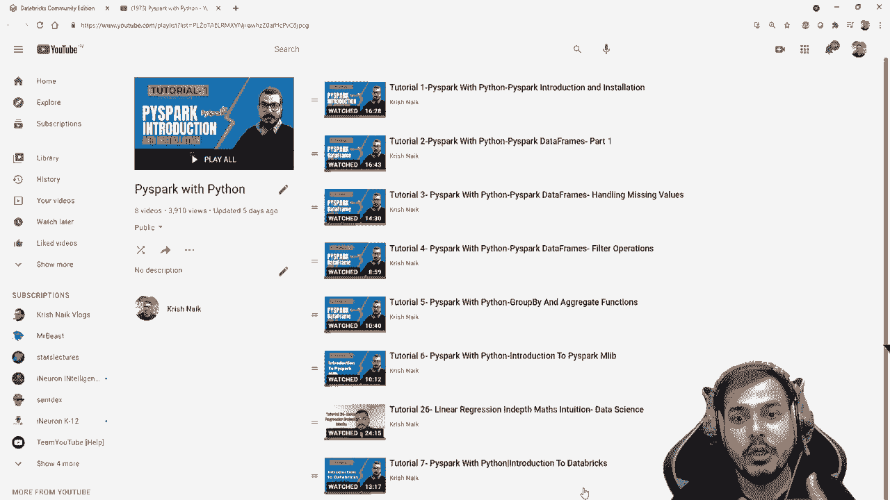
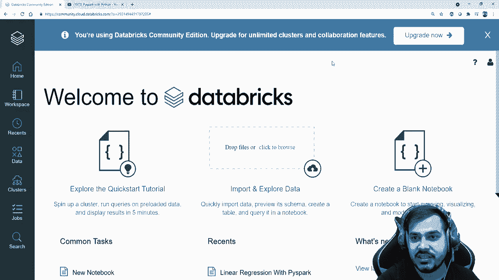
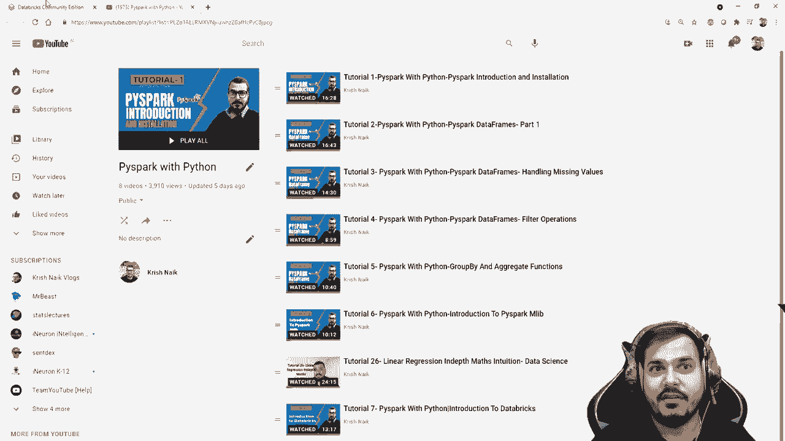
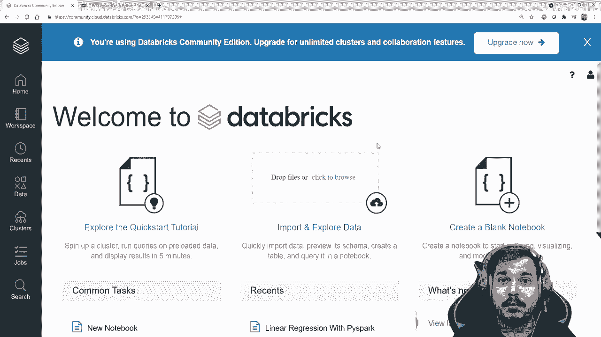
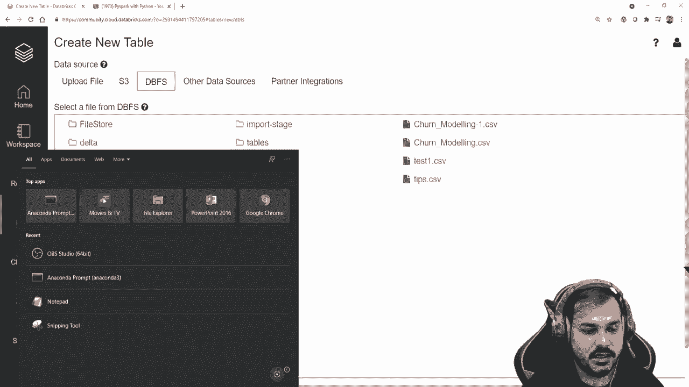
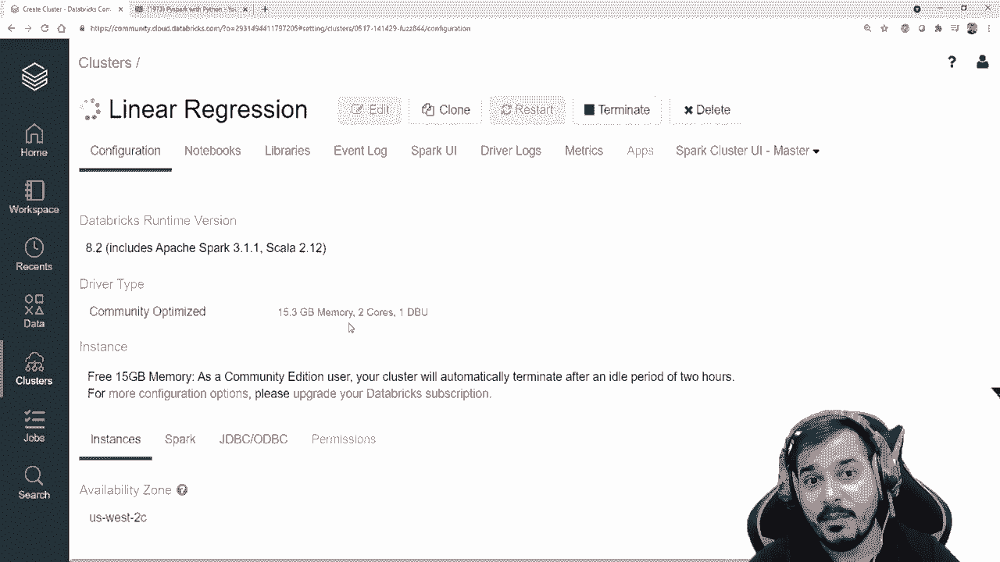
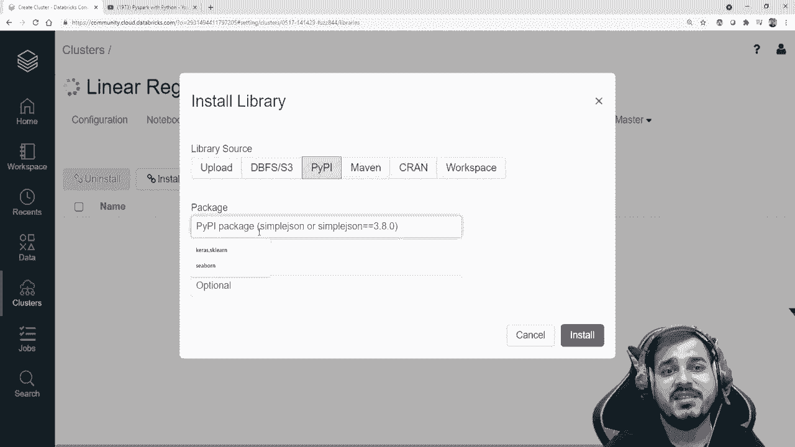
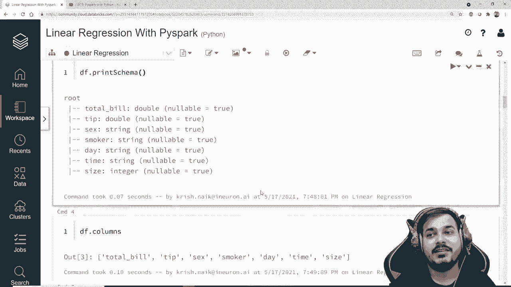

# PySpark 大数据处理入门，8：L8- Databricks 中的 Pyspark 多元线性回归实现 

。

大家好，我叫Krisnak，欢迎来到我的YouTube频道，今天我们将继续Pi Park教程，在这期视频中，我们将进入第8个教程，利用Pipar实现线性回归。

😊，这是我在这里创建的整个播放列表，我还放了一段关于线性回归理论理解的视频。在教程8中，我们将选择一个问题陈述，并尝试解决它，可能是一个回归问题。

我们要讨论的第一个算法是线性回归算法，我们将尝试解决问题。这是一个多元线性回归问题，我们将在databs中进行。之前我已经给你们介绍了databs，我希望你们已经创建了账户并开始使用。如果你不知道如何创建账户，请观看教程7，整个播放列表链接将在描述中提供。

😊。

这是我的Datas社区账户。请记住，在社区版本中我们只能创建一个集群。我未来可能会购买升级版本，并尝试展示如何创建多个集群，但那需要使用一些云服务，比如AWS或Azure。现在首先。

我将使用什么数据？这就是我将使用的全部数据，这组数据称为小费数据。这意味着顾客在餐厅用餐时，基于总账单给予的小费，或者我也可以根据所有这些参数来解决这个问题，推算出顾客可能支付的总账单。这就是我要解决的问题陈述。这里你可以看到这是一个多元线性回归问题，具有多个特征。

让我们继续。首先，我将点击浏览并上传这组数据。😊。

为了上传这组数据集，我在我的路径中有这组数据。因此我可能也会将这组数据集分享给你们，所以不用担心。让我快速上传数据集，好吧。Ppar，好的，你可以看到这是我正在上传的小费数据集。

让我现在打开它，你将能够看到你的 tips 数据将直接上传到这个 Dfs 中。所以在这里你会有一些像文件存储/表的东西。好的。现在你可以做的事情是，点击这个 Dvfs，在文件存储上你可以看到，可能你也可以点击表。在这里你有这个 tips.dot.csv。我在之前的视频中也上传了所有这些数据。

可能我之前只是在使用这个。好的，但在这里我只是关注 tips.do csv。现在我将在这里做什么？让我们进行第一步。记住在数据湖中第一步是我们需要创建集群，好的。😊 

现在就创建一个集群，默认是在社区版中。Datas 实际上帮助你创建一个集群，仅一个集群。好的。但是如果你使用的是付费版，升级版，它实际上会帮助你创建多个集群，如果你拥有 AWS 云的额外资源。

所以我就要点击集群，创建一个新的集群。我会说这是我的线性回归集群，好的。😊 然后我将使用这个运行时 8.2 的标量。这个就在这里。我只需点击集群，其他所有内容在这个实例中的几乎都是相同的。你将获得 15 Gb 的内存和其他所有信息，你可以查看。

你也可以获得两个课程和一个我 debutbu。好的，这个我之前实际上已经讨论过了。所以我将去点击集群，这将需要一些时间。记住，大家，如果你真的想使用任何类型的库，只需点击这里。😊

安装你想要的库，比如如果你想使用 seaborn，你想使用 scarers，你想使用 TensorFlow。所以在这里你可以基本上输入它们及其版本，你将能够安装它，好的，但现在我不需要任何库，我只会使用 spice plug，这就是我的菜单。所以，大家在这里点击集群，你可以看到，可能过了一分钟，这个特定的集群实际上已经创建了。好的，现在再次返回主页。

你可以创建一个空白笔记本，我已经创建了一个笔记本，以便我可以编写基本代码，所以我现在就打开它，开始这个过程。首先，我有一个称为文件位置的东西，我知道我的文件位置基本上是tips.csv，文件类型是csv，然后我正在使用spark do3.dot csv文件位置，header设为true，schemeche等于2，然后让我写Df.dot show，这实际上可以帮助我检查整个数据。好吧，我现在就要在你面前执行它，让我们逐行来，我会尽量把所有代码写下来，这一定对你理解有所帮助，所以请确保你也跟我一起输入代码，这样会更好地理解。好吧，现在我要执行这个，你会看到我的集群开始运行，然后你可以看到正在等待运行命令，我们可能会看到它。

我稍微缩小一下，这样你就能更好地看到。再说一遍，大家，第一次启动这个集群时会花一些时间。好吧，spark作业正在运行，现在你将看到我的数据集。😊这是我上传到这个特定文件位置的小费数据集。所以这就是我整个数据集：总账单、小费、性别、吸烟者、时间、大小，完美。现在让我们进入下一步，我将写Df.dot print schema。

所以我也可以使用tab，你知道的，它将加载整个内容。现在你可以看到这是我所有的特征：总账单、小费、性别、吸烟者、时间。所以这里是你所有的特征，比如double，性别是字符串，吸烟者是字符串，日期是字符串，时间是字符串。请记住，你可能会想：克里斯，我为什么要在databs中做这些，目的是让你理解它如何在集群中运行。现在我只有一个集群。

这基本上意味着这个特定集群中的最大内存大约是15 GB，但请理解，如果你处理的是100 GB的数据，这种处理会在多个集群中进行分割。因此，你将能够在即将到来的工作中处理大数据。现在我觉得这就是全部，大家，让我们来理解一下我的独立特征，独立特征是我的小费特征、性别、吸烟者、时间和大小，而我的依赖特征基本上是总账单。

根据所有这些特征，我需要创建一个线性回归算法，能够预测总账单。所以现在我在这里要写Df.dot columns。如果我想检查我的列，这里就是我的列，我可以看到这就是我的确切列，我实际上有这么多列。关于这个特征的一件事，你们有性别、吸烟者、日期、时间等列，这些都是类别特征，对吧？而且你知道，这些类别特征需要转换成一些数值，只有这样我的机器学习算法才能理解。所以让我们看看如何处理类别特征。这里我就写一个评论。

😊，好的。处理类别特征，对吧。现在我会尝试展示如何处理这种类别特征。现在。在Pispar中，我们知道在正常的电子表格中，我们尝试使用单热编码，使用普通编码，尝试使用不同的编码。同样，我们也可以在这里使用相同的编码，借助Pipar。因此，对于这个特定的过程，我们有一个叫做字符串索引器的东西。所以我就说从Pispar中，你知道，从Pispar.dot ml.dot feature。

😊，好的。我将导入一个叫做字符串索引器的东西。所以我会使用这个字符串索引器。这个字符串索引器实际上会帮助我们，基本上将字符串类别特征转换为一些数值特征。数值特征基本上是有序编码。比如如果我有性别，像男性或女性，它会显示为零和一。

在这里你会看到大多数类别的口头编码。现在你可能在想，单热编码是什么过程，我将在接下来的几个视频中尝试用不同的机器学习算法展示给你。之所以这样做，是因为一次学习一件事情更好，对吧？所以我会尝试展示所有这些例子。现在让我们继续，看看如何将这些类别特征如性别、吸烟者、日期和时间转换。

可能时间也是类别特征，看看这里。如果我看到这里的所有特征，让我做一件事。好吧，我就写D.dot show。😊，所以这是我所有的特征。快速查看，如果我去看，这个时间也是一个类别特征。所以快速的，让我们继续看看我们基本上如何使用这个。让我也删除这个东西。

或者让我稍等一下写一下。所以我实际上导入了一个叫做字符串索引器的库。现在我在这里要做的是创建一个索引器对象，命名为这个。我会写字符串索引器。😊，首先，我需要提供哪些是类别特征。现在，记住在这个字符串索引器中。

如果我按**shift+tab**，可能在这里你能看到我需要提供输入列。😊，所以让我加快一点，我需要提供输入列，并且我需要提供输出列。我还可以选择提供多个输入列和多个输出列。所以让我尝试这两种情况。好的，首先，让我尝试输入列。

所以在输入列中，我将提供我的第一个值。现在假设我真的想把性别列转换成。😊，我的类别特征。所以我在这里写输出列。好的，然后我会说**sex_indexed**。现在，这里我们实际上在做什么，伙计们。我实际上是在给我的性别列，而这个性别列将通过字符串索引器转换成一种独热编码。

好的，现在在下一步，我要做的就是写**df**。好的，我可能只会使用**df**，或者我可以创建另一个数据框。所以我会写**df_score**，可能会看到，因为我不想改变那个**df**，然后再运行那段代码，现在我会说**indexer**。

😊，点**fit**。好的，我肯定可以使用**fit**，然后可以使用**transform**。所以这里也是几乎一样的，只有伙计们**fit_transform**。这里我也要使用**df**。好的，然后如果我去看看**df.df_score**，现在你就能看到这个性别列将会创建一个额外的**sex_index**列，并且在这个特定列中会有独热编码的值。

所以我们去看看这个。一旦我执行。😊，完美，我觉得它正在运行。可能会需要一些时间。现在你可以看到我有一个额外的列，叫做**sex_indexed**。无论是女性值，值为1；无论是男性值，值为0，对吧。

所以我们处理了这个特定的列，并且基本上把这个类别特征转换成了独热编码。现在，我们还有许多特征。所以我要做的就是再次使用这个索引器。好的，我可能会在这里写。现在我将指定多个列。所以第一个列我已经更改了。我将把它更改为其他东西，**sex**。

代替性别，它将变成**smoker**。😊，好的，**smoker**。但是我给你们展示过。代替写输入列，现在我必须写输入列，对吧。所以在我给出的多个列中，这就是**smoker**。然后如果我看到还有一个特征是**day**和**time**，**day**和**time**是更多的两个特征。

所以我会在这里写**day_**。所以伙计们，现在我写了**smoker**、**day**和**time**。类似地，我会在这里再写三个列。第一个列应该是因为我要创建独热编码，所以我可能会在这里创建一个新列。这将是我的**smoker_indexed**，我在这里关闭括号。

我的第二个特征基本上是day underscore index，对吧？我的第三个特征可能是time underscore index。所以在这里我将创建三个特征，然后我给index dot fit Df underscore R，好吧。因为现在我有了我的新数据框，然后我将说Df underscore dot show。现在一旦我执行它，大家。我希望它不会给我们错误，好吧，它在说给出的Para输出列的无效参数值，无法转换类，所以我必须将其作为输出。

所以那就是问题所在，所以现在你将能够看到它执行得非常顺利。现在这里你可以看到所有可用的特征，sex underscore index，smoker underscore index，day underscore index和time underscore index，所有你在这里看到的都是编码，比如0。

12，对吧？我们现在已经将所有字符串值转换为该特征中所有可用的类别值的数值。现在我的模型肯定能够理解。好的，现在我们完成了，大家。接下来是什么步骤我们基本上要讨论的，现在步骤非常简单，因为我们已经创建了这个特定数据集。现在我们要做的是有一个叫做向量组装器的东西。现在总是记住，大家，在Pipar中，无论何时我们有所有这些特征，我们需要将所有独立特征分组在一起，而将依赖特征分开。

好的，大家，我们将从Pipar写作。😊，Dot。Ml dot feature。我将导入一个叫做向量组装器的东西，所以我将使用这个向量组装器。这实际上将帮助我们将独立特征分组在一起，而将一个依赖特征分开。那么让我继续写向量组装器，然后我将初始化它，第一参数我必须提供的基本上是我的输入列，在这里我的输入列有哪些，我先看看，在此之前让我快速做一件事，就是创建一个单元格。

😊，好的，向上移动一个单元格，创建一个单元格，或者让我删除这个，然后可能让我写一下。Df underscore R dot columns。好的，那么我们有多少列呢？所以我有关于列的所有信息。所以我这里的输入列，第一件我肯定要提供的是我的小费列，因为小费是必需的。

小费是第一个独立特征，它是一个数值特征。然后我有像sex underscore co indexed这样的东西。好的，我将复制这个并粘贴到这里。这是我的另一个输入特征。记住，大家，我们真的需要遵循顺序。

现在我的第三个特征基本上是烟雾指数。在这之前，我还可以指定大小，好吗？所以我会指定大小、性别指数、吸烟者指数，好吗？然后我可能还会创建天数指数。好的，指数逗号。我只是会使用时间指数。好的，所以这些都是我的独立特征，关于这一点，请记住这些将被分组在一起，我还必须说如果这些被分组在一起，让我们创建一个新特征，并给这个整个组命名，好吗？所以在这里我只是会说输出列等于，并且在这里我只会指定这些是我的独立特征，所以我会将整个东西命名为我的独立特征，简单得多。现在让我做一件事，创建一个叫做特征组合器的变量，这样就能转换这些值。特征组合器等于向量组合器，在这里我必须提供我的输入列和输出列，非常简单。接下来我要做的步骤是，输出等于，我只是会说点转换，因为我确实需要转换，并且这需要从我的 D_艺术中转换。好的，让我执行一下。

😊 它已经执行完毕，你可以看到整个输出，所有这些我创建的都是我的独立特征。现在在独立特征中，我们需要创建这些独立特征，这是 Pipar 中给出的规范。请始终记住，我们需要创建一组特征，并且这些独立特征可能会一起完成。现在如果我去看我的输出，点显示。

😊 在这里现在你将能够看到我能看到另一个特征，或者让我写上输出点选择，因为所有特征可能已经分组在一起，很难在一个屏幕上看到所有特征。我只会拿这些独立特征，点击点显示。现在一旦我这样做。

😊 在这里，你将能够看到所有这些特征。请记住，这需要按相同的顺序显示。第一个特征是小费，然后是大小、性别_指数、吸烟者_指数、天数_指数、时间_指数。所以这些是我的独立特征。现在我只有一个特征，在这里你可以看到它仅仅列出了所有特征，就像这样，这是创建的第一个主要步骤。好的，现在让我们进入下一个步骤。现在我知道我的输出是什么，接下来我要做的是，在这个整个输出中，如果我去查看我的输出。

😊 输出点显示，在这里你将能够看到所有特征都在输出点显示中可用。所以在这里你将能够看到所有特征都可用。现在，你知道哪个是你的输出特征，对吧？所以这是我的依赖特征，而这些独立特征是我的独立特征。那么我接下来要做的就是选择输出。

或者我会说这基本上是我的最终数据，我将提取两列，即 output dot select。😊在这里，我将给出我的两个特征。我将说一个是独立特征。好的，独立特征。我希望这个名称是正确的。否则，我会再确认一次。让我在这里点击。

独立特征和总账单，完美的逗号。总账单。好的，现在如果我去执行这个，我只是在提取这两个特征。现在，如果我去查找 finalize data dot show，现在我将能够看到两个重要特征。也就是独立特征和总账单。记住，这都是我的独立特征。

这是我的依赖特征。😊到目前为止，这非常简单。如果完成了，大家。下一步是我将复制和粘贴一些代码。我将应用线性回归。所以首先，从 Pipar do ml dot regression。我将导入线性回归。然后我将采取这整个最终数据，并进行 75% 和 25%的随机拆分，然后在我的线性回归中。

我将把我的独立特征提供为特征列。这是线性回归中需要给出的两个参数。一个是特征列，这里我将提供独立特征。第二个基本上是总账单，它是我的依赖特征。现在我只需在训练数据上进行拟合。一旦我这样做，我的回归模型就会被创建。

这可能需要一些时间。现在你可以看到所有的信息。你获得了关于训练和测试的惊人信息，记住，大家。我们制作的这个独立特征，是以 UDt 的格式呈现的。😊你可以看到 Uity 的全称，这根本不是大问题。好的，现在我有我的回归器。

所以我将要做的是说 regressor dot coefficient，因为这是多重线性回归。所以我将使用回归器的系数。这些都是我的参数或不同的系数。因为我大约有六个参数。所以这些都是六个不同的系数。

永远记住，在线性回归中，你将根据特征的数量拥有系数。你也会有。😊，截距。所以我将说截距。好的。这基本上是我的截距，0.923。现在你有了这两条信息。现在是时候评估测试数据了。

所以我将说 attached。这基本上是我的预测，对吧。让我写成这样。预测。好的。预测。我将写成 bread，underscore results。结果等于这个，这将是我的结果，好的。testest 没有定义。

为什么test未定义，因为这应该是测试数据。其实我很抱歉，没关系。你会遇到一些小错误。好了，现在如果我真的想查看我的预测结果，去看看bread的预测。会有类似于预测显示的东西，好的。😊如果你这样写，你将能够获得整个预测，好的。

所以记住在这个预测中，这是你的独立特征。这是你的总账单。这是你的实际值，这也是预测值。实际值，预测值。实际值和预测值在这里，你可以比较一下效果如何。你知道，通过查看你的总账单和预测值，效果非常好。相当惊艳。

你能看到数据。我将写下我的最终比较。好的，最终比较完美。我对此很有信心，你可以看到它。让我们看看其他一些信息，比如我们可以从中检查到什么。我们可能想查看R平方。

所以你可以写，你基本上可以写回归。如果我按下tab键，这个系数截距。然后你就会丢失。还有一些称为R平方的东西。如果我去执行这个。这基本上是我的R平方，或者让我写下来。😊我想预测。预测结果。

我不认为R平方是在哪里。让我们看看是否能够看到R平方值。稍等，我正在查看文档页面。哦，抱歉。我不需要在这里使用回归器。所以这里我将使用预测结果，让我计算R平方。所以这是我的R平方。类似地，你也可以查看预测结果的平均绝对误差。

所以你有平均绝对误差。你还有预测结果的均值平方误差。这三个值你可以确认一下。所以这里是你的平均绝对误差。这里是你的均方误差。这些是我的性能指标，我一定会有的。每当你们面临任何问题时。

只需确保查看Apache Spark的文档。这样，你绝对可以解决整个问题陈述。现在我给你一个作业。尝试在Google上查找，看看如何保存这个特定文件，可能是以pickle格式，或者可能是临时模型的pickle文件。你知道这非常。

非常简单。你只需使用回归保存，但试着看看如何保存这个特定的pickle文件。现在这就是关于这个视频的全部内容。希望你喜欢，现在就尝试解决其他任何问题陈述。

尝试在接下来的录像中做到这一点。我还会尝试展示如何进行独热编码，可能你也能学会。所以我希望你喜欢这个视频。如果你还没有订阅频道，请订阅，因为下周我会有精彩内容。祝你有美好的一天。

谢谢你们，大家再见。😊。
