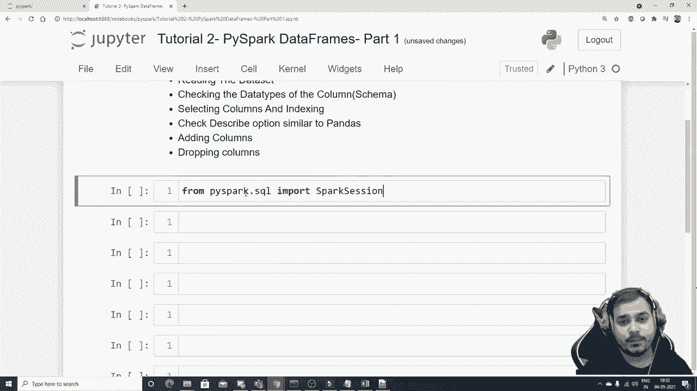
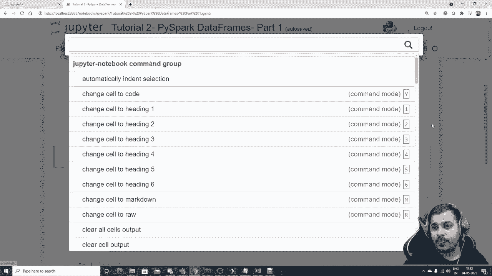
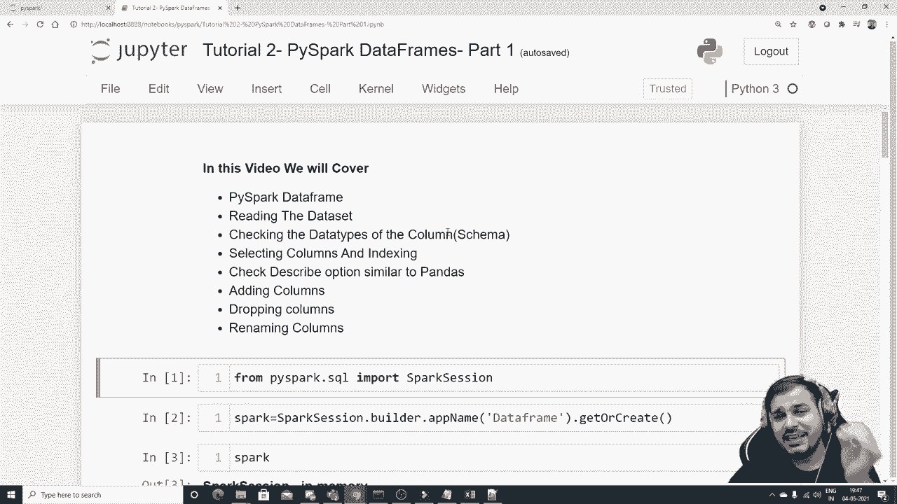

# PySpark 大数据处理入门，带你玩转Python+Spark大数据操作与分析！＜实战教程系列＞ - P2：L2- Pyspark 数据帧 - ShowMeAI - BV1sL4y147dP

。

大家好。我的名字是Krisushnaak，欢迎来到我的Udish频道。所以大家，我们将继续Pipar系列。在本教程中，我们实际上将看到什么是Pipar数据框，我们尝试读取数据集，检查列的数据类型，我们基本上在Pipar中称之为schema，然后我们将看看如何选择列并执行索引描述功能，这与pandas相似，然后我们将尝试看看如何添加新列以及可能删除列，这只是第一部分。所以让我把它写成第一部分，因为之后还会有一部分。

为什么这段视频很重要，因为在Pipar中。如果你计划应用M，机器学习库确实需要先进行数据预处理，可能在第二部分我们将尝试处理缺失值，并看看如何修改行，如何可能设置过滤条件，好吧。接下来我们继续，在继续之前，我要做的是，我们首先要有一个。

😊。

设置一个名为test1的变量。我有三列，一个是姓名，年龄和经验。然后我有一个数据集，如Kris 31，10，就这样。所以Sunny对了。这是我保存在同一位置的一些数据集。现在我要做的第一步，像往常一样，关于Pipar的第一步是构建Pipar会话。现在。

为了构建Pipar会话。我会逐行写代码。所以请确保你也和我一起做，这肯定会有帮助。所以我要写从Pipar。😊，点sqel。导入。Spark会话。然后我将创建一个变量Os，抱歉。

然后我将开始创建一个关于我的会话的变量。所以我将写Sp等于Sp会话点。我们基本上写builder点app名称。在这里我只打算把我的应用程序名称设置为实践。我可以说，或者让我写数据框实践或数据框，就像这样。

因为我们在练习数据框的获取或创建函数。这就是你实际开始一个会话的方式。所以再一次，如果你是第一次执行，这会需要一些时间。否则，它是完全可以的。所以这是我整个的spa，它在内存中运行，正在运行的版本。

而且，显然，当你在本地运行时，你基本上会有一个主节点。好的，应用名称是数据框。所以首先我们尝试再次读取数据集。😊让我们现在读取数据集。我已经给你展示了多种方式，一种是通过读取选项，一种是通过读取。由于这是一个CSV文件，我们将首先尝试读取它。第一种选项是看看我们如何实际读取它，然后我会给你展示多种读取方式。好的，我会写`Spark.dot`。

`Re.dot.options`。在这个选项中，我们基本上说的是键值对。对。所以我将其设置为`header`等于`true`，这样，你知道的，它应该将我的第一行视为标题。这里我会写`head`为`true`，在CSV内部。

我给我的数据集命名为`test1.cism`。现在当我执行这个时，我想你会看到数据集。所以你能看到的，好的，这是一个数据框，你有特征，比如姓名、年龄和经验。所以如果我想查看完整的数据，我只需写`.show`。现在我可以很清楚地看到我的整个数据集。让我将其保存在一个变量`Df_underscore_co_pipar`中。

好的，这是我的整个数据集。首先，我们怎么检查架构呢？让我们检查一下架构。好的，架构基本上意味着数据类型，就像我们在pandas中写的`Df.dot.info`一样。我们可以在这里写。所以你可以看到我在这里写了`Df`下划线`Ipar.dot`。😊打印。想必应该可以正常工作，打印架构。没有类型是字符串架构，哦，抱歉。

所以我已经写了`.show`并保存到一个变量中。我会去掉这个`.show`。让我再执行一次。现在如果我在这里写`print schema`，你将能看到姓名、年龄和经验。但默认情况下，它将其视为字符串。尽管在我的Excel表中，我们已经写入了值，可能这些应该是字符串。

这里应该是整数，那么这里也应该是整数。但为什么它将其视为字符串呢？原因可能是它默认将其视为字符串，因为除非我们在CSV中给出另一个选项，这个CSV有一个选项叫做推断架构。

好的，如果我不将其设置为`true`，那么默认情况下，它将考虑所有特征为字符串值。所以我现在执行这个。现在如果我去查看`Df_underscore_P.dot.print schema`，你将能看到我得到的姓名为字符串，年龄为整数，经验为整数，等级为二级。

这基本上是它可以有空值。所以这。😊一种读取方式，还有一种我会试着给你展示的。这相对简单，所以我可以将头和推断架构都包含在一个操作中，所以我会写`B_F_underscore_co_p`，`spark`等于`Spark.dot.read`。然后是`dot.csv`，在这个CSV中。首先，我会提供我的测试文件，CSV。好的。

然后在这里我将继续写 header。可能等于 true。我可以写 schema 为 I。因此，当我这样写时。如果我写 D F underscore。Picepar.dot.show。在这里，你将能够看到我的整个数据集。好的，所以这里是我的整个数据集。现在，如果我去查看并再次执行这个 schema，它可能会给我同样的方式。

就像我们在这里的情况一样。好的，所以在这里你可以看到姓名是字符串，年龄是整数，经验是整数。完美。那么我们做了什么呢？我们了解了这一点。如果我去查看这个的类型。😊。如果我去查看这个的类型，这基本上是一个数据框。Pandas 也有数据框。

所以如果有人在面试中问你，什么是数据框。你可以基本上说，数据框是一种数据结构，你知道的。因为在里面你可以执行各种操作。所以这也是一种数据结构。好的。那么我们实际上做了什么呢？我介绍了数据框并读取了数据集。现在检查列的数据类型。为了检查列的数据类型，我们已经写了 print schema。好的，现在我可以在此基础上再做一件事。让我们看看选择列和索引。首先，让我们理解一下。

基本上哪些列存在，如何获取所有列名。因此，为了获取列名，你只需写 dot.columns，好的。当你在这里执行时，你将能够得到列名，比如姓名、年龄、经验。完美。这是完全正确的。现在，这是我的 D。现在。

假设如果我想提取一些头部元素。我将能够提取，因为在 pandas 中你也有 head。假设我想获取前三条记录。我将以这种特定格式获得，通常是在列表格式中，使用 pandas 时。

我们通常以数据框格式获取数据。所以在这里你会看到姓名、年龄和经验的组合。好吧，就像这样，这是我的第一行。这是我的第二行。这是我的第三行。好的。现在，我们来讨论下一件事，我该如何选择一列，你知道吗。我可能想提取一列并查看所有元素，就像我们在 pandas 中做的那样。

首先，让我这样写。😊。Pspar.dot.show 这里将能够看到所有列。现在。如果我真的想只提取姓名列。好的，我该怎么做呢，好的，让我们。让我们看看，现在为了提取姓名列。

有一个非常简单的功能，我们写作 Pipar.dot.select。😊。在这里我只需给出我的姓名列。现在一旦我执行这个，你将看到返回类型是数据框，好的，返回类型是数据框，姓名基本上是一个字符串。现在如果我写 dot.show，我将能够看到整个列，好的，当我这样做时，我将能够看到这个，如果我尝试找出这个的类型。

对不起，如果我去掉这个 dot show 并查看类型，这基本上是一个数据框。Pipar dot sql dot data frame，dot data frame，而不是 pandas dot data frame。好的，相对简单。现在，假设我想选择多行，比如说，多列。我想选择名称和经验，可能我想选择这两列。我该怎么做呢？

我在这里做一个改变，最开始我提供了我的一个列名，之后我会提供另一个列，即经验。😊 然后我会执行这个。现在，一旦我在这里执行，你会看到我得到了一个有两个特性的数据显示框，一个是名称，另一个是经验。现在，如果我去写 dot show。😊

在这里，你会发现我的所有元素基本上都在这个特定的数据框中，选择多行的方式非常简单，不过切片在这里确实不管用，因为我尝试过切片，但没成功。好的，如果你有任何疑问，始终查看文档。

😊 Pi park 文档，基本上很简单。好的，这是一种选择列并查看行的方法。现在让我给你演示一下，如果我只想选择，有一种方式像是 C。如果我写 D 的 Pipar 的名称。如果我在这里执行，你会看到列名。

返回类型将在这里是列。如果我直接选择，因为在 pandas 中，我们就是这样直接选择的，对吧？然后我们就有这些列。我们只能理解这个特定的特性，它基本上是一个列，它在说“好的”，没有更多的信息，我们无法获取数据。

不会有显示函数，它会提示这是一个错误。所以通常我们在想要获取或选择任何列并查看时，基本上需要使用这个特定的选择操作，也就是我的函数。

好的，这些事情都完成了，大家试着理解一下。现在我们来看如何检查数据类型。有一个功能，叫做 D types。在这里，你会看到名称被标记为字符串，年龄被标记为整数，经验也是如此。D types 与 pandas 非常相似，我们在 pandas 中也使用过大多数功能。我们实际上做了哪些事情呢？

让我们查看数据名称读取数据。😊 检查数据类型，选择列和索引，检查描述选项，类似于 pandas，因此我们也可以检查描述选项。让我们看看。Picepar dot describe。如果我执行这个，你会看到它给你一个数据框的摘要，内容是字符串，这些信息都在。现在当我写 dot show 时。

😊，好的。你将能够看到这一切，基本上是以数据框的形式呈现。😊。你可能在想，为什么这个 nug 值会出现均值和标准差。因为即使在这里，它也会考虑字符串列。基本上，具有字符串数据类型的值在这里，显然。

你没有任何东西。所以最小值和最大值基本上是在索引上取的，因为在第二个索引中。你将能够看到崩溃，然后太阳在那之后。好的。在第四个索引中，剩下的所有信息实际上都是存在的。好的。所以这基本上和我们实际上看到的描述选项一样。😊，你知道的。

可能在我们的 pandas 中，对吧，所以我们实际上也是这样做的。好的。所以描述选项也完成了。那么现在，让我们去看看添加列和删除列。好的，添加列和删除列非常非常简单。大家。如果我们需要添加列。我将把评论写在这里，添加列。

在数据框中，这个数据框是 pipar 数据框。好的，现在为了添加列。我们有一个很棒的函数，叫做 Df Pi spark dot。这里有一个叫做宽度列的东西，好的，现在这个宽度列如果我查看功能，它会通过添加一个类或替换同名的现有列返回一个新的数据框。好的，所以这里我要给的第一个参数是我的列名。假设我想选择。

让我来选择经验。😊，所以我会说经验，好吧。这可能会是我在两年后的新列。如果经验在两年后会发生什么，你知道的。最初候选人有10年经验，两年后将变为12，对吧？所以我们会尝试放置现在的值。这是我的新列名，应该有什么值，所以我会写 Df P spark，在这里我会说我可能会取那个 spa 经验。😊我会乘以并加上 2，因为两年后经验会增加 2。

我只是用一种方式解决这个问题。我要随意放置任何值，大家随意。好的，你可以实际查看。好的。现在在此之后，这只是需要的两件事。现在如果我执行它，你将能够看到一些操作会发生。在这个数据框中，你有1，2。

第3和第4个特征。如果我想查看完整的数据集，我可以写点显示。😊。一旦我执行它，我们将在这里看到，经过两年的经验不过是 12，10，66，因为 10 加 2 就是 12，你们非常简单。这个宽度列基本上就是这样，你也可以在这方面做不同的事情。

所以这就是你如何在数据框中添加列。再说一遍，伙计们。这不是就地操作，你基本上需要将其赋值给一个变量以便反映。如果我想让它反映，我确实需要像这样赋值。现在如果我去看看，抱歉，首先。让我去掉这个 show，show 不会给我们正确的结果。😊，好的哦。

没有属性宽度列。好的，抱歉，这里有一个问题。我会。我会读取这个数据集，因为我完全替换了它，对吧。现在我会再次执行它。现在没问题。现在，如果我在这里写 dot show，你将能够看到所有元素都正确显示。现在。

这与向数据框添加列有关。现在。我可能还需要删除列。所以删除列。让我们看看我们如何实际删除列。删除列相当简单。就像我们通常删除的功能默认情况下，取列名。

你可以提供一个列的列表。你可以给一个单独的列名。所以假设我说经验在两年后。我想删除这个。因为谁知道两年后会发生什么。所以让我们删除这个。为了删除它，只需像这样执行，然后去看看 dot show。

在这里你将能够再次找到没有那个特定列的内容。这不是就地操作，你需要将其赋值给一个变量，非常简单。所以让我把它赋值给一个变量。是它调用并请确保你删除这个 dot show。dot show 现在是一个功能，如果我写这个 dot show。

在这里你将能够看到所有元素。很好，现在让我们继续。看看如何重命名列。所以我们这样做是因为你真的需要在数据预处理方面非常优秀。好的，所以我会写 thought，还有另一个功能，叫做 width。😊，列重命名。好的，现在在这里，你只需给出你的现有列名和新列名。

假设我这里的现有列名。我会说 name，然后我会说 new name。好的，然后执行它。现在如果我去写 dot show，试着看看这里的元素，你将能够看到，name 旁边会有一个叫做 new name 的东西，对吧。这就是我实际上要讨论的内容。

我在这里再写一个要点。我们也讨论了重命名列。对。是的，这只是数据框的第一部分。第二部分将尝试进行一种称为过滤操作的内容。在过滤操作中，我们将尝试查看各种操作，伙计们，这将非常惊人。你将能够学到很多东西。所以我希望你喜欢这个特别的视频。

如果你都喜欢这个频道，请订阅。我在下一个视频见。祝你有个美好的一天。谢谢你们。伙计们，继续分享。继续支持，我在下一个视频见。拜拜。😊。
